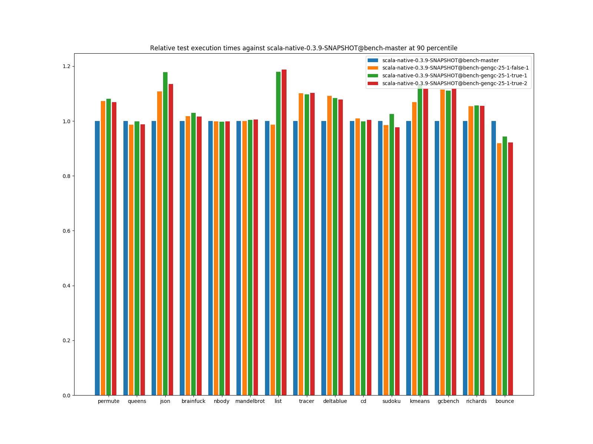

# Summary
## Benchmark run time (ms) at 50 percentile 

|name | scala-native-0.3.9-SNAPSHOT@bench-master | scala-native-0.3.9-SNAPSHOT@bench-gengc-25-1-false-1 |  | scala-native-0.3.9-SNAPSHOT@bench-gengc-25-1-true-1 |  | scala-native-0.3.9-SNAPSHOT@bench-gengc-25-1-true-2 | |
| -- | -- | -- | -- | -- | -- | -- | -- |
|[permute.PermuteBenchmark](#permutepermutebenchmark)|0.1756|0.1868|+6.37%|0.1889|+7.60%|0.1872|+6.60%|
|[queens.QueensBenchmark](#queensqueensbenchmark)|0.0774|0.0768|__-0.73%__|0.0775|+0.19%|0.0768|__-0.70%__|
|[json.JsonBenchmark](#jsonjsonbenchmark)|1.1884|1.3207|+11.13%|1.1908|+0.20%|1.1416|__-3.94%__|
|[brainfuck.BrainfuckBenchmark](#brainfuckbrainfuckbenchmark)|3.0479|3.0517|+0.13%|3.1002|+1.71%|3.0582|+0.34%|
|[nbody.NbodyBenchmark](#nbodynbodybenchmark)|28.9916|28.9643|__-0.09%__|28.9623|__-0.10%__|28.9587|__-0.11%__|
|[mandelbrot.MandelbrotBenchmark](#mandelbrotmandelbrotbenchmark)|114.3510|114.4146|+0.06%|114.9109|+0.49%|114.9940|+0.56%|
|[list.ListBenchmark](#listlistbenchmark)|0.0429|0.0422|__-1.54%__|0.0513|+19.63%|0.0513|+19.57%|
|[tracer.TracerBenchmark](#tracertracerbenchmark)|0.6086|0.6519|+7.12%|0.6509|+6.96%|0.6516|+7.08%|
|[deltablue.DeltaBlueBenchmark](#deltabluedeltabluebenchmark)|0.1731|0.1763|+1.81%|0.1737|+0.32%|0.1764|+1.90%|
|[cd.CDBenchmark](#cdcdbenchmark)|21.3548|21.4957|+0.66%|21.2553|__-0.47%__|21.3578|+0.01%|
|[sudoku.SudokuBenchmark](#sudokusudokubenchmark)|1.7932|1.8477|+3.04%|1.9120|+6.63%|1.8302|+2.07%|
|[kmeans.KmeansBenchmark](#kmeanskmeansbenchmark)|42.1515|44.8806|+6.47%|47.3912|+12.43%|47.8866|+13.61%|
|[gcbench.GCBenchBenchmark](#gcbenchgcbenchbenchmark)|95.7846|106.6277|+11.32%|106.5682|+11.26%|106.6085|+11.30%|
|[richards.RichardsBenchmark](#richardsrichardsbenchmark)|0.0790|0.0833|+5.36%|0.0833|+5.36%|0.0838|+6.09%|
|[bounce.BounceBenchmark](#bouncebouncebenchmark)|0.0450|0.0413|__-8.38%__|0.0426|__-5.29%__|0.0417|__-7.49%__|
| __Geometrical mean:__|| |+2.73%| |+4.28%| |+3.58%|
## Benchmark run time (ms) at 90 percentile 

|name | scala-native-0.3.9-SNAPSHOT@bench-master | scala-native-0.3.9-SNAPSHOT@bench-gengc-25-1-false-1 |  | scala-native-0.3.9-SNAPSHOT@bench-gengc-25-1-true-1 |  | scala-native-0.3.9-SNAPSHOT@bench-gengc-25-1-true-2 | |
| -- | -- | -- | -- | -- | -- | -- | -- |
|[permute.PermuteBenchmark](#permutepermutebenchmark)|0.1793|0.1923|+7.26%|0.1938|+8.07%|0.1917|+6.92%|
|[queens.QueensBenchmark](#queensqueensbenchmark)|0.0796|0.0785|__-1.37%__|0.0795|__-0.07%__|0.0787|__-1.14%__|
|[json.JsonBenchmark](#jsonjsonbenchmark)|1.1988|1.3292|+10.88%|1.4124|+17.82%|1.3612|+13.55%|
|[brainfuck.BrainfuckBenchmark](#brainfuckbrainfuckbenchmark)|3.0719|3.1281|+1.83%|3.1657|+3.05%|3.1211|+1.60%|
|[nbody.NbodyBenchmark](#nbodynbodybenchmark)|29.4740|29.4473|__-0.09%__|29.4071|__-0.23%__|29.4205|__-0.18%__|
|[mandelbrot.MandelbrotBenchmark](#mandelbrotmandelbrotbenchmark)|114.4663|114.5262|+0.05%|115.0154|+0.48%|115.1146|+0.57%|
|[list.ListBenchmark](#listlistbenchmark)|0.0439|0.0434|__-1.29%__|0.0518|+18.00%|0.0522|+18.78%|
|[tracer.TracerBenchmark](#tracertracerbenchmark)|0.6129|0.6750|+10.13%|0.6724|+9.71%|0.6756|+10.24%|
|[deltablue.DeltaBlueBenchmark](#deltabluedeltabluebenchmark)|0.1776|0.1939|+9.18%|0.1924|+8.34%|0.1915|+7.87%|
|[cd.CDBenchmark](#cdcdbenchmark)|21.5335|21.7443|+0.98%|21.5115|__-0.10%__|21.6295|+0.45%|
|[sudoku.SudokuBenchmark](#sudokusudokubenchmark)|1.9290|1.9015|__-1.42%__|1.9781|+2.54%|1.8863|__-2.21%__|
|[kmeans.KmeansBenchmark](#kmeanskmeansbenchmark)|43.3763|46.3685|+6.90%|49.0851|+13.16%|48.4757|+11.76%|
|[gcbench.GCBenchBenchmark](#gcbenchgcbenchbenchmark)|96.7755|107.8571|+11.45%|107.4781|+11.06%|108.2330|+11.84%|
|[richards.RichardsBenchmark](#richardsrichardsbenchmark)|0.0815|0.0858|+5.37%|0.0861|+5.71%|0.0860|+5.58%|
|[bounce.BounceBenchmark](#bouncebouncebenchmark)|0.0461|0.0424|__-8.10%__|0.0435|__-5.69%__|0.0425|__-7.80%__|
| __Geometrical mean:__|| |+3.30%| |+5.91%| |+4.96%|
## Benchmark run time (ms) at 99 percentile 

|name | scala-native-0.3.9-SNAPSHOT@bench-master | scala-native-0.3.9-SNAPSHOT@bench-gengc-25-1-false-1 |  | scala-native-0.3.9-SNAPSHOT@bench-gengc-25-1-true-1 |  | scala-native-0.3.9-SNAPSHOT@bench-gengc-25-1-true-2 | |
| -- | -- | -- | -- | -- | -- | -- | -- |
|[permute.PermuteBenchmark](#permutepermutebenchmark)|0.1948|0.2538|+30.32%|0.2100|+7.82%|0.2073|+6.44%|
|[queens.QueensBenchmark](#queensqueensbenchmark)|0.0828|0.0818|__-1.17%__|0.0831|+0.43%|0.0815|__-1.56%__|
|[json.JsonBenchmark](#jsonjsonbenchmark)|1.2283|1.3778|+12.17%|1.4423|+17.42%|1.4095|+14.75%|
|[brainfuck.BrainfuckBenchmark](#brainfuckbrainfuckbenchmark)|3.2144|3.2057|__-0.27%__|3.2480|+1.05%|3.2012|__-0.41%__|
|[nbody.NbodyBenchmark](#nbodynbodybenchmark)|30.5462|30.5807|+0.11%|30.3123|__-0.77%__|30.4420|__-0.34%__|
|[mandelbrot.MandelbrotBenchmark](#mandelbrotmandelbrotbenchmark)|115.3908|115.4528|+0.05%|115.9572|+0.49%|116.0283|+0.55%|
|[list.ListBenchmark](#listlistbenchmark)|0.0450|0.0447|__-0.64%__|0.0537|+19.32%|0.0534|+18.78%|
|[tracer.TracerBenchmark](#tracertracerbenchmark)|0.6295|0.6878|+9.26%|0.6874|+9.19%|0.6899|+9.59%|
|[deltablue.DeltaBlueBenchmark](#deltabluedeltabluebenchmark)|0.2011|0.2211|+9.98%|0.2092|+4.04%|0.2067|+2.83%|
|[cd.CDBenchmark](#cdcdbenchmark)|21.9787|22.1122|+0.61%|21.8697|__-0.50%__|22.0649|+0.39%|
|[sudoku.SudokuBenchmark](#sudokusudokubenchmark)|1.9925|2.0521|+2.99%|2.1205|+6.42%|2.0343|+2.10%|
|[kmeans.KmeansBenchmark](#kmeanskmeansbenchmark)|44.7395|47.6848|+6.58%|55.8129|+24.75%|49.8744|+11.48%|
|[gcbench.GCBenchBenchmark](#gcbenchgcbenchbenchmark)|98.4781|109.1533|+10.84%|108.8880|+10.57%|109.5408|+11.23%|
|[richards.RichardsBenchmark](#richardsrichardsbenchmark)|0.0916|0.0908|__-0.86%__|0.0918|+0.21%|0.0922|+0.67%|
|[bounce.BounceBenchmark](#bouncebouncebenchmark)|0.0470|0.0443|__-5.79%__|0.0455|__-3.32%__|0.0445|__-5.49%__|
| __Geometrical mean:__|| |+4.62%| |+6.18%| |+4.52%|
# Individual benchmarks
## permute.PermuteBenchmark

## queens.QueensBenchmark

## json.JsonBenchmark

## brainfuck.BrainfuckBenchmark

## nbody.NbodyBenchmark

## mandelbrot.MandelbrotBenchmark

## list.ListBenchmark

## tracer.TracerBenchmark

## deltablue.DeltaBlueBenchmark

## cd.CDBenchmark

## sudoku.SudokuBenchmark

## kmeans.KmeansBenchmark

## gcbench.GCBenchBenchmark

## richards.RichardsBenchmark

## bounce.BounceBenchmark

