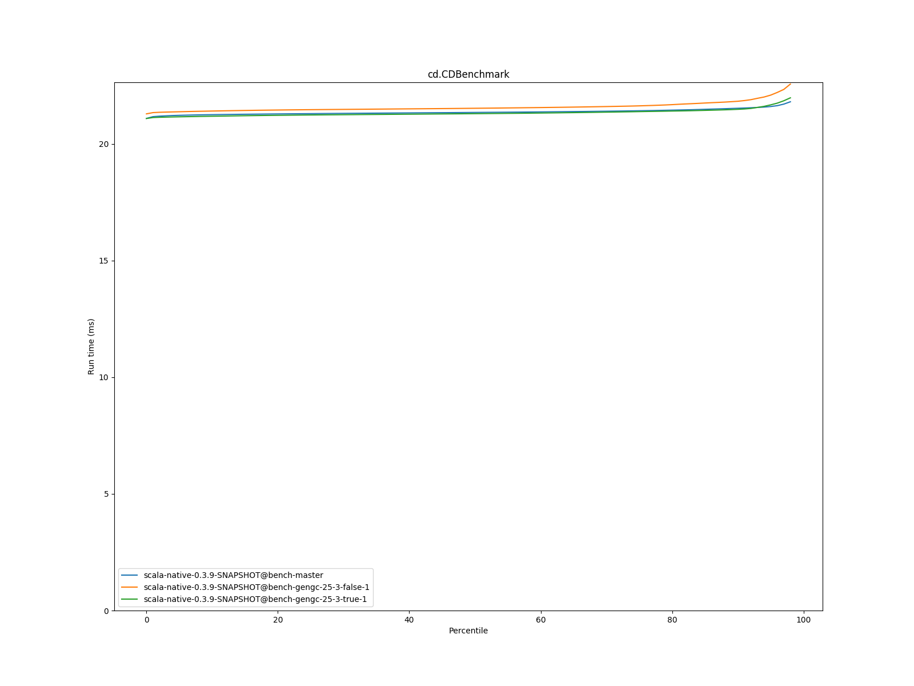
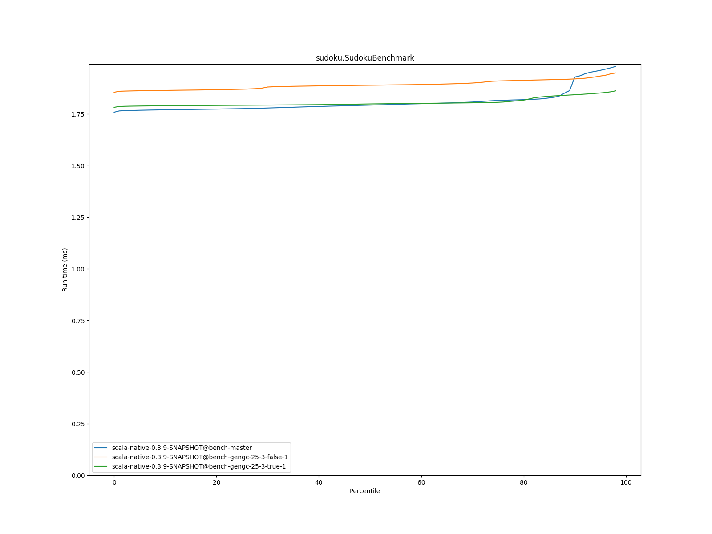

# Summary
## Benchmark run time (ms) at 50 percentile 

|name | scala-native-0.3.9-SNAPSHOT@bench-master | scala-native-0.3.9-SNAPSHOT@bench-gengc-25-3-false-1 |  | scala-native-0.3.9-SNAPSHOT@bench-gengc-25-3-true-1 | |
| -- | -- | -- | -- | -- | -- |
|[permute.PermuteBenchmark](#permutepermutebenchmark)|0.1756|0.1904|+8.43%|0.1871|+6.56%|
|[queens.QueensBenchmark](#queensqueensbenchmark)|0.0774|0.0764|__-1.24%__|0.0764|__-1.25%__|
|[json.JsonBenchmark](#jsonjsonbenchmark)|1.1884|1.1533|__-2.96%__|1.2103|+1.84%|
|[brainfuck.BrainfuckBenchmark](#brainfuckbrainfuckbenchmark)|3.0479|3.1769|+4.23%|3.1460|+3.22%|
|[nbody.NbodyBenchmark](#nbodynbodybenchmark)|28.9916|28.9546|__-0.13%__|28.9531|__-0.13%__|
|[mandelbrot.MandelbrotBenchmark](#mandelbrotmandelbrotbenchmark)|114.3510|114.3472|__-0.00%__|114.3473|__-0.00%__|
|[list.ListBenchmark](#listlistbenchmark)|0.0429|0.0512|+19.45%|0.0456|+6.42%|
|[tracer.TracerBenchmark](#tracertracerbenchmark)|0.6086|0.6458|+6.11%|0.6566|+7.90%|
|[deltablue.DeltaBlueBenchmark](#deltabluedeltabluebenchmark)|0.1731|0.1734|+0.14%|0.1786|+3.18%|
|[cd.CDBenchmark](#cdcdbenchmark)|21.3548|21.5334|+0.84%|21.3027|__-0.24%__|
|[sudoku.SudokuBenchmark](#sudokusudokubenchmark)|1.7932|1.8897|+5.38%|1.7989|+0.32%|
|[kmeans.KmeansBenchmark](#kmeanskmeansbenchmark)|42.1515|43.9863|+4.35%|43.1576|+2.39%|
|[gcbench.GCBenchBenchmark](#gcbenchgcbenchbenchmark)|95.7846|91.0771|__-4.91%__|92.4156|__-3.52%__|
|[richards.RichardsBenchmark](#richardsrichardsbenchmark)|0.0790|0.0834|+5.51%|0.0840|+6.27%|
|[bounce.BounceBenchmark](#bouncebouncebenchmark)|0.0450|0.0467|+3.64%|0.0423|__-6.11%__|
| __Geometrical mean:__|| |+3.11%| |+1.72%|
## Benchmark run time (ms) at 90 percentile 

|name | scala-native-0.3.9-SNAPSHOT@bench-master | scala-native-0.3.9-SNAPSHOT@bench-gengc-25-3-false-1 |  | scala-native-0.3.9-SNAPSHOT@bench-gengc-25-3-true-1 | |
| -- | -- | -- | -- | -- | -- |
|[permute.PermuteBenchmark](#permutepermutebenchmark)|0.1793|0.1949|+8.66%|0.1916|+6.87%|
|[queens.QueensBenchmark](#queensqueensbenchmark)|0.0796|0.0784|__-1.46%__|0.0784|__-1.54%__|
|[json.JsonBenchmark](#jsonjsonbenchmark)|1.1988|1.2122|+1.12%|1.3283|+10.80%|
|[brainfuck.BrainfuckBenchmark](#brainfuckbrainfuckbenchmark)|3.0719|3.2570|+6.03%|3.2242|+4.96%|
|[nbody.NbodyBenchmark](#nbodynbodybenchmark)|29.4740|29.4237|__-0.17%__|29.4238|__-0.17%__|
|[mandelbrot.MandelbrotBenchmark](#mandelbrotmandelbrotbenchmark)|114.4663|114.4400|__-0.02%__|114.4539|__-0.01%__|
|[list.ListBenchmark](#listlistbenchmark)|0.0439|0.0523|+19.04%|0.0464|+5.70%|
|[tracer.TracerBenchmark](#tracertracerbenchmark)|0.6129|0.6608|+7.83%|0.6740|+9.97%|
|[deltablue.DeltaBlueBenchmark](#deltabluedeltabluebenchmark)|0.1776|0.2005|+12.90%|0.2039|+14.86%|
|[cd.CDBenchmark](#cdcdbenchmark)|21.5335|21.8342|+1.40%|21.4889|__-0.21%__|
|[sudoku.SudokuBenchmark](#sudokusudokubenchmark)|1.9290|1.9201|__-0.46%__|1.8434|__-4.43%__|
|[kmeans.KmeansBenchmark](#kmeanskmeansbenchmark)|43.3763|44.6280|+2.89%|57.4551|+32.46%|
|[gcbench.GCBenchBenchmark](#gcbenchgcbenchbenchmark)|96.7755|100.7367|+4.09%|101.4986|+4.88%|
|[richards.RichardsBenchmark](#richardsrichardsbenchmark)|0.0815|0.0853|+4.75%|0.0863|+5.92%|
|[bounce.BounceBenchmark](#bouncebouncebenchmark)|0.0461|0.0469|+1.66%|0.0426|__-7.62%__|
| __Geometrical mean:__|| |+4.41%| |+5.12%|
## Benchmark run time (ms) at 99 percentile 

|name | scala-native-0.3.9-SNAPSHOT@bench-master | scala-native-0.3.9-SNAPSHOT@bench-gengc-25-3-false-1 |  | scala-native-0.3.9-SNAPSHOT@bench-gengc-25-3-true-1 | |
| -- | -- | -- | -- | -- | -- |
|[permute.PermuteBenchmark](#permutepermutebenchmark)|0.1948|0.1980|+1.64%|0.1962|+0.72%|
|[queens.QueensBenchmark](#queensqueensbenchmark)|0.0828|0.0811|__-2.05%__|0.0810|__-2.17%__|
|[json.JsonBenchmark](#jsonjsonbenchmark)|1.2283|1.2555|+2.21%|1.3699|+11.53%|
|[brainfuck.BrainfuckBenchmark](#brainfuckbrainfuckbenchmark)|3.2144|3.3187|+3.24%|3.3287|+3.56%|
|[nbody.NbodyBenchmark](#nbodynbodybenchmark)|30.5462|30.5988|+0.17%|30.4281|__-0.39%__|
|[mandelbrot.MandelbrotBenchmark](#mandelbrotmandelbrotbenchmark)|115.3908|115.3758|__-0.01%__|115.3859|__-0.00%__|
|[list.ListBenchmark](#listlistbenchmark)|0.0450|0.0534|+18.65%|0.0476|+5.77%|
|[tracer.TracerBenchmark](#tracertracerbenchmark)|0.6295|0.6987|+10.99%|0.7026|+11.61%|
|[deltablue.DeltaBlueBenchmark](#deltabluedeltabluebenchmark)|0.2011|0.2177|+8.28%|0.2193|+9.08%|
|[cd.CDBenchmark](#cdcdbenchmark)|21.9787|23.2435|+5.75%|22.2896|+1.41%|
|[sudoku.SudokuBenchmark](#sudokusudokubenchmark)|1.9925|1.9575|__-1.75%__|1.8724|__-6.03%__|
|[kmeans.KmeansBenchmark](#kmeanskmeansbenchmark)|44.7395|45.8291|+2.44%|95.9239|+114.41%|
|[gcbench.GCBenchBenchmark](#gcbenchgcbenchbenchmark)|98.4781|103.5150|+5.11%|105.9151|+7.55%|
|[richards.RichardsBenchmark](#richardsrichardsbenchmark)|0.0916|0.0900|__-1.68%__|0.0910|__-0.58%__|
|[bounce.BounceBenchmark](#bouncebouncebenchmark)|0.0470|0.0492|+4.66%|0.0445|__-5.45%__|
| __Geometrical mean:__|| |+3.71%| |+7.64%|
# Individual benchmarks
## permute.PermuteBenchmark

## queens.QueensBenchmark

## json.JsonBenchmark

## brainfuck.BrainfuckBenchmark

## nbody.NbodyBenchmark

## mandelbrot.MandelbrotBenchmark

## list.ListBenchmark

## tracer.TracerBenchmark

## deltablue.DeltaBlueBenchmark

## cd.CDBenchmark

## sudoku.SudokuBenchmark

## kmeans.KmeansBenchmark

## gcbench.GCBenchBenchmark

## richards.RichardsBenchmark

## bounce.BounceBenchmark

