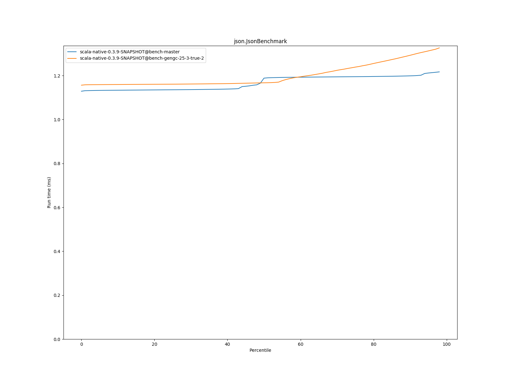
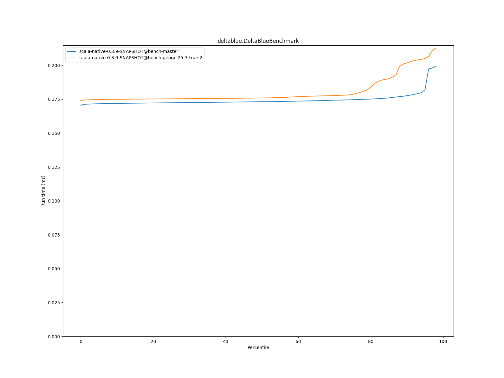

# Summary
## Benchmark run time (ms) at 50 percentile 

|name | scala-native-0.3.9-SNAPSHOT@bench-master | scala-native-0.3.9-SNAPSHOT@bench-gengc-25-3-true-2 | |
| -- | -- | -- | -- |
|[permute.PermuteBenchmark](#permutepermutebenchmark)|0.1756|0.1879|+7.02%|
|[queens.QueensBenchmark](#queensqueensbenchmark)|0.0774|0.0772|__-0.19%__|
|[json.JsonBenchmark](#jsonjsonbenchmark)|1.1884|1.1671|__-1.79%__|
|[brainfuck.BrainfuckBenchmark](#brainfuckbrainfuckbenchmark)|3.0479|3.1477|+3.28%|
|[nbody.NbodyBenchmark](#nbodynbodybenchmark)|28.9916|28.9629|__-0.10%__|
|[mandelbrot.MandelbrotBenchmark](#mandelbrotmandelbrotbenchmark)|114.3510|114.3466|__-0.00%__|
|[list.ListBenchmark](#listlistbenchmark)|0.0429|0.0424|__-1.18%__|
|[tracer.TracerBenchmark](#tracertracerbenchmark)|0.6086|0.6477|+6.44%|
|[deltablue.DeltaBlueBenchmark](#deltabluedeltabluebenchmark)|0.1731|0.1759|+1.61%|
|[cd.CDBenchmark](#cdcdbenchmark)|21.3548|21.2816|__-0.34%__|
|[sudoku.SudokuBenchmark](#sudokusudokubenchmark)|1.7932|1.8264|+1.86%|
|[kmeans.KmeansBenchmark](#kmeanskmeansbenchmark)|42.1515|53.9738|+28.05%|
|[gcbench.GCBenchBenchmark](#gcbenchgcbenchbenchmark)|95.7846|92.5188|__-3.41%__|
|[richards.RichardsBenchmark](#richardsrichardsbenchmark)|0.0790|0.0837|+5.90%|
|[bounce.BounceBenchmark](#bouncebouncebenchmark)|0.0450|0.0410|__-8.94%__|
| __Geometrical mean:__|| |+2.27%|
## Benchmark run time (ms) at 90 percentile 

|name | scala-native-0.3.9-SNAPSHOT@bench-master | scala-native-0.3.9-SNAPSHOT@bench-gengc-25-3-true-2 | |
| -- | -- | -- | -- |
|[permute.PermuteBenchmark](#permutepermutebenchmark)|0.1793|0.1924|+7.28%|
|[queens.QueensBenchmark](#queensqueensbenchmark)|0.0796|0.0791|__-0.57%__|
|[json.JsonBenchmark](#jsonjsonbenchmark)|1.1988|1.2924|+7.81%|
|[brainfuck.BrainfuckBenchmark](#brainfuckbrainfuckbenchmark)|3.0719|3.2140|+4.63%|
|[nbody.NbodyBenchmark](#nbodynbodybenchmark)|29.4740|29.4215|__-0.18%__|
|[mandelbrot.MandelbrotBenchmark](#mandelbrotmandelbrotbenchmark)|114.4663|114.4930|+0.02%|
|[list.ListBenchmark](#listlistbenchmark)|0.0439|0.0435|__-0.90%__|
|[tracer.TracerBenchmark](#tracertracerbenchmark)|0.6129|0.6551|+6.89%|
|[deltablue.DeltaBlueBenchmark](#deltabluedeltabluebenchmark)|0.1776|0.2018|+13.63%|
|[cd.CDBenchmark](#cdcdbenchmark)|21.5335|21.4288|__-0.49%__|
|[sudoku.SudokuBenchmark](#sudokusudokubenchmark)|1.9290|1.8724|__-2.93%__|
|[kmeans.KmeansBenchmark](#kmeanskmeansbenchmark)|43.3763|56.6699|+30.65%|
|[gcbench.GCBenchBenchmark](#gcbenchgcbenchbenchmark)|96.7755|101.2754|+4.65%|
|[richards.RichardsBenchmark](#richardsrichardsbenchmark)|0.0815|0.0863|+5.94%|
|[bounce.BounceBenchmark](#bouncebouncebenchmark)|0.0461|0.0413|__-10.40%__|
| __Geometrical mean:__|| |+4.05%|
## Benchmark run time (ms) at 99 percentile 

|name | scala-native-0.3.9-SNAPSHOT@bench-master | scala-native-0.3.9-SNAPSHOT@bench-gengc-25-3-true-2 | |
| -- | -- | -- | -- |
|[permute.PermuteBenchmark](#permutepermutebenchmark)|0.1948|0.1969|+1.08%|
|[queens.QueensBenchmark](#queensqueensbenchmark)|0.0828|0.0818|__-1.19%__|
|[json.JsonBenchmark](#jsonjsonbenchmark)|1.2283|1.3387|+8.98%|
|[brainfuck.BrainfuckBenchmark](#brainfuckbrainfuckbenchmark)|3.2144|3.3070|+2.88%|
|[nbody.NbodyBenchmark](#nbodynbodybenchmark)|30.5462|30.4470|__-0.32%__|
|[mandelbrot.MandelbrotBenchmark](#mandelbrotmandelbrotbenchmark)|115.3908|115.4285|+0.03%|
|[list.ListBenchmark](#listlistbenchmark)|0.0450|0.0448|__-0.47%__|
|[tracer.TracerBenchmark](#tracertracerbenchmark)|0.6295|0.6938|+10.20%|
|[deltablue.DeltaBlueBenchmark](#deltabluedeltabluebenchmark)|0.2011|0.2151|+6.99%|
|[cd.CDBenchmark](#cdcdbenchmark)|21.9787|22.2219|+1.11%|
|[sudoku.SudokuBenchmark](#sudokusudokubenchmark)|1.9925|1.9071|__-4.28%__|
|[kmeans.KmeansBenchmark](#kmeanskmeansbenchmark)|44.7395|58.1878|+30.06%|
|[gcbench.GCBenchBenchmark](#gcbenchgcbenchbenchmark)|98.4781|105.9063|+7.54%|
|[richards.RichardsBenchmark](#richardsrichardsbenchmark)|0.0916|0.0918|+0.21%|
|[bounce.BounceBenchmark](#bouncebouncebenchmark)|0.0470|0.0431|__-8.31%__|
| __Geometrical mean:__|| |+3.31%|
# Individual benchmarks
## permute.PermuteBenchmark

## queens.QueensBenchmark

## json.JsonBenchmark

## brainfuck.BrainfuckBenchmark

## nbody.NbodyBenchmark

## mandelbrot.MandelbrotBenchmark

## list.ListBenchmark

## tracer.TracerBenchmark

## deltablue.DeltaBlueBenchmark

## cd.CDBenchmark

## sudoku.SudokuBenchmark

## kmeans.KmeansBenchmark

## gcbench.GCBenchBenchmark

## richards.RichardsBenchmark

## bounce.BounceBenchmark

