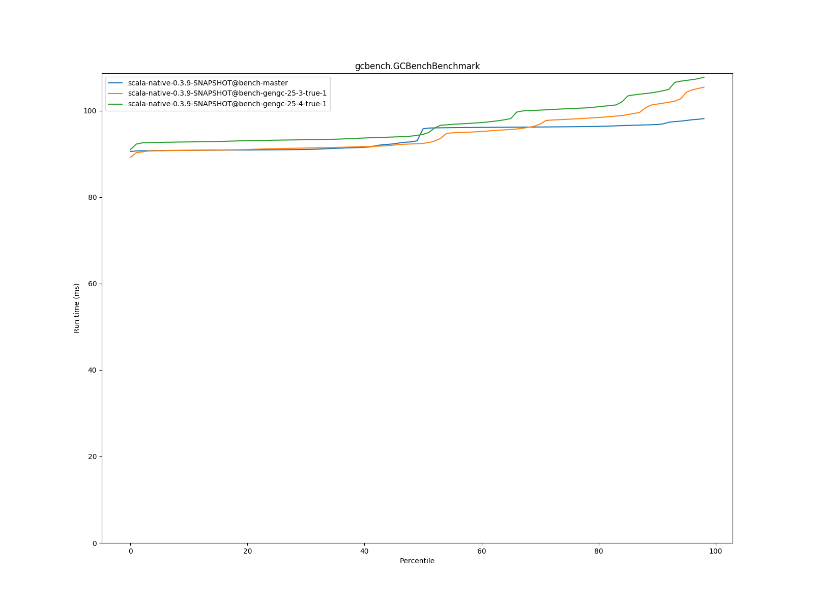

# Summary
## Benchmark run time (ms) at 50 percentile 

|name | scala-native-0.3.9-SNAPSHOT@bench-master | scala-native-0.3.9-SNAPSHOT@bench-gengc-25-3-true-1 |  | scala-native-0.3.9-SNAPSHOT@bench-gengc-25-4-true-1 | |
| -- | -- | -- | -- | -- | -- |
|[permute.PermuteBenchmark](#permutepermutebenchmark)|0.1756|0.1871|+6.56%|0.1874|+6.74%|
|[queens.QueensBenchmark](#queensqueensbenchmark)|0.0774|0.0764|__-1.25%__|0.0776|+0.31%|
|[json.JsonBenchmark](#jsonjsonbenchmark)|1.1884|1.2103|+1.84%|1.1255|__-5.30%__|
|[brainfuck.BrainfuckBenchmark](#brainfuckbrainfuckbenchmark)|3.0479|3.1460|+3.22%|3.2112|+5.36%|
|[nbody.NbodyBenchmark](#nbodynbodybenchmark)|28.9916|28.9531|__-0.13%__|28.9625|__-0.10%__|
|[mandelbrot.MandelbrotBenchmark](#mandelbrotmandelbrotbenchmark)|114.3510|114.3473|__-0.00%__|114.3664|+0.01%|
|[list.ListBenchmark](#listlistbenchmark)|0.0429|0.0456|+6.42%|0.0424|__-0.99%__|
|[tracer.TracerBenchmark](#tracertracerbenchmark)|0.6086|0.6566|+7.90%|0.6523|+7.19%|
|[deltablue.DeltaBlueBenchmark](#deltabluedeltabluebenchmark)|0.1731|0.1786|+3.18%|0.1776|+2.60%|
|[cd.CDBenchmark](#cdcdbenchmark)|21.3548|21.3027|__-0.24%__|21.3348|__-0.09%__|
|[sudoku.SudokuBenchmark](#sudokusudokubenchmark)|1.7932|1.7989|+0.32%|1.8352|+2.35%|
|[kmeans.KmeansBenchmark](#kmeanskmeansbenchmark)|42.1515|43.1576|+2.39%|42.7966|+1.53%|
|[gcbench.GCBenchBenchmark](#gcbenchgcbenchbenchmark)|95.7846|92.4156|__-3.52%__|94.5018|__-1.34%__|
|[richards.RichardsBenchmark](#richardsrichardsbenchmark)|0.0790|0.0840|+6.27%|0.0833|+5.48%|
|[bounce.BounceBenchmark](#bouncebouncebenchmark)|0.0450|0.0423|__-6.11%__|0.0462|+2.56%|
| __Geometrical mean:__|| |+1.72%| |+1.70%|
## Benchmark run time (ms) at 90 percentile 

|name | scala-native-0.3.9-SNAPSHOT@bench-master | scala-native-0.3.9-SNAPSHOT@bench-gengc-25-3-true-1 |  | scala-native-0.3.9-SNAPSHOT@bench-gengc-25-4-true-1 | |
| -- | -- | -- | -- | -- | -- |
|[permute.PermuteBenchmark](#permutepermutebenchmark)|0.1793|0.1916|+6.87%|0.1919|+7.04%|
|[queens.QueensBenchmark](#queensqueensbenchmark)|0.0796|0.0784|__-1.54%__|0.0795|__-0.16%__|
|[json.JsonBenchmark](#jsonjsonbenchmark)|1.1988|1.3283|+10.80%|1.2509|+4.34%|
|[brainfuck.BrainfuckBenchmark](#brainfuckbrainfuckbenchmark)|3.0719|3.2242|+4.96%|3.3465|+8.94%|
|[nbody.NbodyBenchmark](#nbodynbodybenchmark)|29.4740|29.4238|__-0.17%__|29.4351|__-0.13%__|
|[mandelbrot.MandelbrotBenchmark](#mandelbrotmandelbrotbenchmark)|114.4663|114.4539|__-0.01%__|114.5005|+0.03%|
|[list.ListBenchmark](#listlistbenchmark)|0.0439|0.0464|+5.70%|0.0436|__-0.82%__|
|[tracer.TracerBenchmark](#tracertracerbenchmark)|0.6129|0.6740|+9.97%|0.6625|+8.09%|
|[deltablue.DeltaBlueBenchmark](#deltabluedeltabluebenchmark)|0.1776|0.2039|+14.86%|0.2029|+14.29%|
|[cd.CDBenchmark](#cdcdbenchmark)|21.5335|21.4889|__-0.21%__|21.5264|__-0.03%__|
|[sudoku.SudokuBenchmark](#sudokusudokubenchmark)|1.9290|1.8434|__-4.43%__|1.8785|__-2.62%__|
|[kmeans.KmeansBenchmark](#kmeanskmeansbenchmark)|43.3763|57.4551|+32.46%|85.5012|+97.11%|
|[gcbench.GCBenchBenchmark](#gcbenchgcbenchbenchmark)|96.7755|101.4986|+4.88%|104.3079|+7.78%|
|[richards.RichardsBenchmark](#richardsrichardsbenchmark)|0.0815|0.0863|+5.92%|0.0860|+5.50%|
|[bounce.BounceBenchmark](#bouncebouncebenchmark)|0.0461|0.0426|__-7.62%__|0.0464|+0.64%|
| __Geometrical mean:__|| |+5.12%| |+8.21%|
## Benchmark run time (ms) at 99 percentile 

|name | scala-native-0.3.9-SNAPSHOT@bench-master | scala-native-0.3.9-SNAPSHOT@bench-gengc-25-3-true-1 |  | scala-native-0.3.9-SNAPSHOT@bench-gengc-25-4-true-1 | |
| -- | -- | -- | -- | -- | -- |
|[permute.PermuteBenchmark](#permutepermutebenchmark)|0.1948|0.1962|+0.72%|0.1963|+0.80%|
|[queens.QueensBenchmark](#queensqueensbenchmark)|0.0828|0.0810|__-2.17%__|0.0821|__-0.79%__|
|[json.JsonBenchmark](#jsonjsonbenchmark)|1.2283|1.3699|+11.53%|1.2953|+5.45%|
|[brainfuck.BrainfuckBenchmark](#brainfuckbrainfuckbenchmark)|3.2144|3.3287|+3.56%|3.4995|+8.87%|
|[nbody.NbodyBenchmark](#nbodynbodybenchmark)|30.5462|30.4281|__-0.39%__|30.4087|__-0.45%__|
|[mandelbrot.MandelbrotBenchmark](#mandelbrotmandelbrotbenchmark)|115.3908|115.3859|__-0.00%__|115.4521|+0.05%|
|[list.ListBenchmark](#listlistbenchmark)|0.0450|0.0476|+5.77%|0.0449|__-0.26%__|
|[tracer.TracerBenchmark](#tracertracerbenchmark)|0.6295|0.7026|+11.61%|0.6939|+10.22%|
|[deltablue.DeltaBlueBenchmark](#deltabluedeltabluebenchmark)|0.2011|0.2193|+9.08%|0.2158|+7.31%|
|[cd.CDBenchmark](#cdcdbenchmark)|21.9787|22.2896|+1.41%|22.1114|+0.60%|
|[sudoku.SudokuBenchmark](#sudokusudokubenchmark)|1.9925|1.8724|__-6.03%__|1.9197|__-3.65%__|
|[kmeans.KmeansBenchmark](#kmeanskmeansbenchmark)|44.7395|95.9239|+114.41%|179.4403|+301.08%|
|[gcbench.GCBenchBenchmark](#gcbenchgcbenchbenchmark)|98.4781|105.9151|+7.55%|108.0747|+9.74%|
|[richards.RichardsBenchmark](#richardsrichardsbenchmark)|0.0916|0.0910|__-0.58%__|0.0909|__-0.68%__|
|[bounce.BounceBenchmark](#bouncebouncebenchmark)|0.0470|0.0445|__-5.45%__|0.0482|+2.44%|
| __Geometrical mean:__|| |+7.64%| |+12.50%|
# Individual benchmarks
## permute.PermuteBenchmark

## queens.QueensBenchmark

## json.JsonBenchmark

## brainfuck.BrainfuckBenchmark

## nbody.NbodyBenchmark

## mandelbrot.MandelbrotBenchmark

## list.ListBenchmark

## tracer.TracerBenchmark

## deltablue.DeltaBlueBenchmark

## cd.CDBenchmark

## sudoku.SudokuBenchmark

## kmeans.KmeansBenchmark

## gcbench.GCBenchBenchmark

## richards.RichardsBenchmark

## bounce.BounceBenchmark

