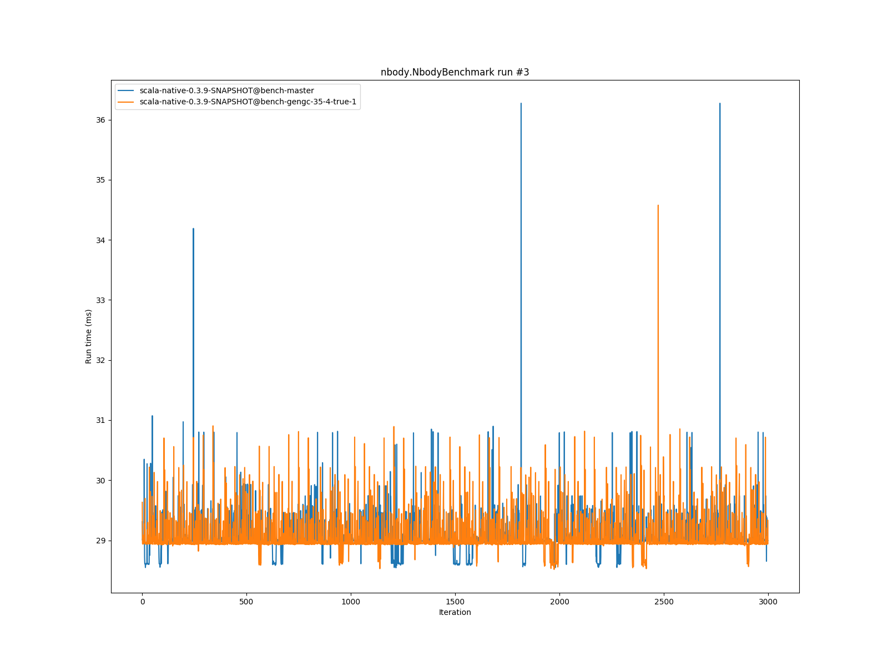
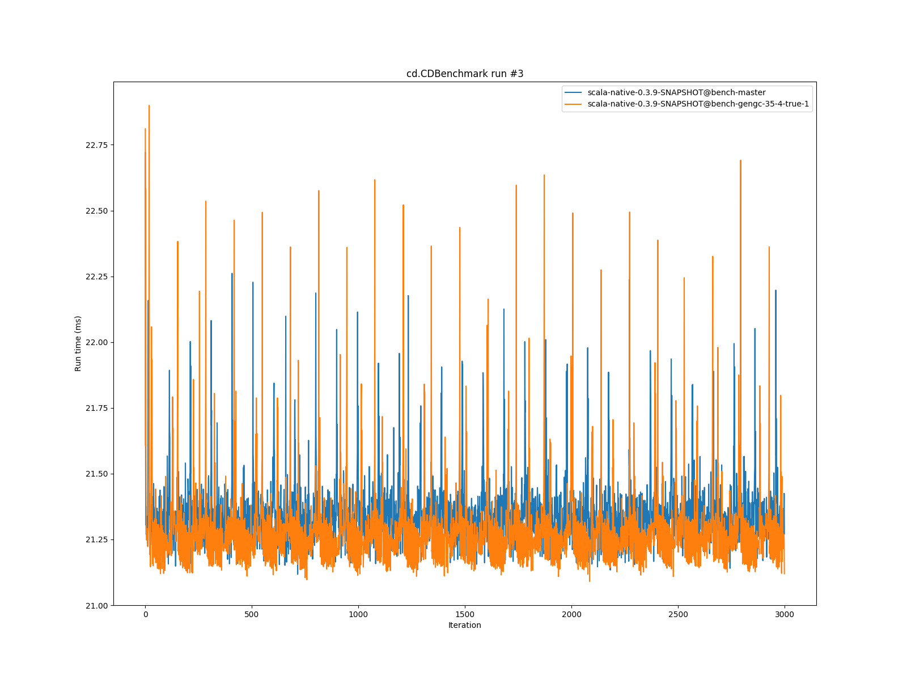

# Summary
## Benchmark run time (ms) at 50 percentile 

|name | scala-native-0.3.9-SNAPSHOT@bench-master | scala-native-0.3.9-SNAPSHOT@bench-gengc-35-4-true-1 | |
| -- | -- | -- | -- |
|[permute.PermuteBenchmark](#permutepermutebenchmark)|0.1756|0.1869|+6.42%|
|[queens.QueensBenchmark](#queensqueensbenchmark)|0.0774|0.0767|__-0.89%__|
|[json.JsonBenchmark](#jsonjsonbenchmark)|1.1884|1.1851|__-0.28%__|
|[brainfuck.BrainfuckBenchmark](#brainfuckbrainfuckbenchmark)|3.0479|3.2225|+5.73%|
|[nbody.NbodyBenchmark](#nbodynbodybenchmark)|28.9916|28.9580|__-0.12%__|
|[mandelbrot.MandelbrotBenchmark](#mandelbrotmandelbrotbenchmark)|114.3510|114.3315|__-0.02%__|
|[list.ListBenchmark](#listlistbenchmark)|0.0429|0.0514|+19.87%|
|[tracer.TracerBenchmark](#tracertracerbenchmark)|0.6086|0.6498|+6.77%|
|[deltablue.DeltaBlueBenchmark](#deltabluedeltabluebenchmark)|0.1731|0.1768|+2.14%|
|[cd.CDBenchmark](#cdcdbenchmark)|21.3548|21.2447|__-0.52%__|
|[sudoku.SudokuBenchmark](#sudokusudokubenchmark)|1.7932|1.8574|+3.58%|
|[kmeans.KmeansBenchmark](#kmeanskmeansbenchmark)|42.1515|42.5740|+1.00%|
|[gcbench.GCBenchBenchmark](#gcbenchgcbenchbenchmark)|95.7846|95.1851|__-0.63%__|
|[richards.RichardsBenchmark](#richardsrichardsbenchmark)|0.0790|0.0834|+5.58%|
|[bounce.BounceBenchmark](#bouncebouncebenchmark)|0.0450|0.0475|+5.52%|
| __Geometrical mean:__|| |+3.49%|
## Benchmark run time (ms) at 90 percentile 

|name | scala-native-0.3.9-SNAPSHOT@bench-master | scala-native-0.3.9-SNAPSHOT@bench-gengc-35-4-true-1 | |
| -- | -- | -- | -- |
|[permute.PermuteBenchmark](#permutepermutebenchmark)|0.1793|0.1919|+7.02%|
|[queens.QueensBenchmark](#queensqueensbenchmark)|0.0796|0.0785|__-1.34%__|
|[json.JsonBenchmark](#jsonjsonbenchmark)|1.1988|1.3114|+9.39%|
|[brainfuck.BrainfuckBenchmark](#brainfuckbrainfuckbenchmark)|3.0719|3.3432|+8.83%|
|[nbody.NbodyBenchmark](#nbodynbodybenchmark)|29.4740|29.4180|__-0.19%__|
|[mandelbrot.MandelbrotBenchmark](#mandelbrotmandelbrotbenchmark)|114.4663|114.4443|__-0.02%__|
|[list.ListBenchmark](#listlistbenchmark)|0.0439|0.0520|+18.50%|
|[tracer.TracerBenchmark](#tracertracerbenchmark)|0.6129|0.6590|+7.52%|
|[deltablue.DeltaBlueBenchmark](#deltabluedeltabluebenchmark)|0.1776|0.1895|+6.72%|
|[cd.CDBenchmark](#cdcdbenchmark)|21.5335|21.3910|__-0.66%__|
|[sudoku.SudokuBenchmark](#sudokusudokubenchmark)|1.9290|1.9190|__-0.52%__|
|[kmeans.KmeansBenchmark](#kmeanskmeansbenchmark)|43.3763|43.5488|+0.40%|
|[gcbench.GCBenchBenchmark](#gcbenchgcbenchbenchmark)|96.7755|104.8940|+8.39%|
|[richards.RichardsBenchmark](#richardsrichardsbenchmark)|0.0815|0.0857|+5.23%|
|[bounce.BounceBenchmark](#bouncebouncebenchmark)|0.0461|0.0486|+5.43%|
| __Geometrical mean:__|| |+4.85%|
## Benchmark run time (ms) at 99 percentile 

|name | scala-native-0.3.9-SNAPSHOT@bench-master | scala-native-0.3.9-SNAPSHOT@bench-gengc-35-4-true-1 | |
| -- | -- | -- | -- |
|[permute.PermuteBenchmark](#permutepermutebenchmark)|0.1948|0.1968|+1.04%|
|[queens.QueensBenchmark](#queensqueensbenchmark)|0.0828|0.0822|__-0.69%__|
|[json.JsonBenchmark](#jsonjsonbenchmark)|1.2283|1.3529|+10.14%|
|[brainfuck.BrainfuckBenchmark](#brainfuckbrainfuckbenchmark)|3.2144|3.4383|+6.96%|
|[nbody.NbodyBenchmark](#nbodynbodybenchmark)|30.5462|30.3518|__-0.64%__|
|[mandelbrot.MandelbrotBenchmark](#mandelbrotmandelbrotbenchmark)|115.3908|115.3769|__-0.01%__|
|[list.ListBenchmark](#listlistbenchmark)|0.0450|0.0534|+18.79%|
|[tracer.TracerBenchmark](#tracertracerbenchmark)|0.6295|0.6888|+9.42%|
|[deltablue.DeltaBlueBenchmark](#deltabluedeltabluebenchmark)|0.2011|0.2127|+5.78%|
|[cd.CDBenchmark](#cdcdbenchmark)|21.9787|21.9760|__-0.01%__|
|[sudoku.SudokuBenchmark](#sudokusudokubenchmark)|1.9925|1.9812|__-0.56%__|
|[kmeans.KmeansBenchmark](#kmeanskmeansbenchmark)|44.7395|336.2796|+651.64%|
|[gcbench.GCBenchBenchmark](#gcbenchgcbenchbenchmark)|98.4781|108.5777|+10.26%|
|[richards.RichardsBenchmark](#richardsrichardsbenchmark)|0.0916|0.0910|__-0.64%__|
|[bounce.BounceBenchmark](#bouncebouncebenchmark)|0.0470|0.0502|+6.69%|
| __Geometrical mean:__|| |+19.29%|
# Individual benchmarks
## permute.PermuteBenchmark

## queens.QueensBenchmark

## json.JsonBenchmark

## brainfuck.BrainfuckBenchmark

## nbody.NbodyBenchmark

## mandelbrot.MandelbrotBenchmark

## list.ListBenchmark

## tracer.TracerBenchmark

## deltablue.DeltaBlueBenchmark

## cd.CDBenchmark

## sudoku.SudokuBenchmark

## kmeans.KmeansBenchmark

## gcbench.GCBenchBenchmark

## richards.RichardsBenchmark

## bounce.BounceBenchmark

