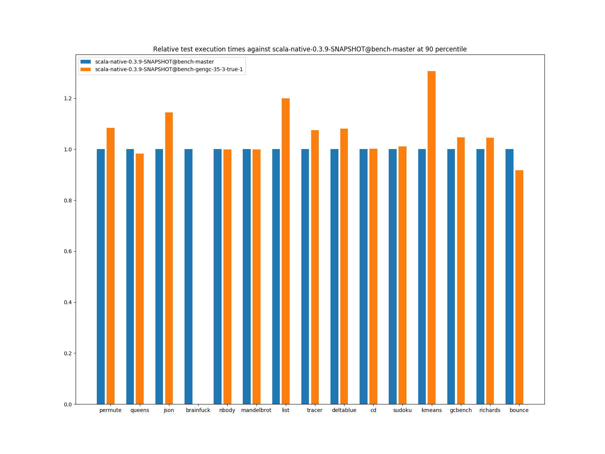
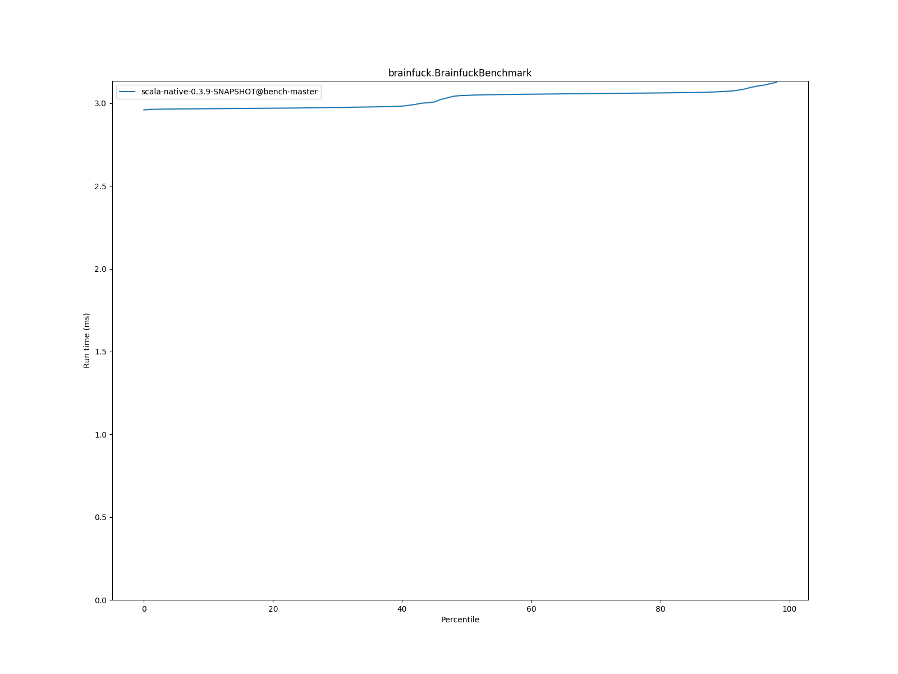
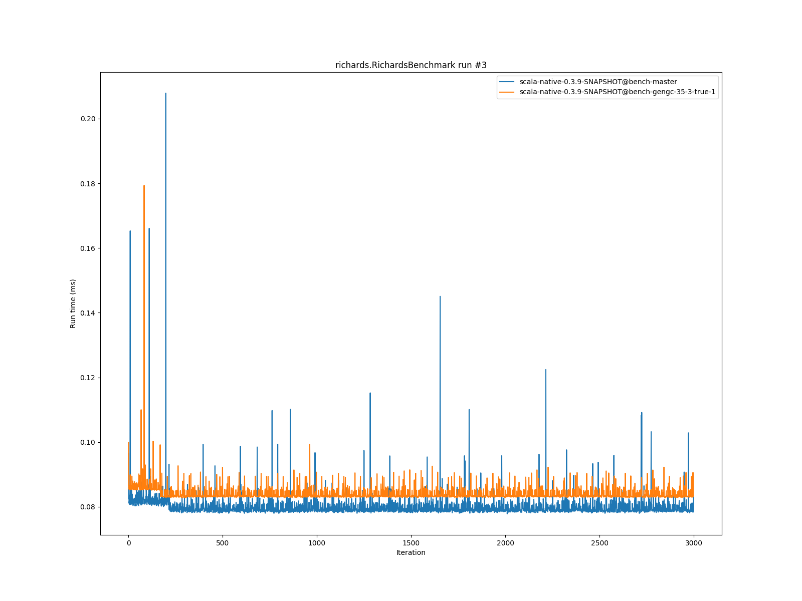

# Summary
## Benchmark run time (ms) at 50 percentile 

|name | scala-native-0.3.9-SNAPSHOT@bench-master | scala-native-0.3.9-SNAPSHOT@bench-gengc-35-3-true-1 | |
| -- | -- | -- | -- |
|[permute.PermuteBenchmark](#permutepermutebenchmark)|0.1756|0.1891|+7.67%|
|[queens.QueensBenchmark](#queensqueensbenchmark)|0.0774|0.0776|+0.31%|
|[json.JsonBenchmark](#jsonjsonbenchmark)|1.1884|1.2506|+5.23%|
|[brainfuck.BrainfuckBenchmark](#brainfuckbrainfuckbenchmark)|3.0479|0.0000|__-100.00%__|
|[nbody.NbodyBenchmark](#nbodynbodybenchmark)|28.9916|28.9960|+0.02%|
|[mandelbrot.MandelbrotBenchmark](#mandelbrotmandelbrotbenchmark)|114.3510|114.3552|+0.00%|
|[list.ListBenchmark](#listlistbenchmark)|0.0429|0.0513|+19.63%|
|[tracer.TracerBenchmark](#tracertracerbenchmark)|0.6086|0.6478|+6.44%|
|[deltablue.DeltaBlueBenchmark](#deltabluedeltabluebenchmark)|0.1731|0.1794|+3.64%|
|[cd.CDBenchmark](#cdcdbenchmark)|21.3548|21.3737|+0.09%|
|[sudoku.SudokuBenchmark](#sudokusudokubenchmark)|1.7932|1.9046|+6.21%|
|[kmeans.KmeansBenchmark](#kmeanskmeansbenchmark)|42.1515|43.8736|+4.09%|
|[gcbench.GCBenchBenchmark](#gcbenchgcbenchbenchmark)|95.7846|92.2159|__-3.73%__|
|[richards.RichardsBenchmark](#richardsrichardsbenchmark)|0.0790|0.0832|+5.29%|
|[bounce.BounceBenchmark](#bouncebouncebenchmark)|0.0450|0.0420|__-6.69%__|
| __Geometrical mean:__|| |+3.28%|
## Benchmark run time (ms) at 90 percentile 

|name | scala-native-0.3.9-SNAPSHOT@bench-master | scala-native-0.3.9-SNAPSHOT@bench-gengc-35-3-true-1 | |
| -- | -- | -- | -- |
|[permute.PermuteBenchmark](#permutepermutebenchmark)|0.1793|0.1944|+8.41%|
|[queens.QueensBenchmark](#queensqueensbenchmark)|0.0796|0.0782|__-1.76%__|
|[json.JsonBenchmark](#jsonjsonbenchmark)|1.1988|1.3730|+14.53%|
|[brainfuck.BrainfuckBenchmark](#brainfuckbrainfuckbenchmark)|3.0719|0.0000|__-100.00%__|
|[nbody.NbodyBenchmark](#nbodynbodybenchmark)|29.4740|29.4714|__-0.01%__|
|[mandelbrot.MandelbrotBenchmark](#mandelbrotmandelbrotbenchmark)|114.4663|114.4557|__-0.01%__|
|[list.ListBenchmark](#listlistbenchmark)|0.0439|0.0527|+19.90%|
|[tracer.TracerBenchmark](#tracertracerbenchmark)|0.6129|0.6586|+7.46%|
|[deltablue.DeltaBlueBenchmark](#deltabluedeltabluebenchmark)|0.1776|0.1920|+8.13%|
|[cd.CDBenchmark](#cdcdbenchmark)|21.5335|21.5862|+0.24%|
|[sudoku.SudokuBenchmark](#sudokusudokubenchmark)|1.9290|1.9497|+1.07%|
|[kmeans.KmeansBenchmark](#kmeanskmeansbenchmark)|43.3763|56.6746|+30.66%|
|[gcbench.GCBenchBenchmark](#gcbenchgcbenchbenchmark)|96.7755|101.2522|+4.63%|
|[richards.RichardsBenchmark](#richardsrichardsbenchmark)|0.0815|0.0852|+4.60%|
|[bounce.BounceBenchmark](#bouncebouncebenchmark)|0.0461|0.0423|__-8.28%__|
| __Geometrical mean:__|| |+5.99%|
## Benchmark run time (ms) at 99 percentile 

|name | scala-native-0.3.9-SNAPSHOT@bench-master | scala-native-0.3.9-SNAPSHOT@bench-gengc-35-3-true-1 | |
| -- | -- | -- | -- |
|[permute.PermuteBenchmark](#permutepermutebenchmark)|0.1948|0.1984|+1.85%|
|[queens.QueensBenchmark](#queensqueensbenchmark)|0.0828|0.0829|+0.20%|
|[json.JsonBenchmark](#jsonjsonbenchmark)|1.2283|1.4170|+15.36%|
|[brainfuck.BrainfuckBenchmark](#brainfuckbrainfuckbenchmark)|3.2144|0.0000|__-100.00%__|
|[nbody.NbodyBenchmark](#nbodynbodybenchmark)|30.5462|30.7099|+0.54%|
|[mandelbrot.MandelbrotBenchmark](#mandelbrotmandelbrotbenchmark)|115.3908|115.3872|__-0.00%__|
|[list.ListBenchmark](#listlistbenchmark)|0.0450|0.0541|+20.21%|
|[tracer.TracerBenchmark](#tracertracerbenchmark)|0.6295|0.6893|+9.50%|
|[deltablue.DeltaBlueBenchmark](#deltabluedeltabluebenchmark)|0.2011|0.2271|+12.93%|
|[cd.CDBenchmark](#cdcdbenchmark)|21.9787|22.3658|+1.76%|
|[sudoku.SudokuBenchmark](#sudokusudokubenchmark)|1.9925|1.9892|__-0.16%__|
|[kmeans.KmeansBenchmark](#kmeanskmeansbenchmark)|44.7395|60.1092|+34.35%|
|[gcbench.GCBenchBenchmark](#gcbenchgcbenchbenchmark)|98.4781|105.5194|+7.15%|
|[richards.RichardsBenchmark](#richardsrichardsbenchmark)|0.0916|0.0903|__-1.35%__|
|[bounce.BounceBenchmark](#bouncebouncebenchmark)|0.0470|0.0441|__-6.26%__|
| __Geometrical mean:__|| |+6.39%|
# Individual benchmarks
## permute.PermuteBenchmark

## queens.QueensBenchmark

## json.JsonBenchmark

## brainfuck.BrainfuckBenchmark

## nbody.NbodyBenchmark

## mandelbrot.MandelbrotBenchmark

## list.ListBenchmark

## tracer.TracerBenchmark

## deltablue.DeltaBlueBenchmark

## cd.CDBenchmark

## sudoku.SudokuBenchmark

## kmeans.KmeansBenchmark

## gcbench.GCBenchBenchmark

## richards.RichardsBenchmark

## bounce.BounceBenchmark

