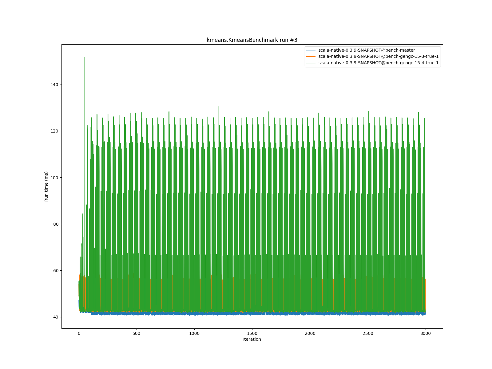
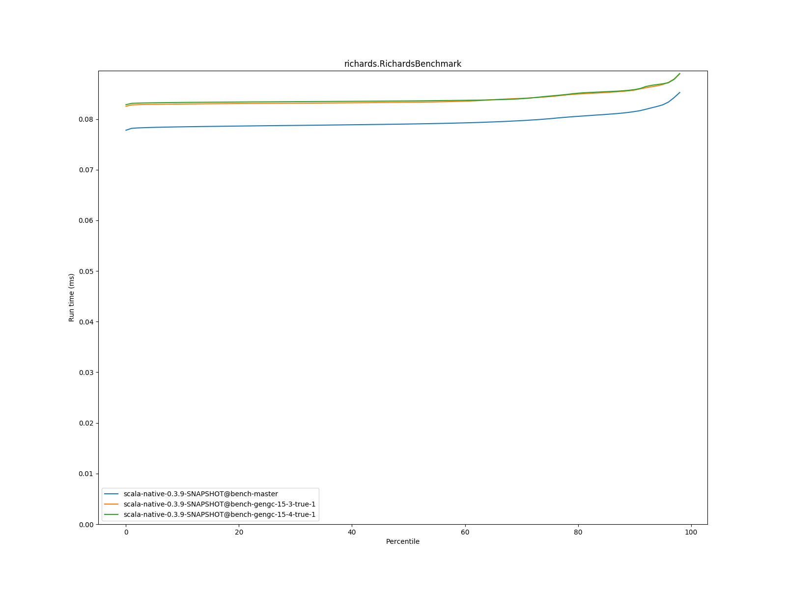

# Summary
## Benchmark run time (ms) at 50 percentile 

|name | scala-native-0.3.9-SNAPSHOT@bench-master | scala-native-0.3.9-SNAPSHOT@bench-gengc-15-3-true-1 |  | scala-native-0.3.9-SNAPSHOT@bench-gengc-15-4-true-1 | |
| -- | -- | -- | -- | -- | -- |
|[permute.PermuteBenchmark](#permutepermutebenchmark)|0.1756|0.1889|+7.60%|0.1881|+7.11%|
|[queens.QueensBenchmark](#queensqueensbenchmark)|0.0774|0.0772|__-0.21%__|0.0770|__-0.44%__|
|[json.JsonBenchmark](#jsonjsonbenchmark)|1.1884|1.2041|+1.32%|1.1975|+0.77%|
|[brainfuck.BrainfuckBenchmark](#brainfuckbrainfuckbenchmark)|3.0479|0.0000|__-100.00%__|0.0000|__-100.00%__|
|[nbody.NbodyBenchmark](#nbodynbodybenchmark)|28.9916|28.9855|__-0.02%__|28.9647|__-0.09%__|
|[mandelbrot.MandelbrotBenchmark](#mandelbrotmandelbrotbenchmark)|114.3510|114.3004|__-0.04%__|115.2243|+0.76%|
|[list.ListBenchmark](#listlistbenchmark)|0.0429|0.0452|+5.41%|0.0433|+1.04%|
|[tracer.TracerBenchmark](#tracertracerbenchmark)|0.6086|0.6561|+7.81%|0.6621|+8.80%|
|[deltablue.DeltaBlueBenchmark](#deltabluedeltabluebenchmark)|0.1731|0.1760|+1.66%|0.1765|+1.97%|
|[cd.CDBenchmark](#cdcdbenchmark)|21.3548|21.2919|__-0.29%__|21.2821|__-0.34%__|
|[sudoku.SudokuBenchmark](#sudokusudokubenchmark)|1.7932|1.8531|+3.34%|1.8530|+3.33%|
|[kmeans.KmeansBenchmark](#kmeanskmeansbenchmark)|42.1515|43.5295|+3.27%|42.7583|+1.44%|
|[gcbench.GCBenchBenchmark](#gcbenchgcbenchbenchmark)|95.7846|92.4793|__-3.45%__|94.4272|__-1.42%__|
|[richards.RichardsBenchmark](#richardsrichardsbenchmark)|0.0790|0.0833|+5.44%|0.0836|+5.77%|
|[bounce.BounceBenchmark](#bouncebouncebenchmark)|0.0450|0.0450|__-0.14%__|0.0445|__-1.13%__|
| __Geometrical mean:__|| |+2.21%| |+1.92%|
## Benchmark run time (ms) at 90 percentile 

|name | scala-native-0.3.9-SNAPSHOT@bench-master | scala-native-0.3.9-SNAPSHOT@bench-gengc-15-3-true-1 |  | scala-native-0.3.9-SNAPSHOT@bench-gengc-15-4-true-1 | |
| -- | -- | -- | -- | -- | -- |
|[permute.PermuteBenchmark](#permutepermutebenchmark)|0.1793|0.1929|+7.58%|0.1917|+6.91%|
|[queens.QueensBenchmark](#queensqueensbenchmark)|0.0796|0.0789|__-0.89%__|0.0791|__-0.60%__|
|[json.JsonBenchmark](#jsonjsonbenchmark)|1.1988|1.3048|+8.84%|1.2970|+8.20%|
|[brainfuck.BrainfuckBenchmark](#brainfuckbrainfuckbenchmark)|3.0719|0.0000|__-100.00%__|0.0000|__-100.00%__|
|[nbody.NbodyBenchmark](#nbodynbodybenchmark)|29.4740|29.4607|__-0.05%__|29.4479|__-0.09%__|
|[mandelbrot.MandelbrotBenchmark](#mandelbrotmandelbrotbenchmark)|114.4663|114.3915|__-0.07%__|115.3184|+0.74%|
|[list.ListBenchmark](#listlistbenchmark)|0.0439|0.0462|+5.09%|0.0443|+0.94%|
|[tracer.TracerBenchmark](#tracertracerbenchmark)|0.6129|0.6647|+8.45%|0.6797|+10.90%|
|[deltablue.DeltaBlueBenchmark](#deltabluedeltabluebenchmark)|0.1776|0.2031|+14.37%|0.2023|+13.95%|
|[cd.CDBenchmark](#cdcdbenchmark)|21.5335|21.5270|__-0.03%__|21.4097|__-0.58%__|
|[sudoku.SudokuBenchmark](#sudokusudokubenchmark)|1.9290|1.8989|__-1.56%__|1.9988|+3.62%|
|[kmeans.KmeansBenchmark](#kmeanskmeansbenchmark)|43.3763|56.8103|+30.97%|112.2283|+158.73%|
|[gcbench.GCBenchBenchmark](#gcbenchgcbenchbenchmark)|96.7755|101.3890|+4.77%|103.7449|+7.20%|
|[richards.RichardsBenchmark](#richardsrichardsbenchmark)|0.0815|0.0857|+5.21%|0.0858|+5.32%|
|[bounce.BounceBenchmark](#bouncebouncebenchmark)|0.0461|0.0462|+0.27%|0.0456|__-1.05%__|
| __Geometrical mean:__|| |+5.63%| |+11.16%|
## Benchmark run time (ms) at 99 percentile 

|name | scala-native-0.3.9-SNAPSHOT@bench-master | scala-native-0.3.9-SNAPSHOT@bench-gengc-15-3-true-1 |  | scala-native-0.3.9-SNAPSHOT@bench-gengc-15-4-true-1 | |
| -- | -- | -- | -- | -- | -- |
|[permute.PermuteBenchmark](#permutepermutebenchmark)|0.1948|0.1996|+2.48%|0.1974|+1.33%|
|[queens.QueensBenchmark](#queensqueensbenchmark)|0.0828|0.0809|__-2.20%__|0.0818|__-1.11%__|
|[json.JsonBenchmark](#jsonjsonbenchmark)|1.2283|1.3783|+12.21%|1.3545|+10.27%|
|[brainfuck.BrainfuckBenchmark](#brainfuckbrainfuckbenchmark)|3.2144|0.0000|__-100.00%__|0.0000|__-100.00%__|
|[nbody.NbodyBenchmark](#nbodynbodybenchmark)|30.5462|30.5635|+0.06%|30.5676|+0.07%|
|[mandelbrot.MandelbrotBenchmark](#mandelbrotmandelbrotbenchmark)|115.3908|115.3104|__-0.07%__|116.2809|+0.77%|
|[list.ListBenchmark](#listlistbenchmark)|0.0450|0.0472|+4.80%|0.0456|+1.35%|
|[tracer.TracerBenchmark](#tracertracerbenchmark)|0.6295|0.6923|+9.97%|0.7824|+24.28%|
|[deltablue.DeltaBlueBenchmark](#deltabluedeltabluebenchmark)|0.2011|0.2245|+11.63%|0.2153|+7.09%|
|[cd.CDBenchmark](#cdcdbenchmark)|21.9787|22.2411|+1.19%|22.0838|+0.48%|
|[sudoku.SudokuBenchmark](#sudokusudokubenchmark)|1.9925|1.9397|__-2.65%__|2.0852|+4.65%|
|[kmeans.KmeansBenchmark](#kmeanskmeansbenchmark)|44.7395|70.4288|+57.42%|125.8576|+181.31%|
|[gcbench.GCBenchBenchmark](#gcbenchgcbenchbenchmark)|98.4781|105.7152|+7.35%|107.4713|+9.13%|
|[richards.RichardsBenchmark](#richardsrichardsbenchmark)|0.0916|0.0904|__-1.33%__|0.0917|+0.19%|
|[bounce.BounceBenchmark](#bouncebouncebenchmark)|0.0470|0.0488|+3.67%|0.0480|+2.09%|
| __Geometrical mean:__|| |+6.65%| |+12.12%|
# Individual benchmarks
## permute.PermuteBenchmark

## queens.QueensBenchmark

## json.JsonBenchmark

## brainfuck.BrainfuckBenchmark

## nbody.NbodyBenchmark

## mandelbrot.MandelbrotBenchmark

## list.ListBenchmark

## tracer.TracerBenchmark

## deltablue.DeltaBlueBenchmark

## cd.CDBenchmark

## sudoku.SudokuBenchmark

## kmeans.KmeansBenchmark

## gcbench.GCBenchBenchmark

## richards.RichardsBenchmark

## bounce.BounceBenchmark

