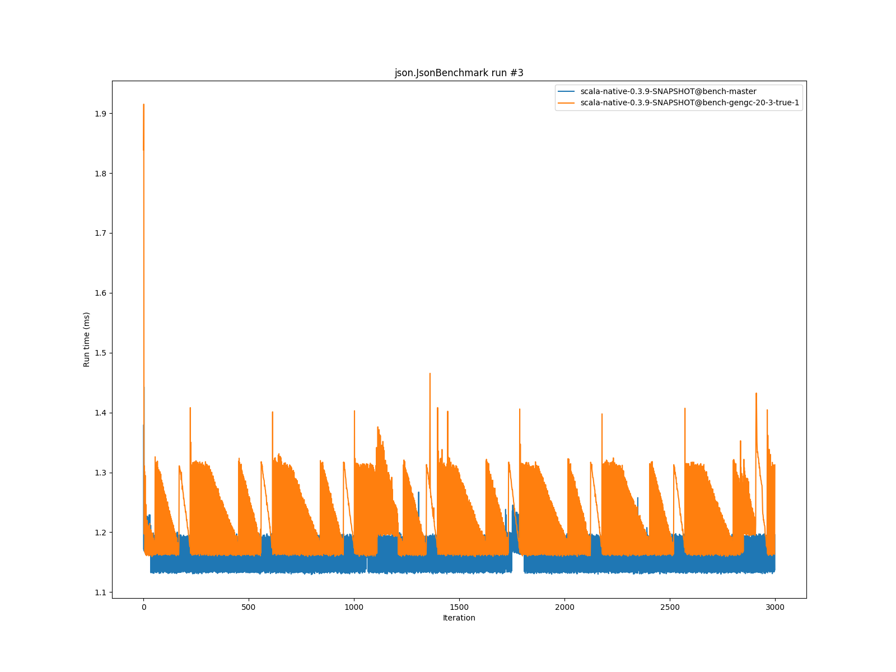

# Summary
## Benchmark run time (ms) at 50 percentile 

|name | scala-native-0.3.9-SNAPSHOT@bench-master | scala-native-0.3.9-SNAPSHOT@bench-gengc-20-3-true-1 | |
| -- | -- | -- | -- |
|[permute.PermuteBenchmark](#permutepermutebenchmark)|0.1756|0.2154|+22.65%|
|[queens.QueensBenchmark](#queensqueensbenchmark)|0.0774|0.0768|__-0.77%__|
|[json.JsonBenchmark](#jsonjsonbenchmark)|1.1884|1.1741|__-1.21%__|
|[brainfuck.BrainfuckBenchmark](#brainfuckbrainfuckbenchmark)|3.0479|0.0000|__-100.00%__|
|[nbody.NbodyBenchmark](#nbodynbodybenchmark)|28.9916|28.9870|__-0.02%__|
|[mandelbrot.MandelbrotBenchmark](#mandelbrotmandelbrotbenchmark)|114.3510|114.9568|+0.53%|
|[list.ListBenchmark](#listlistbenchmark)|0.0429|0.0433|+1.03%|
|[tracer.TracerBenchmark](#tracertracerbenchmark)|0.6086|0.6541|+7.48%|
|[deltablue.DeltaBlueBenchmark](#deltabluedeltabluebenchmark)|0.1731|0.1785|+3.11%|
|[cd.CDBenchmark](#cdcdbenchmark)|21.3548|21.4768|+0.57%|
|[sudoku.SudokuBenchmark](#sudokusudokubenchmark)|1.7932|1.8236|+1.70%|
|[kmeans.KmeansBenchmark](#kmeanskmeansbenchmark)|42.1515|43.1043|+2.26%|
|[gcbench.GCBenchBenchmark](#gcbenchgcbenchbenchmark)|95.7846|90.8319|__-5.17%__|
|[richards.RichardsBenchmark](#richardsrichardsbenchmark)|0.0790|0.0836|+5.82%|
|[bounce.BounceBenchmark](#bouncebouncebenchmark)|0.0450|0.0462|+2.70%|
| __Geometrical mean:__|| |+2.73%|
## Benchmark run time (ms) at 90 percentile 

|name | scala-native-0.3.9-SNAPSHOT@bench-master | scala-native-0.3.9-SNAPSHOT@bench-gengc-20-3-true-1 | |
| -- | -- | -- | -- |
|[permute.PermuteBenchmark](#permutepermutebenchmark)|0.1793|0.2231|+24.39%|
|[queens.QueensBenchmark](#queensqueensbenchmark)|0.0796|0.0784|__-1.46%__|
|[json.JsonBenchmark](#jsonjsonbenchmark)|1.1988|1.3002|+8.45%|
|[brainfuck.BrainfuckBenchmark](#brainfuckbrainfuckbenchmark)|3.0719|0.0000|__-100.00%__|
|[nbody.NbodyBenchmark](#nbodynbodybenchmark)|29.4740|29.4517|__-0.08%__|
|[mandelbrot.MandelbrotBenchmark](#mandelbrotmandelbrotbenchmark)|114.4663|115.0768|+0.53%|
|[list.ListBenchmark](#listlistbenchmark)|0.0439|0.0443|+0.93%|
|[tracer.TracerBenchmark](#tracertracerbenchmark)|0.6129|0.6658|+8.63%|
|[deltablue.DeltaBlueBenchmark](#deltabluedeltabluebenchmark)|0.1776|0.2051|+15.51%|
|[cd.CDBenchmark](#cdcdbenchmark)|21.5335|21.7219|+0.87%|
|[sudoku.SudokuBenchmark](#sudokusudokubenchmark)|1.9290|1.8698|__-3.07%__|
|[kmeans.KmeansBenchmark](#kmeanskmeansbenchmark)|43.3763|69.2556|+59.66%|
|[gcbench.GCBenchBenchmark](#gcbenchgcbenchbenchmark)|96.7755|98.4061|+1.68%|
|[richards.RichardsBenchmark](#richardsrichardsbenchmark)|0.0815|0.0860|+5.54%|
|[bounce.BounceBenchmark](#bouncebouncebenchmark)|0.0461|0.0475|+2.93%|
| __Geometrical mean:__|| |+7.95%|
## Benchmark run time (ms) at 99 percentile 

|name | scala-native-0.3.9-SNAPSHOT@bench-master | scala-native-0.3.9-SNAPSHOT@bench-gengc-20-3-true-1 | |
| -- | -- | -- | -- |
|[permute.PermuteBenchmark](#permutepermutebenchmark)|0.1948|0.2266|+16.34%|
|[queens.QueensBenchmark](#queensqueensbenchmark)|0.0828|0.0810|__-2.07%__|
|[json.JsonBenchmark](#jsonjsonbenchmark)|1.2283|1.3382|+8.94%|
|[brainfuck.BrainfuckBenchmark](#brainfuckbrainfuckbenchmark)|3.2144|0.0000|__-100.00%__|
|[nbody.NbodyBenchmark](#nbodynbodybenchmark)|30.5462|30.5892|+0.14%|
|[mandelbrot.MandelbrotBenchmark](#mandelbrotmandelbrotbenchmark)|115.3908|116.0315|+0.56%|
|[list.ListBenchmark](#listlistbenchmark)|0.0450|0.0455|+1.10%|
|[tracer.TracerBenchmark](#tracertracerbenchmark)|0.6295|0.6924|+9.99%|
|[deltablue.DeltaBlueBenchmark](#deltabluedeltabluebenchmark)|0.2011|0.2281|+13.42%|
|[cd.CDBenchmark](#cdcdbenchmark)|21.9787|22.5297|+2.51%|
|[sudoku.SudokuBenchmark](#sudokusudokubenchmark)|1.9925|1.9001|__-4.64%__|
|[kmeans.KmeansBenchmark](#kmeanskmeansbenchmark)|44.7395|121.5122|+171.60%|
|[gcbench.GCBenchBenchmark](#gcbenchgcbenchbenchmark)|98.4781|105.2188|+6.84%|
|[richards.RichardsBenchmark](#richardsrichardsbenchmark)|0.0916|0.0907|__-0.97%__|
|[bounce.BounceBenchmark](#bouncebouncebenchmark)|0.0470|0.0496|+5.33%|
| __Geometrical mean:__|| |+11.63%|
# Individual benchmarks
## permute.PermuteBenchmark

## queens.QueensBenchmark

## json.JsonBenchmark

## brainfuck.BrainfuckBenchmark

## nbody.NbodyBenchmark

## mandelbrot.MandelbrotBenchmark

## list.ListBenchmark

## tracer.TracerBenchmark

## deltablue.DeltaBlueBenchmark

## cd.CDBenchmark

## sudoku.SudokuBenchmark

## kmeans.KmeansBenchmark

## gcbench.GCBenchBenchmark

## richards.RichardsBenchmark

## bounce.BounceBenchmark

