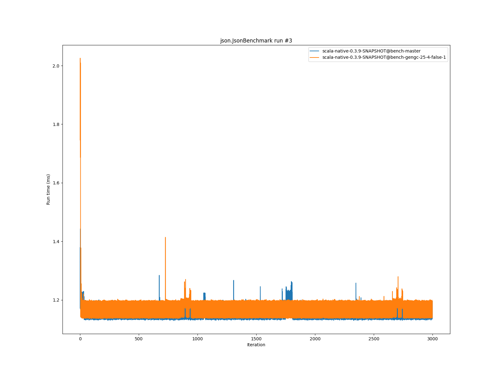
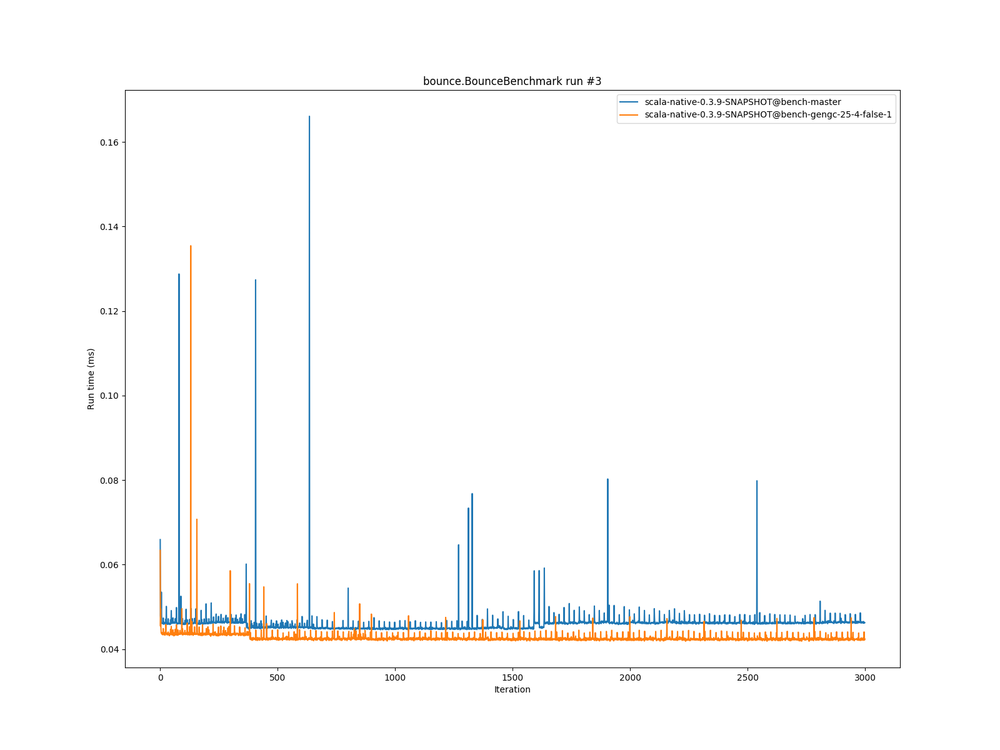

# Summary
## Benchmark run time (ms) at 50 percentile 

|name | scala-native-0.3.9-SNAPSHOT@bench-master | scala-native-0.3.9-SNAPSHOT@bench-gengc-25-4-false-1 | |
| -- | -- | -- | -- |
|[permute.PermuteBenchmark](#permutepermutebenchmark)|0.1756|0.1891|+7.69%|
|[queens.QueensBenchmark](#queensqueensbenchmark)|0.0774|0.0765|__-1.06%__|
|[json.JsonBenchmark](#jsonjsonbenchmark)|1.1884|1.1419|__-3.91%__|
|[brainfuck.BrainfuckBenchmark](#brainfuckbrainfuckbenchmark)|3.0479|3.1812|+4.37%|
|[nbody.NbodyBenchmark](#nbodynbodybenchmark)|28.9916|28.9613|__-0.10%__|
|[mandelbrot.MandelbrotBenchmark](#mandelbrotmandelbrotbenchmark)|114.3510|114.3517|+0.00%|
|[list.ListBenchmark](#listlistbenchmark)|0.0429|0.0514|+19.90%|
|[tracer.TracerBenchmark](#tracertracerbenchmark)|0.6086|0.6528|+7.28%|
|[deltablue.DeltaBlueBenchmark](#deltabluedeltabluebenchmark)|0.1731|0.1715|__-0.96%__|
|[cd.CDBenchmark](#cdcdbenchmark)|21.3548|21.3520|__-0.01%__|
|[sudoku.SudokuBenchmark](#sudokusudokubenchmark)|1.7932|1.8589|+3.67%|
|[kmeans.KmeansBenchmark](#kmeanskmeansbenchmark)|42.1515|43.5654|+3.35%|
|[gcbench.GCBenchBenchmark](#gcbenchgcbenchbenchmark)|95.7846|93.2776|__-2.62%__|
|[richards.RichardsBenchmark](#richardsrichardsbenchmark)|0.0790|0.0833|+5.37%|
|[bounce.BounceBenchmark](#bouncebouncebenchmark)|0.0450|0.0424|__-5.87%__|
| __Geometrical mean:__|| |+2.30%|
## Benchmark run time (ms) at 90 percentile 

|name | scala-native-0.3.9-SNAPSHOT@bench-master | scala-native-0.3.9-SNAPSHOT@bench-gengc-25-4-false-1 | |
| -- | -- | -- | -- |
|[permute.PermuteBenchmark](#permutepermutebenchmark)|0.1793|0.1934|+7.87%|
|[queens.QueensBenchmark](#queensqueensbenchmark)|0.0796|0.0786|__-1.26%__|
|[json.JsonBenchmark](#jsonjsonbenchmark)|1.1988|1.2007|+0.16%|
|[brainfuck.BrainfuckBenchmark](#brainfuckbrainfuckbenchmark)|3.0719|3.2435|+5.59%|
|[nbody.NbodyBenchmark](#nbodynbodybenchmark)|29.4740|29.4250|__-0.17%__|
|[mandelbrot.MandelbrotBenchmark](#mandelbrotmandelbrotbenchmark)|114.4663|114.4620|__-0.00%__|
|[list.ListBenchmark](#listlistbenchmark)|0.0439|0.0523|+19.16%|
|[tracer.TracerBenchmark](#tracertracerbenchmark)|0.6129|0.6639|+8.33%|
|[deltablue.DeltaBlueBenchmark](#deltabluedeltabluebenchmark)|0.1776|0.1957|+10.20%|
|[cd.CDBenchmark](#cdcdbenchmark)|21.5335|21.5022|__-0.15%__|
|[sudoku.SudokuBenchmark](#sudokusudokubenchmark)|1.9290|1.9088|__-1.05%__|
|[kmeans.KmeansBenchmark](#kmeanskmeansbenchmark)|43.3763|44.4392|+2.45%|
|[gcbench.GCBenchBenchmark](#gcbenchgcbenchbenchmark)|96.7755|104.8728|+8.37%|
|[richards.RichardsBenchmark](#richardsrichardsbenchmark)|0.0815|0.0854|+4.84%|
|[bounce.BounceBenchmark](#bouncebouncebenchmark)|0.0461|0.0428|__-7.15%__|
| __Geometrical mean:__|| |+3.64%|
## Benchmark run time (ms) at 99 percentile 

|name | scala-native-0.3.9-SNAPSHOT@bench-master | scala-native-0.3.9-SNAPSHOT@bench-gengc-25-4-false-1 | |
| -- | -- | -- | -- |
|[permute.PermuteBenchmark](#permutepermutebenchmark)|0.1948|0.1975|+1.38%|
|[queens.QueensBenchmark](#queensqueensbenchmark)|0.0828|0.0812|__-1.85%__|
|[json.JsonBenchmark](#jsonjsonbenchmark)|1.2283|1.2120|__-1.33%__|
|[brainfuck.BrainfuckBenchmark](#brainfuckbrainfuckbenchmark)|3.2144|3.3360|+3.78%|
|[nbody.NbodyBenchmark](#nbodynbodybenchmark)|30.5462|30.5215|__-0.08%__|
|[mandelbrot.MandelbrotBenchmark](#mandelbrotmandelbrotbenchmark)|115.3908|115.4014|+0.01%|
|[list.ListBenchmark](#listlistbenchmark)|0.0450|0.0535|+18.89%|
|[tracer.TracerBenchmark](#tracertracerbenchmark)|0.6295|0.6981|+10.89%|
|[deltablue.DeltaBlueBenchmark](#deltabluedeltabluebenchmark)|0.2011|0.2023|+0.61%|
|[cd.CDBenchmark](#cdcdbenchmark)|21.9787|21.8507|__-0.58%__|
|[sudoku.SudokuBenchmark](#sudokusudokubenchmark)|1.9925|2.0289|+1.83%|
|[kmeans.KmeansBenchmark](#kmeanskmeansbenchmark)|44.7395|46.0128|+2.85%|
|[gcbench.GCBenchBenchmark](#gcbenchgcbenchbenchmark)|98.4781|107.0807|+8.74%|
|[richards.RichardsBenchmark](#richardsrichardsbenchmark)|0.0916|0.0907|__-0.92%__|
|[bounce.BounceBenchmark](#bouncebouncebenchmark)|0.0470|0.0445|__-5.32%__|
| __Geometrical mean:__|| |+2.43%|
# Individual benchmarks
## permute.PermuteBenchmark

## queens.QueensBenchmark

## json.JsonBenchmark

## brainfuck.BrainfuckBenchmark

## nbody.NbodyBenchmark

## mandelbrot.MandelbrotBenchmark

## list.ListBenchmark

## tracer.TracerBenchmark

## deltablue.DeltaBlueBenchmark

## cd.CDBenchmark

## sudoku.SudokuBenchmark

## kmeans.KmeansBenchmark

## gcbench.GCBenchBenchmark

## richards.RichardsBenchmark

## bounce.BounceBenchmark

