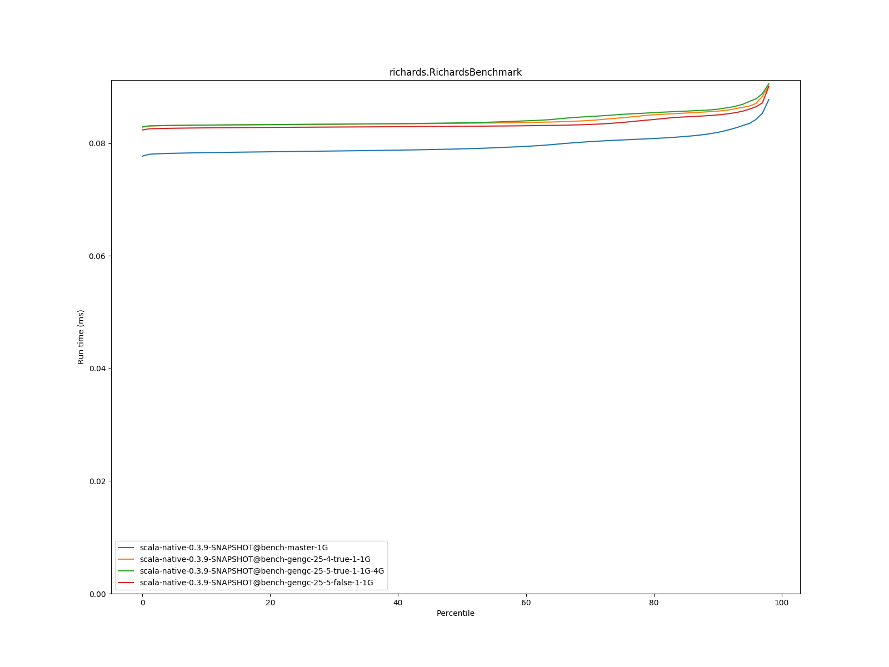
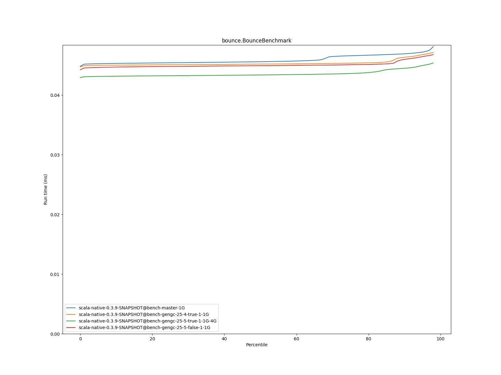

# Summary
## Benchmark run time (ms) at 50 percentile 

|name | scala-native-0.3.9-SNAPSHOT@bench-master-1G | scala-native-0.3.9-SNAPSHOT@bench-gengc-25-4-true-1-1G |  | scala-native-0.3.9-SNAPSHOT@bench-gengc-25-5-true-1-1G-4G |  | scala-native-0.3.9-SNAPSHOT@bench-gengc-25-5-false-1-1G | |
| -- | -- | -- | -- | -- | -- | -- | -- |
|[permute.PermuteBenchmark](#permutepermutebenchmark)|0.1771|0.1870|+5.58%|0.1855|+4.72%|0.1874|+5.80%|
|[queens.QueensBenchmark](#queensqueensbenchmark)|0.0773|0.0769|__-0.55%__|0.0774|+0.11%|0.0765|__-1.13%__|
|[json.JsonBenchmark](#jsonjsonbenchmark)|1.1340|1.1610|+2.38%|1.1613|+2.41%|1.1409|+0.61%|
|[brainfuck.BrainfuckBenchmark](#brainfuckbrainfuckbenchmark)|2.9836|3.0120|+0.95%|3.0261|+1.42%|3.0166|+1.10%|
|[nbody.NbodyBenchmark](#nbodynbodybenchmark)|28.9438|28.9173|__-0.09%__|28.9239|__-0.07%__|28.9188|__-0.09%__|
|[mandelbrot.MandelbrotBenchmark](#mandelbrotmandelbrotbenchmark)|114.4066|115.2177|+0.71%|114.3905|__-0.01%__|114.3206|__-0.08%__|
|[list.ListBenchmark](#listlistbenchmark)|0.0514|0.0512|__-0.36%__|0.0424|__-17.56%__|0.0423|__-17.66%__|
|[tracer.TracerBenchmark](#tracertracerbenchmark)|0.5990|0.6365|+6.27%|0.6365|+6.25%|0.6345|+5.93%|
|[deltablue.DeltaBlueBenchmark](#deltabluedeltabluebenchmark)|0.1742|0.1757|+0.89%|0.1747|+0.31%|0.1750|+0.49%|
|[cd.CDBenchmark](#cdcdbenchmark)|20.8168|20.8489|+0.15%|20.7124|__-0.50%__|21.1444|+1.57%|
|[sudoku.SudokuBenchmark](#sudokusudokubenchmark)|1.8134|1.8782|+3.57%|1.9229|+6.03%|1.8127|__-0.04%__|
|[kmeans.KmeansBenchmark](#kmeanskmeansbenchmark)|41.3884|43.0403|+3.99%|42.6345|+3.01%|42.6304|+3.00%|
|[gcbench.GCBenchBenchmark](#gcbenchgcbenchbenchmark)|88.1750|84.7925|__-3.84%__|84.6786|__-3.97%__|85.1098|__-3.48%__|
|[richards.RichardsBenchmark](#richardsrichardsbenchmark)|0.0790|0.0836|+5.75%|0.0837|+5.86%|0.0830|+5.07%|
|[bounce.BounceBenchmark](#bouncebouncebenchmark)|0.0456|0.0452|__-0.87%__|0.0434|__-4.86%__|0.0449|__-1.46%__|
| __Geometrical mean:__|| |+1.60%| |+0.03%| |__-0.18%__|
## Benchmark run time (ms) at 90 percentile 

|name | scala-native-0.3.9-SNAPSHOT@bench-master-1G | scala-native-0.3.9-SNAPSHOT@bench-gengc-25-4-true-1-1G |  | scala-native-0.3.9-SNAPSHOT@bench-gengc-25-5-true-1-1G-4G |  | scala-native-0.3.9-SNAPSHOT@bench-gengc-25-5-false-1-1G | |
| -- | -- | -- | -- | -- | -- | -- | -- |
|[permute.PermuteBenchmark](#permutepermutebenchmark)|0.2609|0.1891|__-27.54%__|0.1877|__-28.06%__|0.2190|__-16.07%__|
|[queens.QueensBenchmark](#queensqueensbenchmark)|0.0791|0.0790|__-0.11%__|0.0799|+1.03%|0.0783|__-0.92%__|
|[json.JsonBenchmark](#jsonjsonbenchmark)|1.1410|1.1695|+2.49%|1.1727|+2.78%|1.1442|+0.28%|
|[brainfuck.BrainfuckBenchmark](#brainfuckbrainfuckbenchmark)|3.0150|3.1043|+2.96%|3.1209|+3.51%|3.0474|+1.07%|
|[nbody.NbodyBenchmark](#nbodynbodybenchmark)|29.4125|29.5013|+0.30%|29.4689|+0.19%|29.4687|+0.19%|
|[mandelbrot.MandelbrotBenchmark](#mandelbrotmandelbrotbenchmark)|114.5126|115.3299|+0.71%|114.4784|__-0.03%__|114.4182|__-0.08%__|
|[list.ListBenchmark](#listlistbenchmark)|0.0524|0.0526|+0.36%|0.0435|__-17.05%__|0.0435|__-16.91%__|
|[tracer.TracerBenchmark](#tracertracerbenchmark)|0.6024|0.6398|+6.21%|0.6398|+6.20%|0.6387|+6.02%|
|[deltablue.DeltaBlueBenchmark](#deltabluedeltabluebenchmark)|0.1809|0.1794|__-0.80%__|0.1797|__-0.62%__|0.1797|__-0.67%__|
|[cd.CDBenchmark](#cdcdbenchmark)|21.0443|22.1635|+5.32%|22.0323|+4.69%|22.4896|+6.87%|
|[sudoku.SudokuBenchmark](#sudokusudokubenchmark)|1.8512|1.8892|+2.05%|1.9372|+4.65%|1.8235|__-1.50%__|
|[kmeans.KmeansBenchmark](#kmeanskmeansbenchmark)|42.2131|116.1776|+175.22%|122.2428|+189.58%|44.1174|+4.51%|
|[gcbench.GCBenchBenchmark](#gcbenchgcbenchbenchmark)|89.1500|85.7646|__-3.80%__|85.5698|__-4.02%__|86.0488|__-3.48%__|
|[richards.RichardsBenchmark](#richardsrichardsbenchmark)|0.0819|0.0857|+4.62%|0.0861|+5.04%|0.0851|+3.80%|
|[bounce.BounceBenchmark](#bouncebouncebenchmark)|0.0469|0.0463|__-1.24%__|0.0445|__-5.15%__|0.0460|__-2.00%__|
| __Geometrical mean:__|| |+6.01%| |+4.93%| |__-1.50%__|
## Benchmark run time (ms) at 99 percentile 

|name | scala-native-0.3.9-SNAPSHOT@bench-master-1G | scala-native-0.3.9-SNAPSHOT@bench-gengc-25-4-true-1-1G |  | scala-native-0.3.9-SNAPSHOT@bench-gengc-25-5-true-1-1G-4G |  | scala-native-0.3.9-SNAPSHOT@bench-gengc-25-5-false-1-1G | |
| -- | -- | -- | -- | -- | -- | -- | -- |
|[permute.PermuteBenchmark](#permutepermutebenchmark)|0.2696|0.1934|__-28.27%__|0.1920|__-28.78%__|0.2246|__-16.70%__|
|[queens.QueensBenchmark](#queensqueensbenchmark)|0.0808|0.0821|+1.65%|0.0834|+3.20%|0.0809|+0.18%|
|[json.JsonBenchmark](#jsonjsonbenchmark)|1.1687|1.2378|+5.91%|1.2097|+3.51%|1.1800|+0.97%|
|[brainfuck.BrainfuckBenchmark](#brainfuckbrainfuckbenchmark)|4.4373|16.9298|+281.53%|18.6283|+319.81%|4.3467|__-2.04%__|
|[nbody.NbodyBenchmark](#nbodynbodybenchmark)|30.7319|30.5769|__-0.50%__|30.6295|__-0.33%__|30.5804|__-0.49%__|
|[mandelbrot.MandelbrotBenchmark](#mandelbrotmandelbrotbenchmark)|115.4530|116.2753|+0.71%|115.3746|__-0.07%__|115.3627|__-0.08%__|
|[list.ListBenchmark](#listlistbenchmark)|0.0537|0.0539|+0.42%|0.0447|__-16.79%__|0.0449|__-16.43%__|
|[tracer.TracerBenchmark](#tracertracerbenchmark)|0.6309|1.6948|+168.64%|1.6896|+167.82%|1.7349|+175.00%|
|[deltablue.DeltaBlueBenchmark](#deltabluedeltabluebenchmark)|0.2646|0.2630|__-0.59%__|0.2629|__-0.63%__|0.2661|+0.57%|
|[cd.CDBenchmark](#cdcdbenchmark)|25.9839|22.3930|__-13.82%__|22.2447|__-14.39%__|23.2889|__-10.37%__|
|[sudoku.SudokuBenchmark](#sudokusudokubenchmark)|1.8800|2.5003|+33.00%|2.0132|+7.09%|1.8969|+0.90%|
|[kmeans.KmeansBenchmark](#kmeanskmeansbenchmark)|47.4711|129.1634|+172.09%|138.2131|+191.15%|45.1829|__-4.82%__|
|[gcbench.GCBenchBenchmark](#gcbenchgcbenchbenchmark)|90.1073|86.7143|__-3.77%__|86.7015|__-3.78%__|87.0059|__-3.44%__|
|[richards.RichardsBenchmark](#richardsrichardsbenchmark)|0.1613|0.1656|+2.70%|0.1648|+2.21%|0.1183|__-26.65%__|
|[bounce.BounceBenchmark](#bouncebouncebenchmark)|0.0487|0.0479|__-1.64%__|0.0462|__-5.12%__|0.0474|__-2.54%__|
| __Geometrical mean:__|| |+23.60%| |+21.04%| |+0.80%|
# Individual benchmarks
## permute.PermuteBenchmark

## queens.QueensBenchmark

## json.JsonBenchmark

## brainfuck.BrainfuckBenchmark

## nbody.NbodyBenchmark

## mandelbrot.MandelbrotBenchmark

## list.ListBenchmark

## tracer.TracerBenchmark

## deltablue.DeltaBlueBenchmark

## cd.CDBenchmark

## sudoku.SudokuBenchmark

## kmeans.KmeansBenchmark

## gcbench.GCBenchBenchmark

## richards.RichardsBenchmark

## bounce.BounceBenchmark

