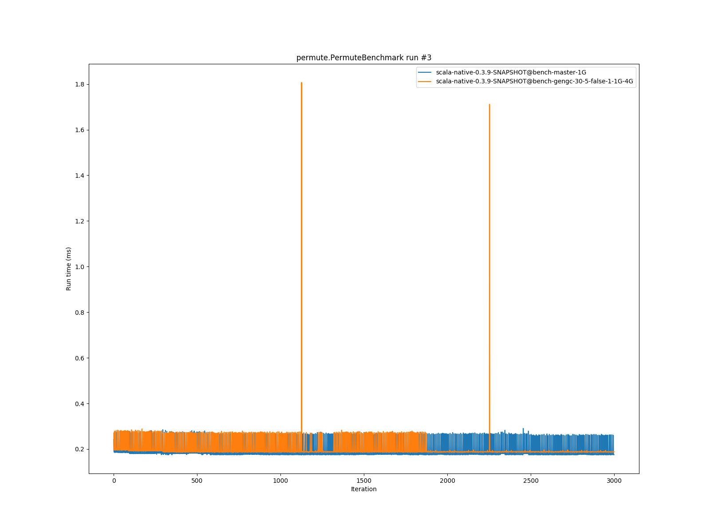
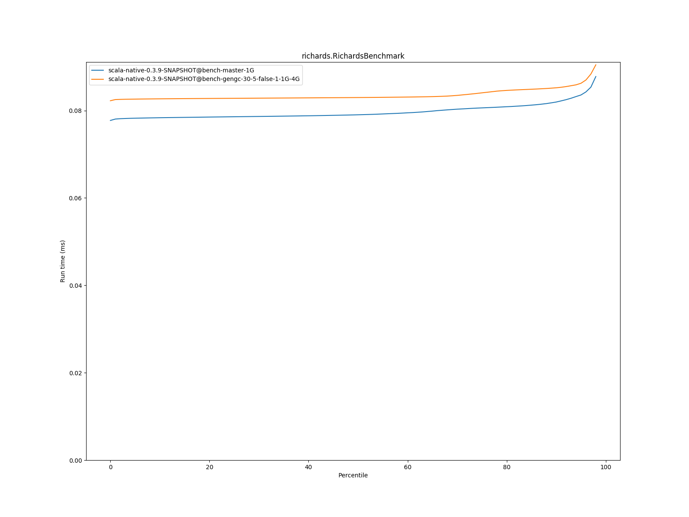

# Summary
## Benchmark run time (ms) at 50 percentile 

|name | scala-native-0.3.9-SNAPSHOT@bench-master-1G | scala-native-0.3.9-SNAPSHOT@bench-gengc-30-5-false-1-1G-4G | |
| -- | -- | -- | -- |
|[permute.PermuteBenchmark](#permutepermutebenchmark)|0.1771|0.1865|+5.29%|
|[queens.QueensBenchmark](#queensqueensbenchmark)|0.0773|0.0763|__-1.30%__|
|[json.JsonBenchmark](#jsonjsonbenchmark)|1.1340|1.1361|+0.18%|
|[brainfuck.BrainfuckBenchmark](#brainfuckbrainfuckbenchmark)|2.9836|2.9999|+0.55%|
|[nbody.NbodyBenchmark](#nbodynbodybenchmark)|28.9438|28.9167|__-0.09%__|
|[mandelbrot.MandelbrotBenchmark](#mandelbrotmandelbrotbenchmark)|114.4066|114.3251|__-0.07%__|
|[list.ListBenchmark](#listlistbenchmark)|0.0514|0.0424|__-17.63%__|
|[tracer.TracerBenchmark](#tracertracerbenchmark)|0.5990|0.6350|+6.01%|
|[deltablue.DeltaBlueBenchmark](#deltabluedeltabluebenchmark)|0.1742|0.1722|__-1.14%__|
|[cd.CDBenchmark](#cdcdbenchmark)|20.8168|20.8996|+0.40%|
|[sudoku.SudokuBenchmark](#sudokusudokubenchmark)|1.8134|1.8605|+2.59%|
|[kmeans.KmeansBenchmark](#kmeanskmeansbenchmark)|41.3884|42.6964|+3.16%|
|[gcbench.GCBenchBenchmark](#gcbenchgcbenchbenchmark)|88.1750|84.4705|__-4.20%__|
|[richards.RichardsBenchmark](#richardsrichardsbenchmark)|0.0790|0.0830|+5.00%|
|[bounce.BounceBenchmark](#bouncebouncebenchmark)|0.0456|0.0457|+0.36%|
| __Geometrical mean:__|| |__-0.22%__|
## Benchmark run time (ms) at 90 percentile 

|name | scala-native-0.3.9-SNAPSHOT@bench-master-1G | scala-native-0.3.9-SNAPSHOT@bench-gengc-30-5-false-1-1G-4G | |
| -- | -- | -- | -- |
|[permute.PermuteBenchmark](#permutepermutebenchmark)|0.2609|0.1892|__-27.48%__|
|[queens.QueensBenchmark](#queensqueensbenchmark)|0.0791|0.0782|__-1.13%__|
|[json.JsonBenchmark](#jsonjsonbenchmark)|1.1410|1.1390|__-0.18%__|
|[brainfuck.BrainfuckBenchmark](#brainfuckbrainfuckbenchmark)|3.0150|3.0438|+0.96%|
|[nbody.NbodyBenchmark](#nbodynbodybenchmark)|29.4125|29.4494|+0.13%|
|[mandelbrot.MandelbrotBenchmark](#mandelbrotmandelbrotbenchmark)|114.5126|114.4494|__-0.06%__|
|[list.ListBenchmark](#listlistbenchmark)|0.0524|0.0436|__-16.72%__|
|[tracer.TracerBenchmark](#tracertracerbenchmark)|0.6024|0.6386|+6.00%|
|[deltablue.DeltaBlueBenchmark](#deltabluedeltabluebenchmark)|0.1809|0.1764|__-2.45%__|
|[cd.CDBenchmark](#cdcdbenchmark)|21.0443|22.4746|+6.80%|
|[sudoku.SudokuBenchmark](#sudokusudokubenchmark)|1.8512|1.9190|+3.67%|
|[kmeans.KmeansBenchmark](#kmeanskmeansbenchmark)|42.2131|44.6492|+5.77%|
|[gcbench.GCBenchBenchmark](#gcbenchgcbenchbenchmark)|89.1500|89.2602|+0.12%|
|[richards.RichardsBenchmark](#richardsrichardsbenchmark)|0.0819|0.0852|+3.98%|
|[bounce.BounceBenchmark](#bouncebouncebenchmark)|0.0469|0.0467|__-0.48%__|
| __Geometrical mean:__|| |__-1.85%__|
## Benchmark run time (ms) at 99 percentile 

|name | scala-native-0.3.9-SNAPSHOT@bench-master-1G | scala-native-0.3.9-SNAPSHOT@bench-gengc-30-5-false-1-1G-4G | |
| -- | -- | -- | -- |
|[permute.PermuteBenchmark](#permutepermutebenchmark)|0.2696|0.1945|__-27.87%__|
|[queens.QueensBenchmark](#queensqueensbenchmark)|0.0808|0.0811|+0.36%|
|[json.JsonBenchmark](#jsonjsonbenchmark)|1.1687|1.1851|+1.40%|
|[brainfuck.BrainfuckBenchmark](#brainfuckbrainfuckbenchmark)|4.4373|4.5671|+2.92%|
|[nbody.NbodyBenchmark](#nbodynbodybenchmark)|30.7319|30.5611|__-0.56%__|
|[mandelbrot.MandelbrotBenchmark](#mandelbrotmandelbrotbenchmark)|115.4530|115.3416|__-0.10%__|
|[list.ListBenchmark](#listlistbenchmark)|0.0537|0.0451|__-15.93%__|
|[tracer.TracerBenchmark](#tracertracerbenchmark)|0.6309|0.8487|+34.52%|
|[deltablue.DeltaBlueBenchmark](#deltabluedeltabluebenchmark)|0.2646|0.2604|__-1.57%__|
|[cd.CDBenchmark](#cdcdbenchmark)|25.9839|22.7289|__-12.53%__|
|[sudoku.SudokuBenchmark](#sudokusudokubenchmark)|1.8800|1.9759|+5.11%|
|[kmeans.KmeansBenchmark](#kmeanskmeansbenchmark)|47.4711|46.7774|__-1.46%__|
|[gcbench.GCBenchBenchmark](#gcbenchgcbenchbenchmark)|90.1073|90.5472|+0.49%|
|[richards.RichardsBenchmark](#richardsrichardsbenchmark)|0.1613|0.1655|+2.62%|
|[bounce.BounceBenchmark](#bouncebouncebenchmark)|0.0487|0.0481|__-1.27%__|
| __Geometrical mean:__|| |__-1.72%__|
# Individual benchmarks
## permute.PermuteBenchmark

## queens.QueensBenchmark

## json.JsonBenchmark

## brainfuck.BrainfuckBenchmark

## nbody.NbodyBenchmark

## mandelbrot.MandelbrotBenchmark

## list.ListBenchmark

## tracer.TracerBenchmark

## deltablue.DeltaBlueBenchmark

## cd.CDBenchmark

## sudoku.SudokuBenchmark

## kmeans.KmeansBenchmark

## gcbench.GCBenchBenchmark

## richards.RichardsBenchmark

## bounce.BounceBenchmark

