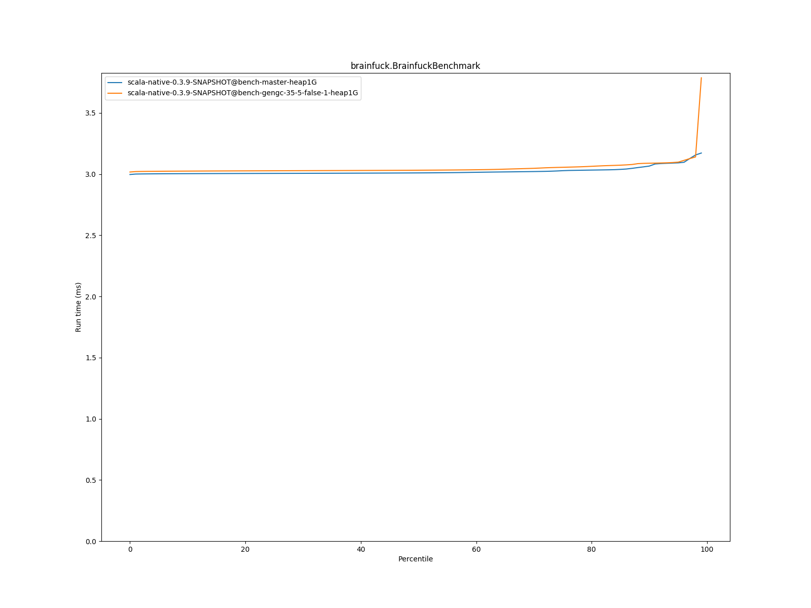
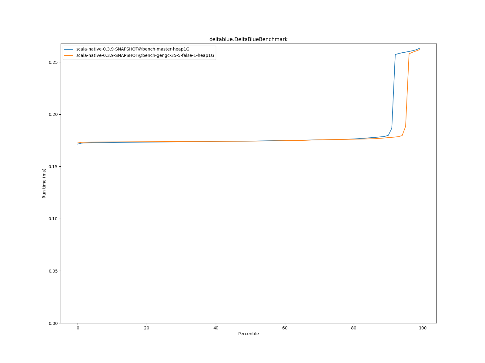
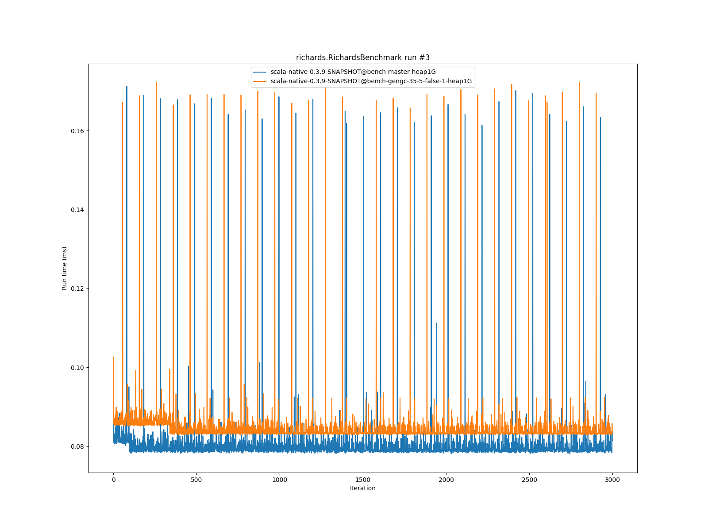
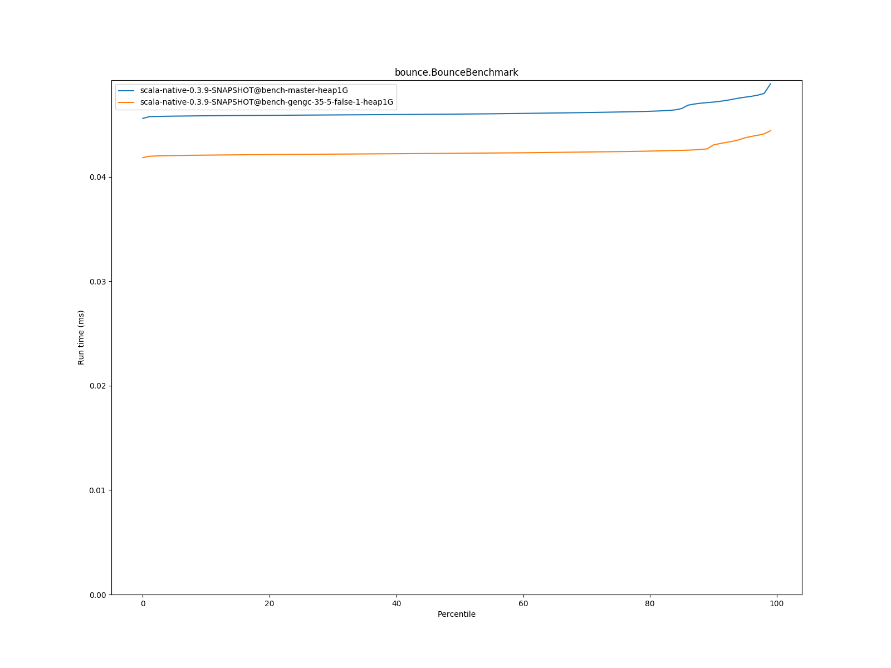

# Summary
## Benchmark run time (ms) at 50 percentile 

|name | scala-native-0.3.9-SNAPSHOT@bench-master-heap1G | scala-native-0.3.9-SNAPSHOT@bench-gengc-35-5-false-1-heap1G | |
| -- | -- | -- | -- |
|[permute.PermuteBenchmark](#permutepermutebenchmark)|0.1760|0.1871|+6.32%|
|[queens.QueensBenchmark](#queensqueensbenchmark)|0.0764|0.0776|+1.49%|
|[json.JsonBenchmark](#jsonjsonbenchmark)|1.1679|1.2270|+5.06%|
|[brainfuck.BrainfuckBenchmark](#brainfuckbrainfuckbenchmark)|3.0094|3.0313|+0.73%|
|[nbody.NbodyBenchmark](#nbodynbodybenchmark)|28.9692|28.9158|__-0.18%__|
|[mandelbrot.MandelbrotBenchmark](#mandelbrotmandelbrotbenchmark)|114.3240|115.0138|+0.60%|
|[list.ListBenchmark](#listlistbenchmark)|0.0426|0.0425|__-0.35%__|
|[tracer.TracerBenchmark](#tracertracerbenchmark)|0.6243|0.6350|+1.70%|
|[deltablue.DeltaBlueBenchmark](#deltabluedeltabluebenchmark)|0.1744|0.1743|__-0.01%__|
|[cd.CDBenchmark](#cdcdbenchmark)|20.8529|20.8130|__-0.19%__|
|[sudoku.SudokuBenchmark](#sudokusudokubenchmark)|1.7597|1.8179|+3.31%|
|[kmeans.KmeansBenchmark](#kmeanskmeansbenchmark)|41.1034|42.4970|+3.39%|
|[gcbench.GCBenchBenchmark](#gcbenchgcbenchbenchmark)|88.2452|81.1912|__-7.99%__|
|[richards.RichardsBenchmark](#richardsrichardsbenchmark)|0.0791|0.0833|+5.23%|
|[bounce.BounceBenchmark](#bouncebouncebenchmark)|0.0460|0.0423|__-8.16%__|
| __Geometrical mean:__|| |+0.65%|
## Benchmark run time (ms) at 90 percentile 

|name | scala-native-0.3.9-SNAPSHOT@bench-master-heap1G | scala-native-0.3.9-SNAPSHOT@bench-gengc-35-5-false-1-heap1G | |
| -- | -- | -- | -- |
|[permute.PermuteBenchmark](#permutepermutebenchmark)|0.2602|0.1902|__-26.90%__|
|[queens.QueensBenchmark](#queensqueensbenchmark)|0.0783|0.0794|+1.37%|
|[json.JsonBenchmark](#jsonjsonbenchmark)|1.1741|1.2325|+4.98%|
|[brainfuck.BrainfuckBenchmark](#brainfuckbrainfuckbenchmark)|3.0653|3.0884|+0.76%|
|[nbody.NbodyBenchmark](#nbodynbodybenchmark)|29.4635|29.4363|__-0.09%__|
|[mandelbrot.MandelbrotBenchmark](#mandelbrotmandelbrotbenchmark)|114.4460|115.1060|+0.58%|
|[list.ListBenchmark](#listlistbenchmark)|0.0437|0.0436|__-0.18%__|
|[tracer.TracerBenchmark](#tracertracerbenchmark)|0.6321|0.6391|+1.11%|
|[deltablue.DeltaBlueBenchmark](#deltabluedeltabluebenchmark)|0.1799|0.1777|__-1.22%__|
|[cd.CDBenchmark](#cdcdbenchmark)|21.0551|22.6097|+7.38%|
|[sudoku.SudokuBenchmark](#sudokusudokubenchmark)|1.7783|1.8425|+3.61%|
|[kmeans.KmeansBenchmark](#kmeanskmeansbenchmark)|41.7748|43.6503|+4.49%|
|[gcbench.GCBenchBenchmark](#gcbenchgcbenchbenchmark)|89.9123|88.1592|__-1.95%__|
|[richards.RichardsBenchmark](#richardsrichardsbenchmark)|0.0821|0.0854|+3.99%|
|[bounce.BounceBenchmark](#bouncebouncebenchmark)|0.0472|0.0431|__-8.71%__|
| __Geometrical mean:__|| |__-1.08%__|
## Benchmark run time (ms) at 99 percentile 

|name | scala-native-0.3.9-SNAPSHOT@bench-master-heap1G | scala-native-0.3.9-SNAPSHOT@bench-gengc-35-5-false-1-heap1G | |
| -- | -- | -- | -- |
|[permute.PermuteBenchmark](#permutepermutebenchmark)|0.2674|0.2688|+0.53%|
|[queens.QueensBenchmark](#queensqueensbenchmark)|0.0810|0.0818|+1.00%|
|[json.JsonBenchmark](#jsonjsonbenchmark)|1.2098|1.2684|+4.84%|
|[brainfuck.BrainfuckBenchmark](#brainfuckbrainfuckbenchmark)|3.1718|3.7866|+19.38%|
|[nbody.NbodyBenchmark](#nbodynbodybenchmark)|30.9112|30.7083|__-0.66%__|
|[mandelbrot.MandelbrotBenchmark](#mandelbrotmandelbrotbenchmark)|115.3943|116.0705|+0.59%|
|[list.ListBenchmark](#listlistbenchmark)|0.0449|0.0448|__-0.15%__|
|[tracer.TracerBenchmark](#tracertracerbenchmark)|0.6446|0.6828|+5.92%|
|[deltablue.DeltaBlueBenchmark](#deltabluedeltabluebenchmark)|0.2632|0.2619|__-0.47%__|
|[cd.CDBenchmark](#cdcdbenchmark)|25.9893|22.7678|__-12.40%__|
|[sudoku.SudokuBenchmark](#sudokusudokubenchmark)|1.8228|1.8978|+4.11%|
|[kmeans.KmeansBenchmark](#kmeanskmeansbenchmark)|47.1211|46.3382|__-1.66%__|
|[gcbench.GCBenchBenchmark](#gcbenchgcbenchbenchmark)|90.7894|90.0284|__-0.84%__|
|[richards.RichardsBenchmark](#richardsrichardsbenchmark)|0.1603|0.1659|+3.48%|
|[bounce.BounceBenchmark](#bouncebouncebenchmark)|0.0489|0.0444|__-9.18%__|
| __Geometrical mean:__|| |+0.74%|
# Individual benchmarks
## permute.PermuteBenchmark

## queens.QueensBenchmark

## json.JsonBenchmark

## brainfuck.BrainfuckBenchmark

## nbody.NbodyBenchmark

## mandelbrot.MandelbrotBenchmark

## list.ListBenchmark

## tracer.TracerBenchmark

## deltablue.DeltaBlueBenchmark

## cd.CDBenchmark

## sudoku.SudokuBenchmark

## kmeans.KmeansBenchmark

## gcbench.GCBenchBenchmark

## richards.RichardsBenchmark

## bounce.BounceBenchmark

