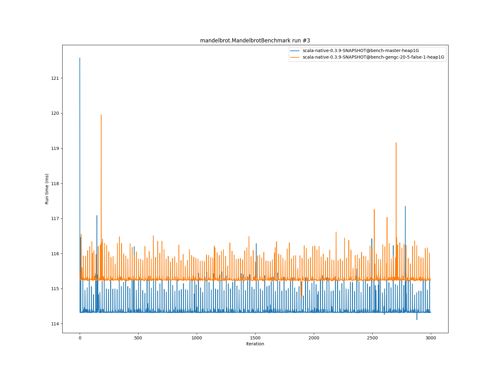
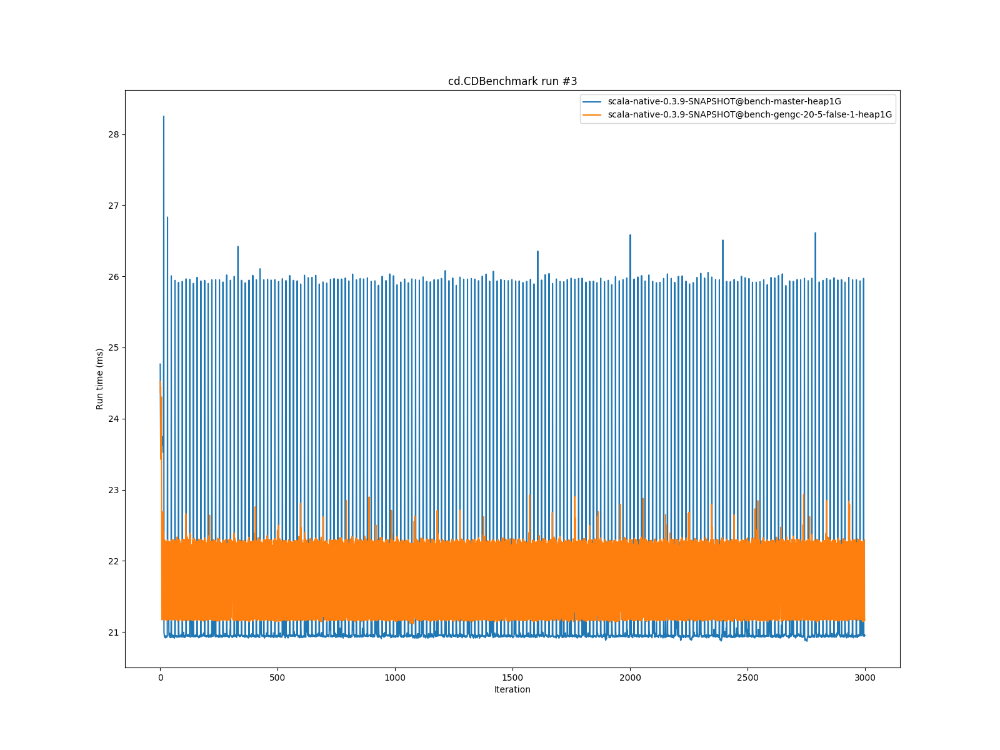
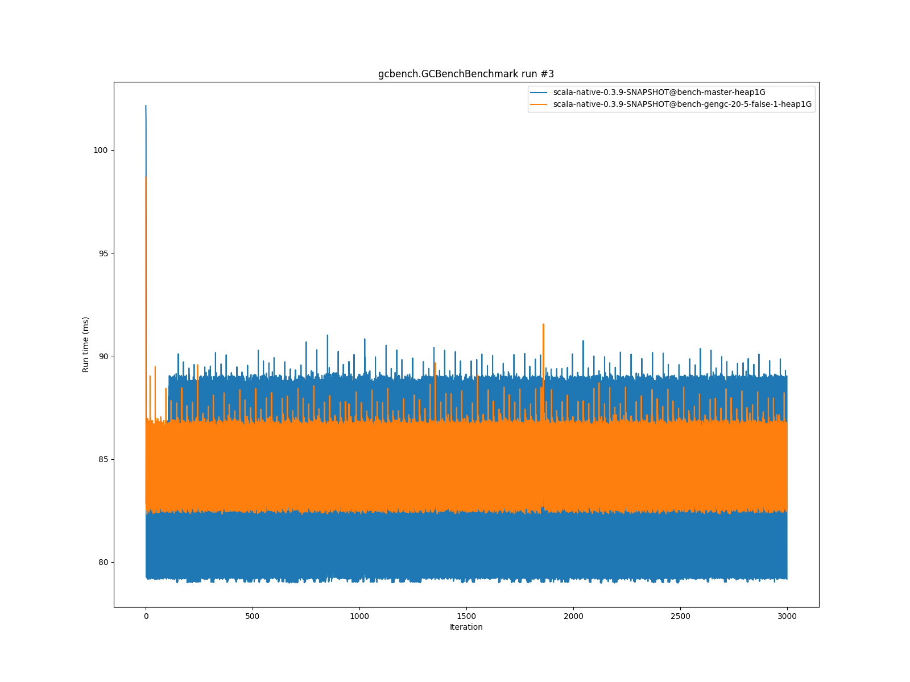

# Summary
## Benchmark run time (ms) at 50 percentile 

|name | scala-native-0.3.9-SNAPSHOT@bench-master-heap1G | scala-native-0.3.9-SNAPSHOT@bench-gengc-20-5-false-1-heap1G | |
| -- | -- | -- | -- |
|[permute.PermuteBenchmark](#permutepermutebenchmark)|0.1760|0.1894|+7.63%|
|[queens.QueensBenchmark](#queensqueensbenchmark)|0.0764|0.0766|+0.25%|
|[json.JsonBenchmark](#jsonjsonbenchmark)|1.1679|1.1619|__-0.51%__|
|[brainfuck.BrainfuckBenchmark](#brainfuckbrainfuckbenchmark)|3.0094|3.0292|+0.66%|
|[nbody.NbodyBenchmark](#nbodynbodybenchmark)|28.9692|28.9173|__-0.18%__|
|[mandelbrot.MandelbrotBenchmark](#mandelbrotmandelbrotbenchmark)|114.3240|115.2497|+0.81%|
|[list.ListBenchmark](#listlistbenchmark)|0.0426|0.0422|__-0.98%__|
|[tracer.TracerBenchmark](#tracertracerbenchmark)|0.6243|0.6367|+1.98%|
|[deltablue.DeltaBlueBenchmark](#deltabluedeltabluebenchmark)|0.1744|0.1725|__-1.05%__|
|[cd.CDBenchmark](#cdcdbenchmark)|20.8529|20.9904|+0.66%|
|[sudoku.SudokuBenchmark](#sudokusudokubenchmark)|1.7597|1.8292|+3.95%|
|[kmeans.KmeansBenchmark](#kmeanskmeansbenchmark)|41.1034|42.4103|+3.18%|
|[gcbench.GCBenchBenchmark](#gcbenchgcbenchbenchmark)|88.2452|86.2147|__-2.30%__|
|[richards.RichardsBenchmark](#richardsrichardsbenchmark)|0.0791|0.0833|+5.22%|
|[bounce.BounceBenchmark](#bouncebouncebenchmark)|0.0460|0.0435|__-5.49%__|
| __Geometrical mean:__|| |+0.88%|
## Benchmark run time (ms) at 90 percentile 

|name | scala-native-0.3.9-SNAPSHOT@bench-master-heap1G | scala-native-0.3.9-SNAPSHOT@bench-gengc-20-5-false-1-heap1G | |
| -- | -- | -- | -- |
|[permute.PermuteBenchmark](#permutepermutebenchmark)|0.2602|0.1914|__-26.44%__|
|[queens.QueensBenchmark](#queensqueensbenchmark)|0.0783|0.0785|+0.27%|
|[json.JsonBenchmark](#jsonjsonbenchmark)|1.1741|1.1656|__-0.73%__|
|[brainfuck.BrainfuckBenchmark](#brainfuckbrainfuckbenchmark)|3.0653|3.0700|+0.15%|
|[nbody.NbodyBenchmark](#nbodynbodybenchmark)|29.4635|29.5417|+0.27%|
|[mandelbrot.MandelbrotBenchmark](#mandelbrotmandelbrotbenchmark)|114.4460|115.3444|+0.79%|
|[list.ListBenchmark](#listlistbenchmark)|0.0437|0.0434|__-0.65%__|
|[tracer.TracerBenchmark](#tracertracerbenchmark)|0.6321|0.6430|+1.72%|
|[deltablue.DeltaBlueBenchmark](#deltabluedeltabluebenchmark)|0.1799|0.1753|__-2.52%__|
|[cd.CDBenchmark](#cdcdbenchmark)|21.0551|22.0801|+4.87%|
|[sudoku.SudokuBenchmark](#sudokusudokubenchmark)|1.7783|1.8423|+3.60%|
|[kmeans.KmeansBenchmark](#kmeanskmeansbenchmark)|41.7748|44.4098|+6.31%|
|[gcbench.GCBenchBenchmark](#gcbenchgcbenchbenchmark)|89.9123|87.5571|__-2.62%__|
|[richards.RichardsBenchmark](#richardsrichardsbenchmark)|0.0821|0.0853|+3.94%|
|[bounce.BounceBenchmark](#bouncebouncebenchmark)|0.0472|0.0446|__-5.54%__|
| __Geometrical mean:__|| |__-1.43%__|
## Benchmark run time (ms) at 99 percentile 

|name | scala-native-0.3.9-SNAPSHOT@bench-master-heap1G | scala-native-0.3.9-SNAPSHOT@bench-gengc-20-5-false-1-heap1G | |
| -- | -- | -- | -- |
|[permute.PermuteBenchmark](#permutepermutebenchmark)|0.2674|0.1944|__-27.32%__|
|[queens.QueensBenchmark](#queensqueensbenchmark)|0.0810|0.0811|+0.14%|
|[json.JsonBenchmark](#jsonjsonbenchmark)|1.2098|1.2332|+1.93%|
|[brainfuck.BrainfuckBenchmark](#brainfuckbrainfuckbenchmark)|3.1718|4.1084|+29.53%|
|[nbody.NbodyBenchmark](#nbodynbodybenchmark)|30.9112|30.6064|__-0.99%__|
|[mandelbrot.MandelbrotBenchmark](#mandelbrotmandelbrotbenchmark)|115.3943|116.2878|+0.77%|
|[list.ListBenchmark](#listlistbenchmark)|0.0449|0.0449|__-0.04%__|
|[tracer.TracerBenchmark](#tracertracerbenchmark)|0.6446|1.5575|+141.60%|
|[deltablue.DeltaBlueBenchmark](#deltabluedeltabluebenchmark)|0.2632|0.2596|__-1.36%__|
|[cd.CDBenchmark](#cdcdbenchmark)|25.9893|22.4645|__-13.56%__|
|[sudoku.SudokuBenchmark](#sudokusudokubenchmark)|1.8228|1.9298|+5.87%|
|[kmeans.KmeansBenchmark](#kmeanskmeansbenchmark)|47.1211|45.6473|__-3.13%__|
|[gcbench.GCBenchBenchmark](#gcbenchgcbenchbenchmark)|90.7894|88.4110|__-2.62%__|
|[richards.RichardsBenchmark](#richardsrichardsbenchmark)|0.1603|0.1655|+3.22%|
|[bounce.BounceBenchmark](#bouncebouncebenchmark)|0.0489|0.0461|__-5.84%__|
| __Geometrical mean:__|| |+4.43%|
# Individual benchmarks
## permute.PermuteBenchmark

## queens.QueensBenchmark

## json.JsonBenchmark

## brainfuck.BrainfuckBenchmark

## nbody.NbodyBenchmark

## mandelbrot.MandelbrotBenchmark

## list.ListBenchmark

## tracer.TracerBenchmark

## deltablue.DeltaBlueBenchmark

## cd.CDBenchmark

## sudoku.SudokuBenchmark

## kmeans.KmeansBenchmark

## gcbench.GCBenchBenchmark

## richards.RichardsBenchmark

## bounce.BounceBenchmark

