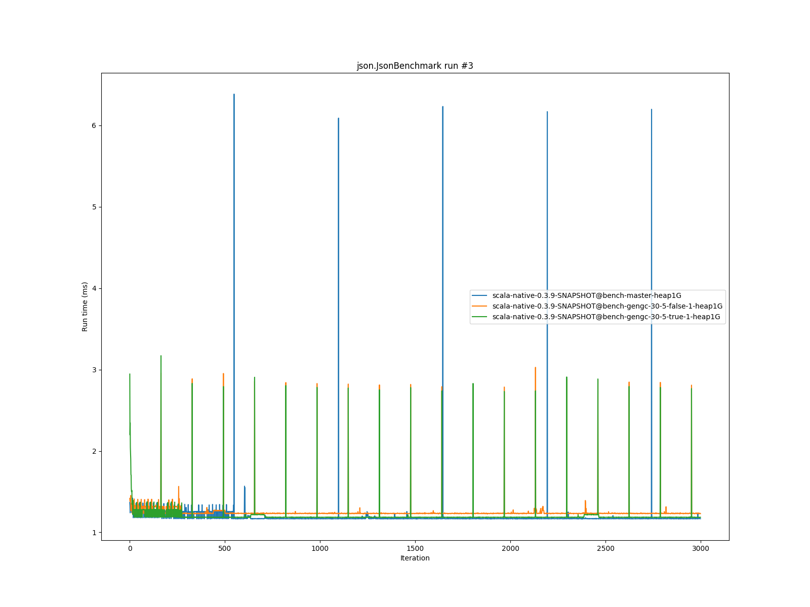

# Summary
## Benchmark run time (ms) at 50 percentile 

|name | scala-native-0.3.9-SNAPSHOT@bench-master-heap1G | scala-native-0.3.9-SNAPSHOT@bench-gengc-30-5-false-1-heap1G |  | scala-native-0.3.9-SNAPSHOT@bench-gengc-30-5-true-1-heap1G | |
| -- | -- | -- | -- | -- | -- |
|[permute.PermuteBenchmark](#permutepermutebenchmark)|0.1760|0.1862|+5.81%|0.1838|+4.45%|
|[queens.QueensBenchmark](#queensqueensbenchmark)|0.0764|0.0768|+0.52%|0.0770|+0.68%|
|[json.JsonBenchmark](#jsonjsonbenchmark)|1.1679|1.2303|+5.34%|1.1826|+1.26%|
|[brainfuck.BrainfuckBenchmark](#brainfuckbrainfuckbenchmark)|3.0094|3.0032|__-0.20%__|3.0194|+0.33%|
|[nbody.NbodyBenchmark](#nbodynbodybenchmark)|28.9692|28.9301|__-0.13%__|28.9122|__-0.20%__|
|[mandelbrot.MandelbrotBenchmark](#mandelbrotmandelbrotbenchmark)|114.3240|114.6009|+0.24%|114.3420|+0.02%|
|[list.ListBenchmark](#listlistbenchmark)|0.0426|0.0426|+0.08%|0.0452|+6.05%|
|[tracer.TracerBenchmark](#tracertracerbenchmark)|0.6243|0.6380|+2.19%|0.6336|+1.49%|
|[deltablue.DeltaBlueBenchmark](#deltabluedeltabluebenchmark)|0.1744|0.1757|+0.79%|0.1769|+1.46%|
|[cd.CDBenchmark](#cdcdbenchmark)|20.8529|20.9411|+0.42%|20.9880|+0.65%|
|[sudoku.SudokuBenchmark](#sudokusudokubenchmark)|1.7597|1.7721|+0.71%|1.8253|+3.73%|
|[kmeans.KmeansBenchmark](#kmeanskmeansbenchmark)|41.1034|42.3983|+3.15%|42.9961|+4.60%|
|[gcbench.GCBenchBenchmark](#gcbenchgcbenchbenchmark)|88.2452|84.5920|__-4.14%__|83.7497|__-5.09%__|
|[richards.RichardsBenchmark](#richardsrichardsbenchmark)|0.0791|0.0835|+5.53%|0.0832|+5.18%|
|[bounce.BounceBenchmark](#bouncebouncebenchmark)|0.0460|0.0422|__-8.36%__|0.0482|+4.63%|
| __Geometrical mean:__|| |+0.73%| |+1.91%|
## Benchmark run time (ms) at 90 percentile 

|name | scala-native-0.3.9-SNAPSHOT@bench-master-heap1G | scala-native-0.3.9-SNAPSHOT@bench-gengc-30-5-false-1-heap1G |  | scala-native-0.3.9-SNAPSHOT@bench-gengc-30-5-true-1-heap1G | |
| -- | -- | -- | -- | -- | -- |
|[permute.PermuteBenchmark](#permutepermutebenchmark)|0.2602|0.1883|__-27.60%__|0.1861|__-28.46%__|
|[queens.QueensBenchmark](#queensqueensbenchmark)|0.0783|0.0790|+0.89%|0.0791|+0.94%|
|[json.JsonBenchmark](#jsonjsonbenchmark)|1.1741|1.2353|+5.21%|1.1871|+1.10%|
|[brainfuck.BrainfuckBenchmark](#brainfuckbrainfuckbenchmark)|3.0653|3.0355|__-0.97%__|3.1117|+1.51%|
|[nbody.NbodyBenchmark](#nbodynbodybenchmark)|29.4635|29.4988|+0.12%|29.4994|+0.12%|
|[mandelbrot.MandelbrotBenchmark](#mandelbrotmandelbrotbenchmark)|114.4460|114.7119|+0.23%|114.4345|__-0.01%__|
|[list.ListBenchmark](#listlistbenchmark)|0.0437|0.0441|+0.83%|0.0463|+5.98%|
|[tracer.TracerBenchmark](#tracertracerbenchmark)|0.6321|0.6416|+1.50%|0.6381|+0.95%|
|[deltablue.DeltaBlueBenchmark](#deltabluedeltabluebenchmark)|0.1799|0.1805|+0.33%|0.1817|+1.04%|
|[cd.CDBenchmark](#cdcdbenchmark)|21.0551|22.5021|+6.87%|22.5590|+7.14%|
|[sudoku.SudokuBenchmark](#sudokusudokubenchmark)|1.7783|1.8030|+1.39%|1.8527|+4.18%|
|[kmeans.KmeansBenchmark](#kmeanskmeansbenchmark)|41.7748|43.8407|+4.95%|127.6854|+205.65%|
|[gcbench.GCBenchBenchmark](#gcbenchgcbenchbenchmark)|89.9123|89.3217|__-0.66%__|88.4051|__-1.68%__|
|[richards.RichardsBenchmark](#richardsrichardsbenchmark)|0.0821|0.0859|+4.57%|0.0853|+3.96%|
|[bounce.BounceBenchmark](#bouncebouncebenchmark)|0.0472|0.0432|__-8.37%__|0.0493|+4.59%|
| __Geometrical mean:__|| |__-1.09%__| |+7.42%|
## Benchmark run time (ms) at 99 percentile 

|name | scala-native-0.3.9-SNAPSHOT@bench-master-heap1G | scala-native-0.3.9-SNAPSHOT@bench-gengc-30-5-false-1-heap1G |  | scala-native-0.3.9-SNAPSHOT@bench-gengc-30-5-true-1-heap1G | |
| -- | -- | -- | -- | -- | -- |
|[permute.PermuteBenchmark](#permutepermutebenchmark)|0.2674|0.1926|__-27.97%__|0.1904|__-28.79%__|
|[queens.QueensBenchmark](#queensqueensbenchmark)|0.0810|0.0816|+0.77%|0.0816|+0.70%|
|[json.JsonBenchmark](#jsonjsonbenchmark)|1.2098|1.2903|+6.65%|1.2218|+0.99%|
|[brainfuck.BrainfuckBenchmark](#brainfuckbrainfuckbenchmark)|3.1718|4.5849|+44.55%|21.8257|+588.11%|
|[nbody.NbodyBenchmark](#nbodynbodybenchmark)|30.9112|30.6475|__-0.85%__|30.6564|__-0.82%__|
|[mandelbrot.MandelbrotBenchmark](#mandelbrotmandelbrotbenchmark)|115.3943|115.6124|+0.19%|115.3520|__-0.04%__|
|[list.ListBenchmark](#listlistbenchmark)|0.0449|0.0455|+1.41%|0.0474|+5.57%|
|[tracer.TracerBenchmark](#tracertracerbenchmark)|0.6446|0.7263|+12.67%|0.7891|+22.41%|
|[deltablue.DeltaBlueBenchmark](#deltabluedeltabluebenchmark)|0.2632|0.2647|+0.57%|0.2656|+0.92%|
|[cd.CDBenchmark](#cdcdbenchmark)|25.9893|22.6599|__-12.81%__|22.8129|__-12.22%__|
|[sudoku.SudokuBenchmark](#sudokusudokubenchmark)|1.8228|1.8483|+1.40%|1.9162|+5.12%|
|[kmeans.KmeansBenchmark](#kmeanskmeansbenchmark)|47.1211|46.0117|__-2.35%__|157.9792|+235.26%|
|[gcbench.GCBenchBenchmark](#gcbenchgcbenchbenchmark)|90.7894|91.2768|+0.54%|89.9776|__-0.89%__|
|[richards.RichardsBenchmark](#richardsrichardsbenchmark)|0.1603|0.1656|+3.28%|0.1654|+3.18%|
|[bounce.BounceBenchmark](#bouncebouncebenchmark)|0.0489|0.0444|__-9.20%__|0.0511|+4.46%|
| __Geometrical mean:__|| |+0.26%| |+22.62%|
# Individual benchmarks
## permute.PermuteBenchmark

## queens.QueensBenchmark

## json.JsonBenchmark

## brainfuck.BrainfuckBenchmark

## nbody.NbodyBenchmark

## mandelbrot.MandelbrotBenchmark

## list.ListBenchmark

## tracer.TracerBenchmark

## deltablue.DeltaBlueBenchmark

## cd.CDBenchmark

## sudoku.SudokuBenchmark

## kmeans.KmeansBenchmark

## gcbench.GCBenchBenchmark

## richards.RichardsBenchmark

## bounce.BounceBenchmark

