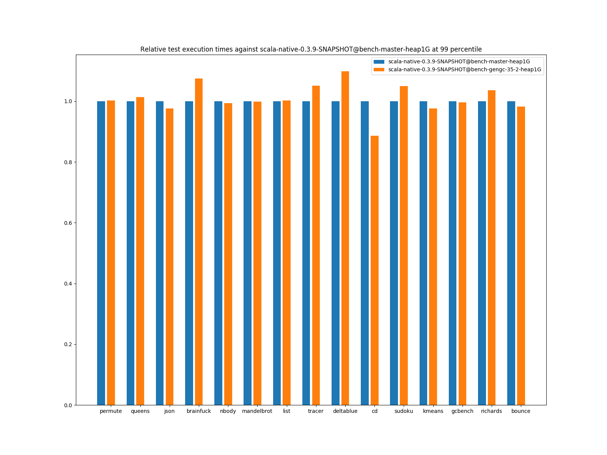
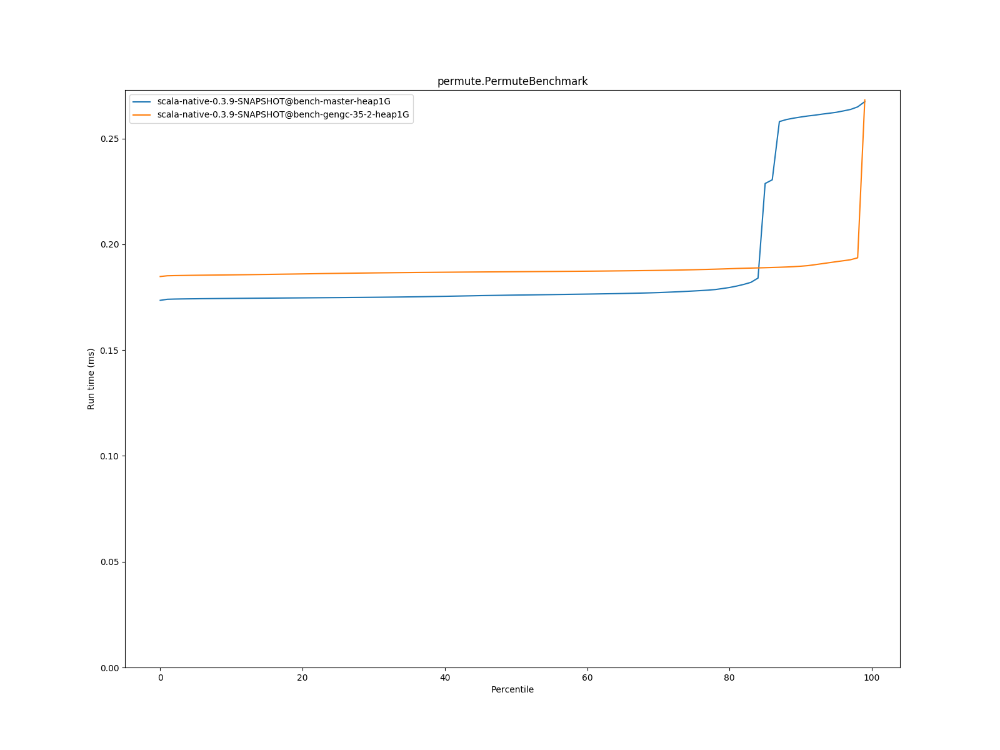
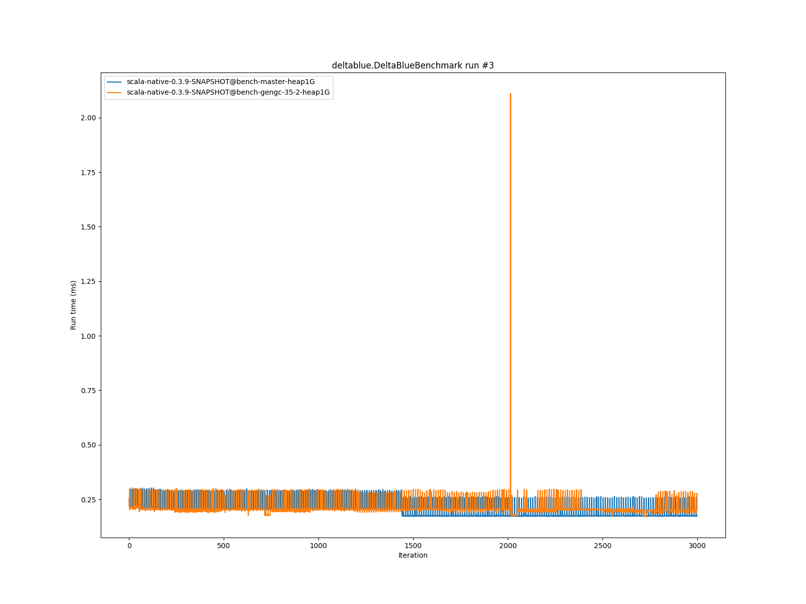
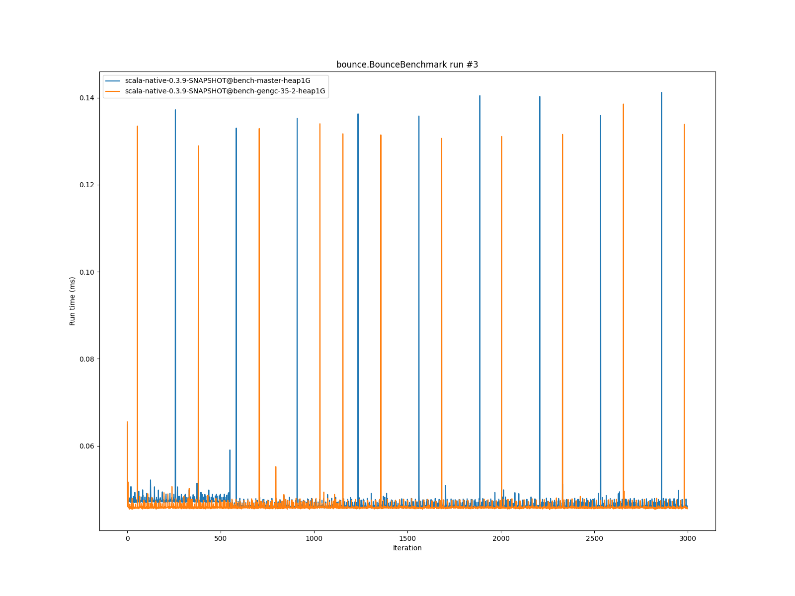

# Summary
## Benchmark run time (ms) at 50 percentile 

|name | scala-native-0.3.9-SNAPSHOT@bench-master-heap1G | scala-native-0.3.9-SNAPSHOT@bench-gengc-35-2-heap1G | |
| -- | -- | -- | -- |
|[permute.PermuteBenchmark](#permutepermutebenchmark)|0.1760|0.1870|+6.27%|
|[queens.QueensBenchmark](#queensqueensbenchmark)|0.0764|0.0775|+1.39%|
|[json.JsonBenchmark](#jsonjsonbenchmark)|1.1679|1.1334|__-2.96%__|
|[brainfuck.BrainfuckBenchmark](#brainfuckbrainfuckbenchmark)|3.0094|3.0024|__-0.23%__|
|[nbody.NbodyBenchmark](#nbodynbodybenchmark)|28.9692|28.9171|__-0.18%__|
|[mandelbrot.MandelbrotBenchmark](#mandelbrotmandelbrotbenchmark)|114.3240|114.2859|__-0.03%__|
|[list.ListBenchmark](#listlistbenchmark)|0.0426|0.0422|__-0.91%__|
|[tracer.TracerBenchmark](#tracertracerbenchmark)|0.6243|0.6375|+2.10%|
|[deltablue.DeltaBlueBenchmark](#deltabluedeltabluebenchmark)|0.1744|0.2003|+14.89%|
|[cd.CDBenchmark](#cdcdbenchmark)|20.8529|20.9130|+0.29%|
|[sudoku.SudokuBenchmark](#sudokusudokubenchmark)|1.7597|1.8189|+3.36%|
|[kmeans.KmeansBenchmark](#kmeanskmeansbenchmark)|41.1034|42.0946|+2.41%|
|[gcbench.GCBenchBenchmark](#gcbenchgcbenchbenchmark)|88.2452|81.7544|__-7.36%__|
|[richards.RichardsBenchmark](#richardsrichardsbenchmark)|0.0791|0.0839|+6.08%|
|[bounce.BounceBenchmark](#bouncebouncebenchmark)|0.0460|0.0447|__-2.82%__|
| __Geometrical mean:__|| |+1.37%|
## Benchmark run time (ms) at 90 percentile 

|name | scala-native-0.3.9-SNAPSHOT@bench-master-heap1G | scala-native-0.3.9-SNAPSHOT@bench-gengc-35-2-heap1G | |
| -- | -- | -- | -- |
|[permute.PermuteBenchmark](#permutepermutebenchmark)|0.2602|0.1896|__-27.10%__|
|[queens.QueensBenchmark](#queensqueensbenchmark)|0.0783|0.0794|+1.35%|
|[json.JsonBenchmark](#jsonjsonbenchmark)|1.1741|1.1492|__-2.13%__|
|[brainfuck.BrainfuckBenchmark](#brainfuckbrainfuckbenchmark)|3.0653|3.0325|__-1.07%__|
|[nbody.NbodyBenchmark](#nbodynbodybenchmark)|29.4635|29.4220|__-0.14%__|
|[mandelbrot.MandelbrotBenchmark](#mandelbrotmandelbrotbenchmark)|114.4460|114.3743|__-0.06%__|
|[list.ListBenchmark](#listlistbenchmark)|0.0437|0.0434|__-0.70%__|
|[tracer.TracerBenchmark](#tracertracerbenchmark)|0.6321|0.6439|+1.86%|
|[deltablue.DeltaBlueBenchmark](#deltabluedeltabluebenchmark)|0.1799|0.2050|+13.97%|
|[cd.CDBenchmark](#cdcdbenchmark)|21.0551|22.7168|+7.89%|
|[sudoku.SudokuBenchmark](#sudokusudokubenchmark)|1.7783|1.8661|+4.93%|
|[kmeans.KmeansBenchmark](#kmeanskmeansbenchmark)|41.7748|43.2389|+3.50%|
|[gcbench.GCBenchBenchmark](#gcbenchgcbenchbenchmark)|89.9123|87.9729|__-2.16%__|
|[richards.RichardsBenchmark](#richardsrichardsbenchmark)|0.0821|0.0867|+5.56%|
|[bounce.BounceBenchmark](#bouncebouncebenchmark)|0.0472|0.0460|__-2.42%__|
| __Geometrical mean:__|| |__-0.19%__|
## Benchmark run time (ms) at 99 percentile 

|name | scala-native-0.3.9-SNAPSHOT@bench-master-heap1G | scala-native-0.3.9-SNAPSHOT@bench-gengc-35-2-heap1G | |
| -- | -- | -- | -- |
|[permute.PermuteBenchmark](#permutepermutebenchmark)|0.2674|0.2682|+0.29%|
|[queens.QueensBenchmark](#queensqueensbenchmark)|0.0810|0.0821|+1.39%|
|[json.JsonBenchmark](#jsonjsonbenchmark)|1.2098|1.1813|__-2.36%__|
|[brainfuck.BrainfuckBenchmark](#brainfuckbrainfuckbenchmark)|3.1718|3.4107|+7.53%|
|[nbody.NbodyBenchmark](#nbodynbodybenchmark)|30.9112|30.7167|__-0.63%__|
|[mandelbrot.MandelbrotBenchmark](#mandelbrotmandelbrotbenchmark)|115.3943|115.2311|__-0.14%__|
|[list.ListBenchmark](#listlistbenchmark)|0.0449|0.0450|+0.19%|
|[tracer.TracerBenchmark](#tracertracerbenchmark)|0.6446|0.6772|+5.05%|
|[deltablue.DeltaBlueBenchmark](#deltabluedeltabluebenchmark)|0.2632|0.2891|+9.84%|
|[cd.CDBenchmark](#cdcdbenchmark)|25.9893|23.0202|__-11.42%__|
|[sudoku.SudokuBenchmark](#sudokusudokubenchmark)|1.8228|1.9132|+4.96%|
|[kmeans.KmeansBenchmark](#kmeanskmeansbenchmark)|47.1211|46.0079|__-2.36%__|
|[gcbench.GCBenchBenchmark](#gcbenchgcbenchbenchmark)|90.7894|90.3992|__-0.43%__|
|[richards.RichardsBenchmark](#richardsrichardsbenchmark)|0.1603|0.1661|+3.57%|
|[bounce.BounceBenchmark](#bouncebouncebenchmark)|0.0489|0.0481|__-1.72%__|
| __Geometrical mean:__|| |+0.80%|
# Individual benchmarks
## permute.PermuteBenchmark

## queens.QueensBenchmark

## json.JsonBenchmark

## brainfuck.BrainfuckBenchmark

## nbody.NbodyBenchmark

## mandelbrot.MandelbrotBenchmark

## list.ListBenchmark

## tracer.TracerBenchmark

## deltablue.DeltaBlueBenchmark

## cd.CDBenchmark

## sudoku.SudokuBenchmark

## kmeans.KmeansBenchmark

## gcbench.GCBenchBenchmark

## richards.RichardsBenchmark

## bounce.BounceBenchmark

