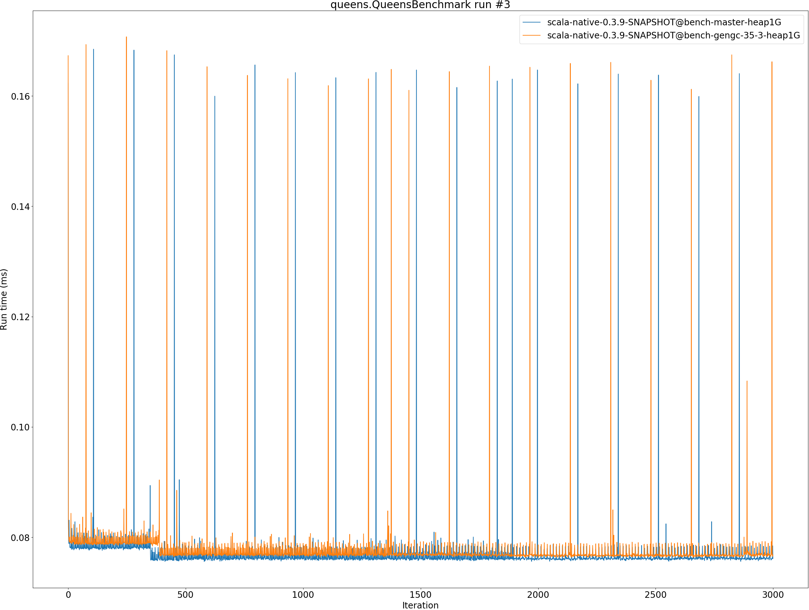
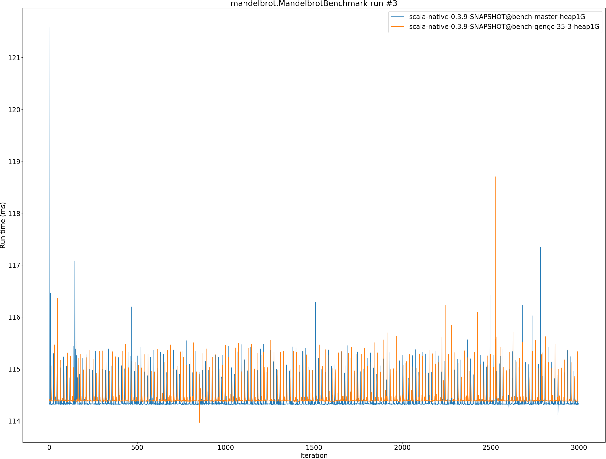
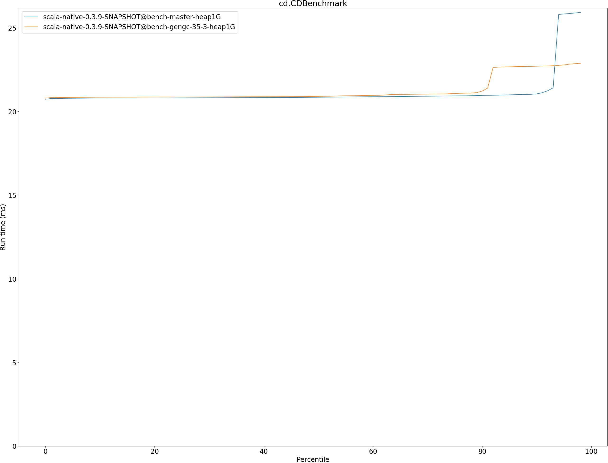

# Summary
## Benchmark run time (ms) at 50 percentile 

|name | scala-native-0.3.9-SNAPSHOT@bench-master-heap1G | scala-native-0.3.9-SNAPSHOT@bench-gengc-35-3-heap1G | |
| -- | -- | -- | -- |
|[permute.PermuteBenchmark](#permutepermutebenchmark)|0.1760|0.1868|+6.13%|
|[queens.QueensBenchmark](#queensqueensbenchmark)|0.0764|0.0768|+0.51%|
|[json.JsonBenchmark](#jsonjsonbenchmark)|1.1679|1.2168|+4.18%|
|[brainfuck.BrainfuckBenchmark](#brainfuckbrainfuckbenchmark)|3.0094|3.0212|+0.39%|
|[nbody.NbodyBenchmark](#nbodynbodybenchmark)|28.9692|28.9239|__-0.16%__|
|[mandelbrot.MandelbrotBenchmark](#mandelbrotmandelbrotbenchmark)|114.3240|114.3862|+0.05%|
|[tracer.TracerBenchmark](#tracertracerbenchmark)|0.6243|0.6365|+1.95%|
|[deltablue.DeltaBlueBenchmark](#deltabluedeltabluebenchmark)|0.1744|0.1764|+1.17%|
|[cd.CDBenchmark](#cdcdbenchmark)|20.8529|20.9046|+0.25%|
|[sudoku.SudokuBenchmark](#sudokusudokubenchmark)|1.7597|1.8296|+3.97%|
|[kmeans.KmeansBenchmark](#kmeanskmeansbenchmark)|41.1034|43.0322|+4.69%|
|[gcbench.GCBenchBenchmark](#gcbenchgcbenchbenchmark)|88.2452|81.1638|__-8.02%__|
|[richards.RichardsBenchmark](#richardsrichardsbenchmark)|0.0791|0.0834|+5.41%|
|[bounce.BounceBenchmark](#bouncebouncebenchmark)|0.0460|0.0479|+4.07%|
| __Geometrical mean:__|| |+1.70%|
## Benchmark run time (ms) at 90 percentile 

|name | scala-native-0.3.9-SNAPSHOT@bench-master-heap1G | scala-native-0.3.9-SNAPSHOT@bench-gengc-35-3-heap1G | |
| -- | -- | -- | -- |
|[permute.PermuteBenchmark](#permutepermutebenchmark)|0.2602|0.1890|__-27.33%__|
|[queens.QueensBenchmark](#queensqueensbenchmark)|0.0783|0.0815|+4.12%|
|[json.JsonBenchmark](#jsonjsonbenchmark)|1.1741|1.2209|+3.98%|
|[brainfuck.BrainfuckBenchmark](#brainfuckbrainfuckbenchmark)|3.0653|3.0633|__-0.06%__|
|[nbody.NbodyBenchmark](#nbodynbodybenchmark)|29.4635|29.4576|__-0.02%__|
|[mandelbrot.MandelbrotBenchmark](#mandelbrotmandelbrotbenchmark)|114.4460|114.4884|+0.04%|
|[tracer.TracerBenchmark](#tracertracerbenchmark)|0.6321|0.6405|+1.32%|
|[deltablue.DeltaBlueBenchmark](#deltabluedeltabluebenchmark)|0.1799|0.1797|__-0.08%__|
|[cd.CDBenchmark](#cdcdbenchmark)|21.0551|22.7078|+7.85%|
|[sudoku.SudokuBenchmark](#sudokusudokubenchmark)|1.7783|1.8723|+5.28%|
|[kmeans.KmeansBenchmark](#kmeanskmeansbenchmark)|41.7748|44.2741|+5.98%|
|[gcbench.GCBenchBenchmark](#gcbenchgcbenchbenchmark)|89.9123|88.2375|__-1.86%__|
|[richards.RichardsBenchmark](#richardsrichardsbenchmark)|0.0821|0.0865|+5.40%|
|[bounce.BounceBenchmark](#bouncebouncebenchmark)|0.0472|0.0491|+4.04%|
| __Geometrical mean:__|| |+0.22%|
## Benchmark run time (ms) at 99 percentile 

|name | scala-native-0.3.9-SNAPSHOT@bench-master-heap1G | scala-native-0.3.9-SNAPSHOT@bench-gengc-35-3-heap1G | |
| -- | -- | -- | -- |
|[permute.PermuteBenchmark](#permutepermutebenchmark)|0.2674|0.2351|__-12.08%__|
|[queens.QueensBenchmark](#queensqueensbenchmark)|0.0810|0.0907|+11.98%|
|[json.JsonBenchmark](#jsonjsonbenchmark)|1.2098|1.2613|+4.25%|
|[brainfuck.BrainfuckBenchmark](#brainfuckbrainfuckbenchmark)|3.1718|3.9571|+24.76%|
|[nbody.NbodyBenchmark](#nbodynbodybenchmark)|30.9112|30.7704|__-0.46%__|
|[mandelbrot.MandelbrotBenchmark](#mandelbrotmandelbrotbenchmark)|115.3943|115.4383|+0.04%|
|[tracer.TracerBenchmark](#tracertracerbenchmark)|0.6446|0.6705|+4.01%|
|[deltablue.DeltaBlueBenchmark](#deltabluedeltabluebenchmark)|0.2632|0.2644|+0.45%|
|[cd.CDBenchmark](#cdcdbenchmark)|25.9893|22.9408|__-11.73%__|
|[sudoku.SudokuBenchmark](#sudokusudokubenchmark)|1.8228|1.9150|+5.06%|
|[kmeans.KmeansBenchmark](#kmeanskmeansbenchmark)|47.1211|46.8545|__-0.57%__|
|[gcbench.GCBenchBenchmark](#gcbenchgcbenchbenchmark)|90.7894|90.0554|__-0.81%__|
|[richards.RichardsBenchmark](#richardsrichardsbenchmark)|0.1603|0.1639|+2.21%|
|[bounce.BounceBenchmark](#bouncebouncebenchmark)|0.0489|0.0504|+2.92%|
| __Geometrical mean:__|| |+1.79%|
## Benchmark total run time (ms) 

|name | scala-native-0.3.9-SNAPSHOT@bench-master-heap1G | scala-native-0.3.9-SNAPSHOT@bench-gengc-35-3-heap1G | |
| -- | -- | -- | -- |
|[permute.PermuteBenchmark](#permutepermutebenchmark)|3781.0794|3795.9355|+0.39%|
|[queens.QueensBenchmark](#queensqueensbenchmark)|1545.0228|1571.3058|+1.70%|
|[json.JsonBenchmark](#jsonjsonbenchmark)|23601.6803|24536.5353|+3.96%|
|[brainfuck.BrainfuckBenchmark](#brainfuckbrainfuckbenchmark)|60858.5172|61086.6795|+0.37%|
|[nbody.NbodyBenchmark](#nbodynbodybenchmark)|583211.2324|581961.9175|__-0.21%__|
|[mandelbrot.MandelbrotBenchmark](#mandelbrotmandelbrotbenchmark)|2287872.1770|2289097.2178|+0.05%|
|[tracer.TracerBenchmark](#tracertracerbenchmark)|12802.1035|13002.9279|+1.57%|
|[deltablue.DeltaBlueBenchmark](#deltabluedeltabluebenchmark)|3644.6332|3654.2357|+0.26%|
|[cd.CDBenchmark](#cdcdbenchmark)|424065.5461|425399.1001|+0.31%|
|[sudoku.SudokuBenchmark](#sudokusudokubenchmark)|35357.5041|36914.7115|+4.40%|
|[kmeans.KmeansBenchmark](#kmeanskmeansbenchmark)|827134.0270|866740.9910|+4.79%|
|[gcbench.GCBenchBenchmark](#gcbenchgcbenchbenchmark)|1690323.7191|1663729.8715|__-1.57%__|
|[richards.RichardsBenchmark](#richardsrichardsbenchmark)|1616.2647|1710.8224|+5.85%|
|[bounce.BounceBenchmark](#bouncebouncebenchmark)|930.5583|968.3205|+4.06%|
| __Geometrical mean:__|| |+1.83%|
# Individual benchmarks
## permute.PermuteBenchmark

## queens.QueensBenchmark

## json.JsonBenchmark

## brainfuck.BrainfuckBenchmark

## nbody.NbodyBenchmark

## mandelbrot.MandelbrotBenchmark

## tracer.TracerBenchmark

## deltablue.DeltaBlueBenchmark

## cd.CDBenchmark

## sudoku.SudokuBenchmark

## kmeans.KmeansBenchmark

## gcbench.GCBenchBenchmark

## richards.RichardsBenchmark

## bounce.BounceBenchmark

