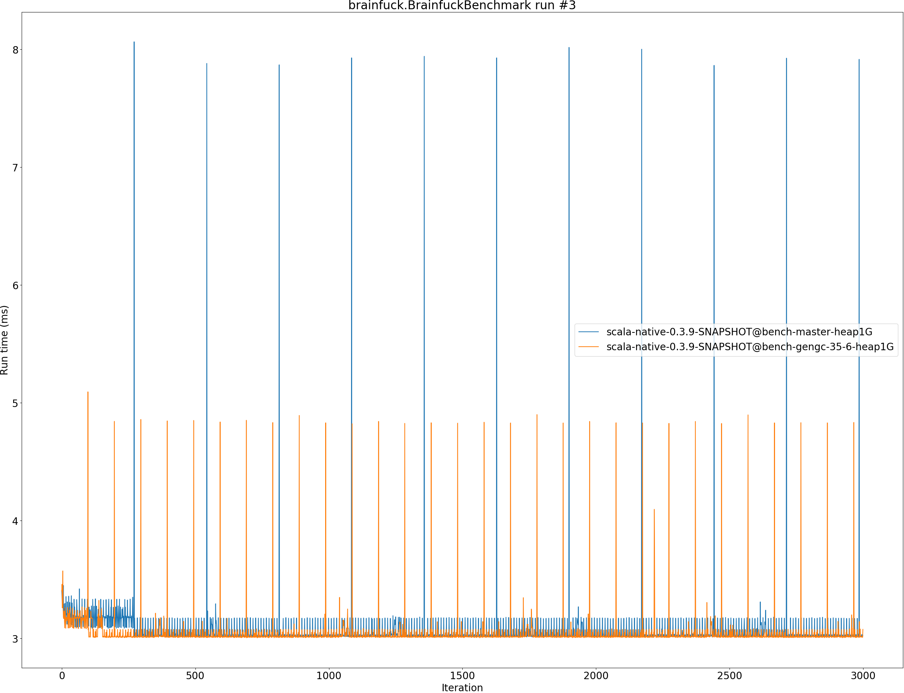
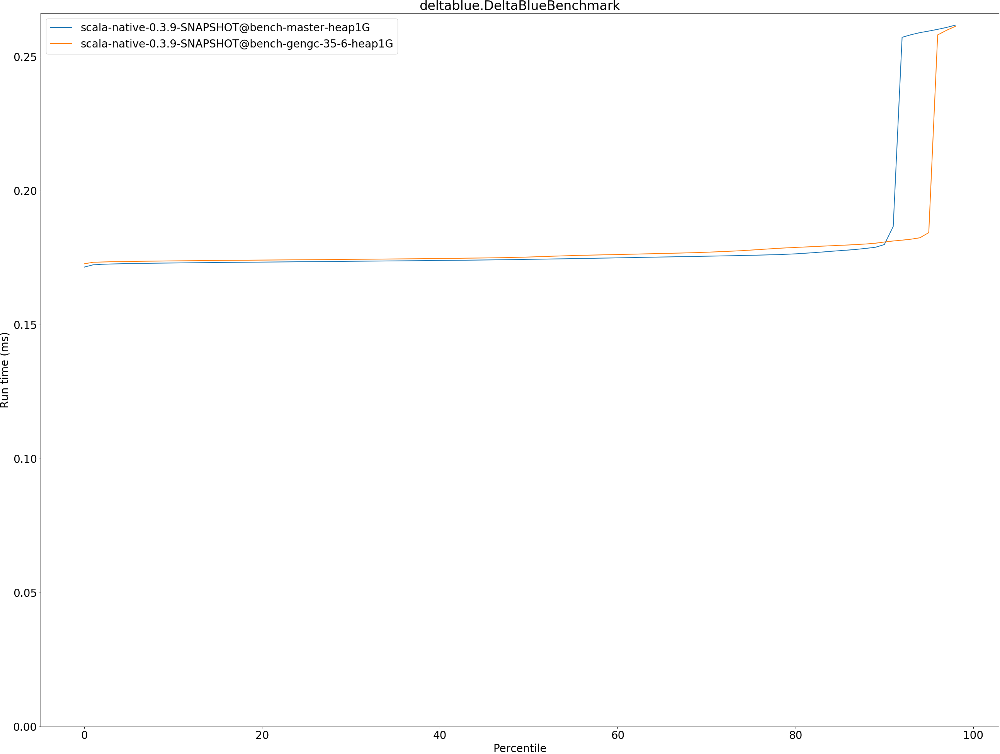

# Summary
## Benchmark run time (ms) at 50 percentile 

|name | scala-native-0.3.9-SNAPSHOT@bench-master-heap1G | scala-native-0.3.9-SNAPSHOT@bench-gengc-35-6-heap1G | |
| -- | -- | -- | -- |
|[permute.PermuteBenchmark](#permutepermutebenchmark)|0.1760|0.1892|+7.51%|
|[queens.QueensBenchmark](#queensqueensbenchmark)|0.0764|0.0771|+0.85%|
|[json.JsonBenchmark](#jsonjsonbenchmark)|1.1679|1.1791|+0.96%|
|[brainfuck.BrainfuckBenchmark](#brainfuckbrainfuckbenchmark)|3.0094|3.0156|+0.21%|
|[nbody.NbodyBenchmark](#nbodynbodybenchmark)|28.9692|28.9204|__-0.17%__|
|[mandelbrot.MandelbrotBenchmark](#mandelbrotmandelbrotbenchmark)|114.3240|114.9132|+0.52%|
|[tracer.TracerBenchmark](#tracertracerbenchmark)|0.6243|0.6376|+2.13%|
|[deltablue.DeltaBlueBenchmark](#deltabluedeltabluebenchmark)|0.1744|0.1752|+0.49%|
|[cd.CDBenchmark](#cdcdbenchmark)|20.8529|20.7131|__-0.67%__|
|[sudoku.SudokuBenchmark](#sudokusudokubenchmark)|1.7597|1.8260|+3.77%|
|[kmeans.KmeansBenchmark](#kmeanskmeansbenchmark)|41.1034|42.3278|+2.98%|
|[gcbench.GCBenchBenchmark](#gcbenchgcbenchbenchmark)|88.2452|81.4948|__-7.65%__|
|[richards.RichardsBenchmark](#richardsrichardsbenchmark)|0.0791|0.0837|+5.73%|
|[bounce.BounceBenchmark](#bouncebouncebenchmark)|0.0460|0.0438|__-4.84%__|
| __Geometrical mean:__|| |+0.77%|
## Benchmark run time (ms) at 90 percentile 

|name | scala-native-0.3.9-SNAPSHOT@bench-master-heap1G | scala-native-0.3.9-SNAPSHOT@bench-gengc-35-6-heap1G | |
| -- | -- | -- | -- |
|[permute.PermuteBenchmark](#permutepermutebenchmark)|0.2602|0.1923|__-26.07%__|
|[queens.QueensBenchmark](#queensqueensbenchmark)|0.0783|0.0790|+0.86%|
|[json.JsonBenchmark](#jsonjsonbenchmark)|1.1741|1.1836|+0.81%|
|[brainfuck.BrainfuckBenchmark](#brainfuckbrainfuckbenchmark)|3.0653|3.0620|__-0.11%__|
|[nbody.NbodyBenchmark](#nbodynbodybenchmark)|29.4635|29.4270|__-0.12%__|
|[mandelbrot.MandelbrotBenchmark](#mandelbrotmandelbrotbenchmark)|114.4460|115.0422|+0.52%|
|[tracer.TracerBenchmark](#tracertracerbenchmark)|0.6321|0.6488|+2.64%|
|[deltablue.DeltaBlueBenchmark](#deltabluedeltabluebenchmark)|0.1799|0.1808|+0.52%|
|[cd.CDBenchmark](#cdcdbenchmark)|21.0551|22.5262|+6.99%|
|[sudoku.SudokuBenchmark](#sudokusudokubenchmark)|1.7783|1.8369|+3.30%|
|[kmeans.KmeansBenchmark](#kmeanskmeansbenchmark)|41.7748|43.5898|+4.34%|
|[gcbench.GCBenchBenchmark](#gcbenchgcbenchbenchmark)|89.9123|88.4332|__-1.65%__|
|[richards.RichardsBenchmark](#richardsrichardsbenchmark)|0.0821|0.0871|+6.13%|
|[bounce.BounceBenchmark](#bouncebouncebenchmark)|0.0472|0.0448|__-5.00%__|
| __Geometrical mean:__|| |__-0.83%__|
## Benchmark run time (ms) at 99 percentile 

|name | scala-native-0.3.9-SNAPSHOT@bench-master-heap1G | scala-native-0.3.9-SNAPSHOT@bench-gengc-35-6-heap1G | |
| -- | -- | -- | -- |
|[permute.PermuteBenchmark](#permutepermutebenchmark)|0.2674|0.2704|+1.12%|
|[queens.QueensBenchmark](#queensqueensbenchmark)|0.0810|0.0817|+0.89%|
|[json.JsonBenchmark](#jsonjsonbenchmark)|1.2098|1.2154|+0.46%|
|[brainfuck.BrainfuckBenchmark](#brainfuckbrainfuckbenchmark)|3.1718|4.4651|+40.78%|
|[nbody.NbodyBenchmark](#nbodynbodybenchmark)|30.9112|30.7226|__-0.61%__|
|[mandelbrot.MandelbrotBenchmark](#mandelbrotmandelbrotbenchmark)|115.3943|116.0180|+0.54%|
|[tracer.TracerBenchmark](#tracertracerbenchmark)|0.6446|0.6692|+3.81%|
|[deltablue.DeltaBlueBenchmark](#deltabluedeltabluebenchmark)|0.2632|0.2649|+0.67%|
|[cd.CDBenchmark](#cdcdbenchmark)|25.9893|22.7228|__-12.57%__|
|[sudoku.SudokuBenchmark](#sudokusudokubenchmark)|1.8228|1.8999|+4.23%|
|[kmeans.KmeansBenchmark](#kmeanskmeansbenchmark)|47.1211|46.1814|__-1.99%__|
|[gcbench.GCBenchBenchmark](#gcbenchgcbenchbenchmark)|90.7894|90.4875|__-0.33%__|
|[richards.RichardsBenchmark](#richardsrichardsbenchmark)|0.1603|0.1656|+3.30%|
|[bounce.BounceBenchmark](#bouncebouncebenchmark)|0.0489|0.0464|__-5.22%__|
| __Geometrical mean:__|| |+1.96%|
## Benchmark total run time (ms) 

|name | scala-native-0.3.9-SNAPSHOT@bench-master-heap1G | scala-native-0.3.9-SNAPSHOT@bench-gengc-35-6-heap1G | |
| -- | -- | -- | -- |
|[permute.PermuteBenchmark](#permutepermutebenchmark)|3781.0794|3880.3502|+2.63%|
|[queens.QueensBenchmark](#queensqueensbenchmark)|1545.0228|1558.3125|+0.86%|
|[json.JsonBenchmark](#jsonjsonbenchmark)|23601.6803|23784.3196|+0.77%|
|[brainfuck.BrainfuckBenchmark](#brainfuckbrainfuckbenchmark)|60858.5172|60961.4440|+0.17%|
|[nbody.NbodyBenchmark](#nbodynbodybenchmark)|583211.2324|581512.9160|__-0.29%__|
|[mandelbrot.MandelbrotBenchmark](#mandelbrotmandelbrotbenchmark)|2287872.1770|2299712.9830|+0.52%|
|[tracer.TracerBenchmark](#tracertracerbenchmark)|12802.1035|13045.9091|+1.90%|
|[deltablue.DeltaBlueBenchmark](#deltabluedeltabluebenchmark)|3644.6332|3638.4596|__-0.17%__|
|[cd.CDBenchmark](#cdcdbenchmark)|424065.5461|421302.4210|__-0.65%__|
|[sudoku.SudokuBenchmark](#sudokusudokubenchmark)|35357.5041|36678.8928|+3.74%|
|[kmeans.KmeansBenchmark](#kmeanskmeansbenchmark)|827134.0270|852755.1570|+3.10%|
|[gcbench.GCBenchBenchmark](#gcbenchgcbenchbenchmark)|1690323.7191|1667018.4622|__-1.38%__|
|[richards.RichardsBenchmark](#richardsrichardsbenchmark)|1616.2647|1718.5468|+6.33%|
|[bounce.BounceBenchmark](#bouncebouncebenchmark)|930.5583|884.0322|__-5.00%__|
| __Geometrical mean:__|| |+0.86%|
# Individual benchmarks
## permute.PermuteBenchmark

## queens.QueensBenchmark

## json.JsonBenchmark

## brainfuck.BrainfuckBenchmark

## nbody.NbodyBenchmark

## mandelbrot.MandelbrotBenchmark

## tracer.TracerBenchmark

## deltablue.DeltaBlueBenchmark

## cd.CDBenchmark

## sudoku.SudokuBenchmark

## kmeans.KmeansBenchmark

## gcbench.GCBenchBenchmark

## richards.RichardsBenchmark

## bounce.BounceBenchmark

