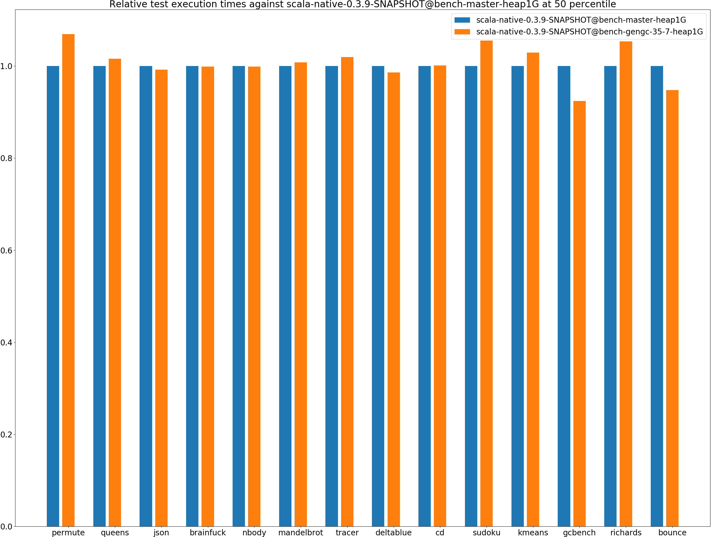
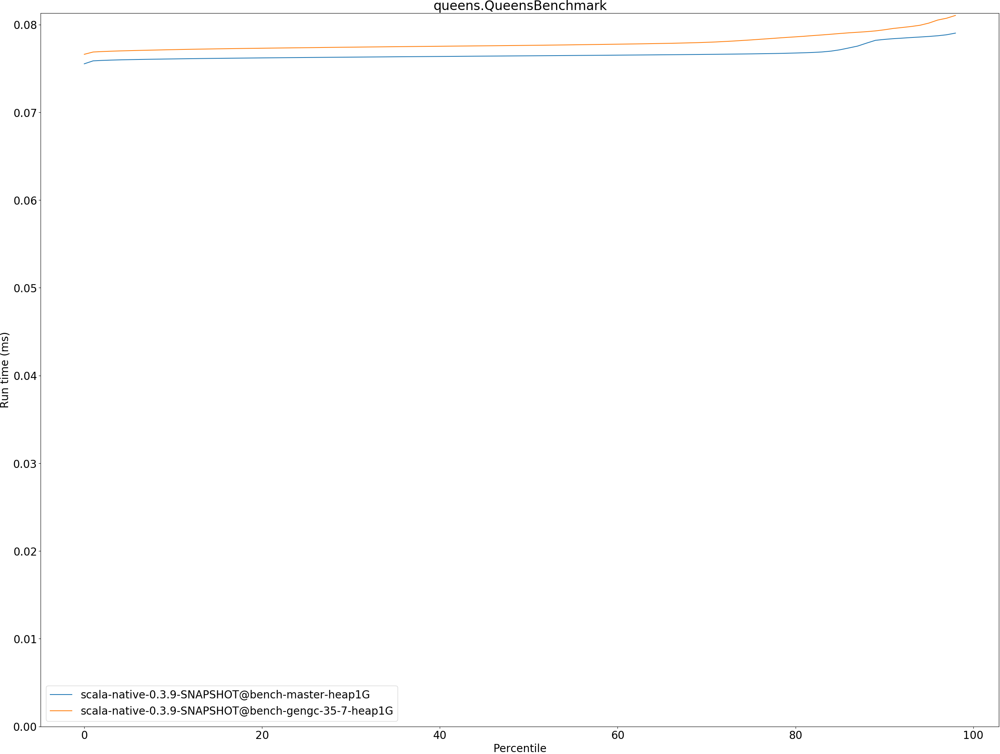
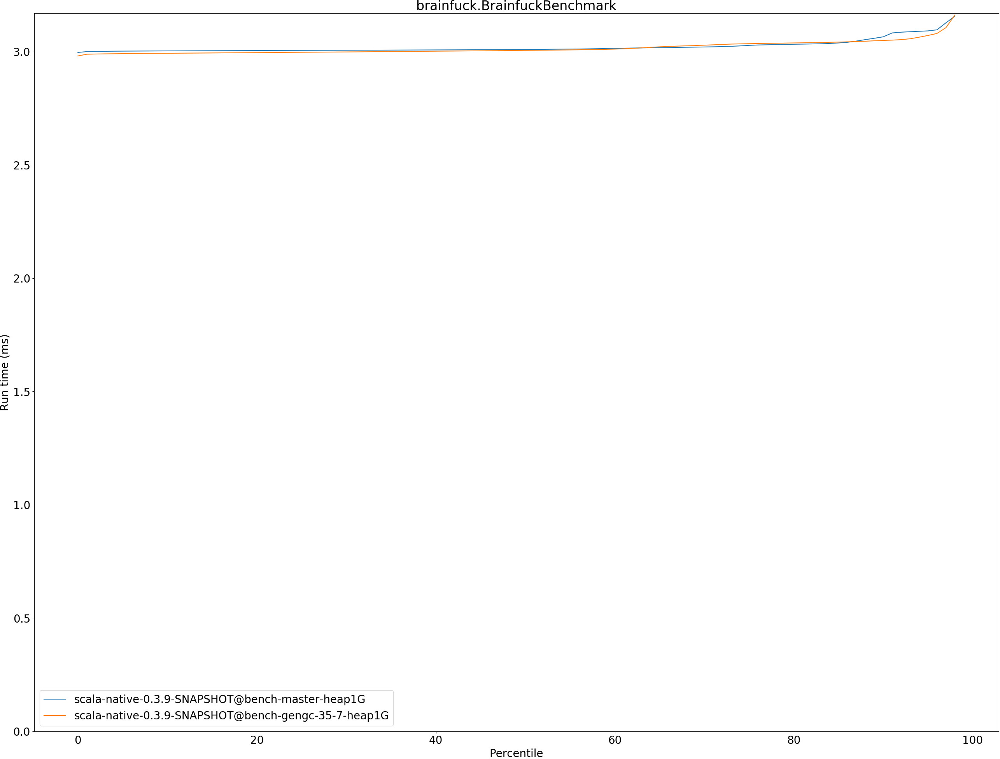

# Summary
## Benchmark run time (ms) at 50 percentile 

|name | scala-native-0.3.9-SNAPSHOT@bench-master-heap1G | scala-native-0.3.9-SNAPSHOT@bench-gengc-35-7-heap1G | |
| -- | -- | -- | -- |
|[permute.PermuteBenchmark](#permutepermutebenchmark)|0.1760|0.1882|+6.91%|
|[queens.QueensBenchmark](#queensqueensbenchmark)|0.0764|0.0776|+1.56%|
|[json.JsonBenchmark](#jsonjsonbenchmark)|1.1679|1.1584|__-0.82%__|
|[brainfuck.BrainfuckBenchmark](#brainfuckbrainfuckbenchmark)|3.0094|3.0054|__-0.13%__|
|[nbody.NbodyBenchmark](#nbodynbodybenchmark)|28.9692|28.9252|__-0.15%__|
|[mandelbrot.MandelbrotBenchmark](#mandelbrotmandelbrotbenchmark)|114.3240|115.2209|+0.78%|
|[tracer.TracerBenchmark](#tracertracerbenchmark)|0.6243|0.6365|+1.94%|
|[deltablue.DeltaBlueBenchmark](#deltabluedeltabluebenchmark)|0.1744|0.1720|__-1.37%__|
|[cd.CDBenchmark](#cdcdbenchmark)|20.8529|20.8786|+0.12%|
|[sudoku.SudokuBenchmark](#sudokusudokubenchmark)|1.7597|1.8569|+5.52%|
|[kmeans.KmeansBenchmark](#kmeanskmeansbenchmark)|41.1034|42.3125|+2.94%|
|[gcbench.GCBenchBenchmark](#gcbenchgcbenchbenchmark)|88.2452|81.5365|__-7.60%__|
|[richards.RichardsBenchmark](#richardsrichardsbenchmark)|0.0791|0.0833|+5.32%|
|[bounce.BounceBenchmark](#bouncebouncebenchmark)|0.0460|0.0436|__-5.20%__|
| __Geometrical mean:__|| |+0.63%|
## Benchmark run time (ms) at 90 percentile 

|name | scala-native-0.3.9-SNAPSHOT@bench-master-heap1G | scala-native-0.3.9-SNAPSHOT@bench-gengc-35-7-heap1G | |
| -- | -- | -- | -- |
|[permute.PermuteBenchmark](#permutepermutebenchmark)|0.2602|0.1906|__-26.74%__|
|[queens.QueensBenchmark](#queensqueensbenchmark)|0.0783|0.0794|+1.40%|
|[json.JsonBenchmark](#jsonjsonbenchmark)|1.1741|1.1631|__-0.94%__|
|[brainfuck.BrainfuckBenchmark](#brainfuckbrainfuckbenchmark)|3.0653|3.0492|__-0.52%__|
|[nbody.NbodyBenchmark](#nbodynbodybenchmark)|29.4635|29.4694|+0.02%|
|[mandelbrot.MandelbrotBenchmark](#mandelbrotmandelbrotbenchmark)|114.4460|115.3388|+0.78%|
|[tracer.TracerBenchmark](#tracertracerbenchmark)|0.6321|0.6413|+1.45%|
|[deltablue.DeltaBlueBenchmark](#deltabluedeltabluebenchmark)|0.1799|0.1762|__-2.03%__|
|[cd.CDBenchmark](#cdcdbenchmark)|21.0551|22.6803|+7.72%|
|[sudoku.SudokuBenchmark](#sudokusudokubenchmark)|1.7783|1.8640|+4.81%|
|[kmeans.KmeansBenchmark](#kmeanskmeansbenchmark)|41.7748|43.3809|+3.84%|
|[gcbench.GCBenchBenchmark](#gcbenchgcbenchbenchmark)|89.9123|88.5443|__-1.52%__|
|[richards.RichardsBenchmark](#richardsrichardsbenchmark)|0.0821|0.0856|+4.23%|
|[bounce.BounceBenchmark](#bouncebouncebenchmark)|0.0472|0.0447|__-5.35%__|
| __Geometrical mean:__|| |__-1.28%__|
## Benchmark run time (ms) at 99 percentile 

|name | scala-native-0.3.9-SNAPSHOT@bench-master-heap1G | scala-native-0.3.9-SNAPSHOT@bench-gengc-35-7-heap1G | |
| -- | -- | -- | -- |
|[permute.PermuteBenchmark](#permutepermutebenchmark)|0.2674|0.2388|__-10.71%__|
|[queens.QueensBenchmark](#queensqueensbenchmark)|0.0810|0.0830|+2.44%|
|[json.JsonBenchmark](#jsonjsonbenchmark)|1.2098|1.1953|__-1.20%__|
|[brainfuck.BrainfuckBenchmark](#brainfuckbrainfuckbenchmark)|3.1718|3.3852|+6.73%|
|[nbody.NbodyBenchmark](#nbodynbodybenchmark)|30.9112|30.7249|__-0.60%__|
|[mandelbrot.MandelbrotBenchmark](#mandelbrotmandelbrotbenchmark)|115.3943|116.2871|+0.77%|
|[tracer.TracerBenchmark](#tracertracerbenchmark)|0.6446|0.6745|+4.63%|
|[deltablue.DeltaBlueBenchmark](#deltabluedeltabluebenchmark)|0.2632|0.2638|+0.25%|
|[cd.CDBenchmark](#cdcdbenchmark)|25.9893|22.9053|__-11.87%__|
|[sudoku.SudokuBenchmark](#sudokusudokubenchmark)|1.8228|1.9223|+5.46%|
|[kmeans.KmeansBenchmark](#kmeanskmeansbenchmark)|47.1211|46.0953|__-2.18%__|
|[gcbench.GCBenchBenchmark](#gcbenchgcbenchbenchmark)|90.7894|90.4575|__-0.37%__|
|[richards.RichardsBenchmark](#richardsrichardsbenchmark)|0.1603|0.1656|+3.30%|
|[bounce.BounceBenchmark](#bouncebouncebenchmark)|0.0489|0.0462|__-5.51%__|
| __Geometrical mean:__|| |__-0.78%__|
## Benchmark total run time (ms) 

|name | scala-native-0.3.9-SNAPSHOT@bench-master-heap1G | scala-native-0.3.9-SNAPSHOT@bench-gengc-35-7-heap1G | |
| -- | -- | -- | -- |
|[permute.PermuteBenchmark](#permutepermutebenchmark)|3781.0794|3822.3001|+1.09%|
|[queens.QueensBenchmark](#queensqueensbenchmark)|1545.0228|1570.5876|+1.65%|
|[json.JsonBenchmark](#jsonjsonbenchmark)|23601.6803|23362.3410|__-1.01%__|
|[brainfuck.BrainfuckBenchmark](#brainfuckbrainfuckbenchmark)|60858.5172|60700.4268|__-0.26%__|
|[nbody.NbodyBenchmark](#nbodynbodybenchmark)|583211.2324|581778.7731|__-0.25%__|
|[mandelbrot.MandelbrotBenchmark](#mandelbrotmandelbrotbenchmark)|2287872.1770|2305770.0128|+0.78%|
|[tracer.TracerBenchmark](#tracertracerbenchmark)|12802.1035|13010.0710|+1.62%|
|[deltablue.DeltaBlueBenchmark](#deltabluedeltabluebenchmark)|3644.6332|3581.0542|__-1.74%__|
|[cd.CDBenchmark](#cdcdbenchmark)|424065.5461|424603.3575|+0.13%|
|[sudoku.SudokuBenchmark](#sudokusudokubenchmark)|35357.5041|37275.2296|+5.42%|
|[kmeans.KmeansBenchmark](#kmeanskmeansbenchmark)|827134.0270|851941.4249|+3.00%|
|[gcbench.GCBenchBenchmark](#gcbenchgcbenchbenchmark)|1690323.7191|1667818.9756|__-1.33%__|
|[richards.RichardsBenchmark](#richardsrichardsbenchmark)|1616.2647|1695.5234|+4.90%|
|[bounce.BounceBenchmark](#bouncebouncebenchmark)|930.5583|882.5295|__-5.16%__|
| __Geometrical mean:__|| |+0.60%|
# Individual benchmarks
## permute.PermuteBenchmark

## queens.QueensBenchmark

## json.JsonBenchmark

## brainfuck.BrainfuckBenchmark

## nbody.NbodyBenchmark

## mandelbrot.MandelbrotBenchmark

## tracer.TracerBenchmark

## deltablue.DeltaBlueBenchmark

## cd.CDBenchmark

## sudoku.SudokuBenchmark

## kmeans.KmeansBenchmark

## gcbench.GCBenchBenchmark

## richards.RichardsBenchmark

## bounce.BounceBenchmark

