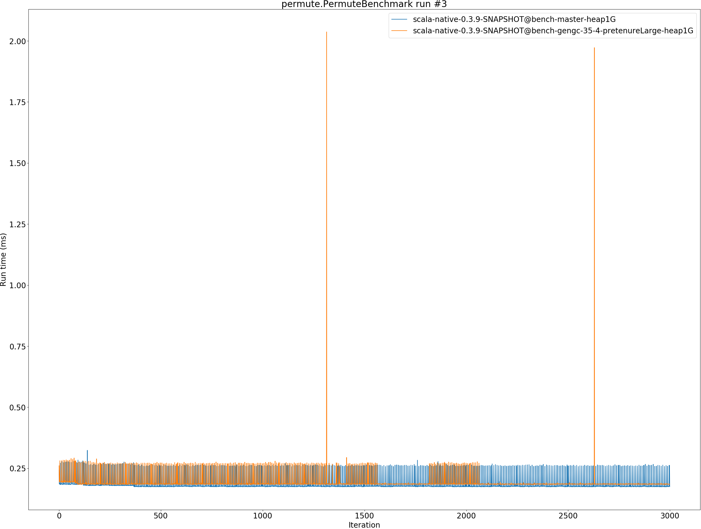
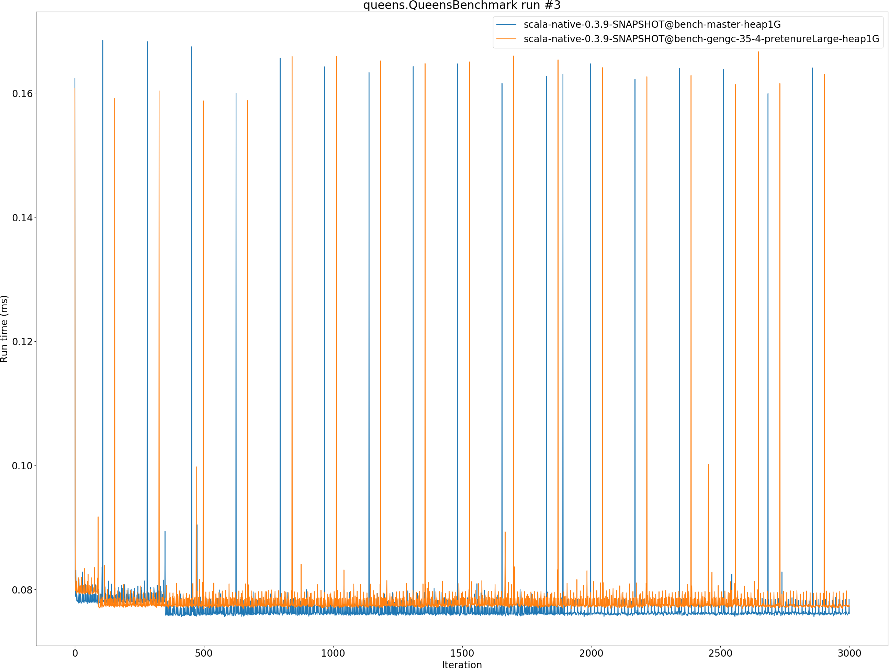
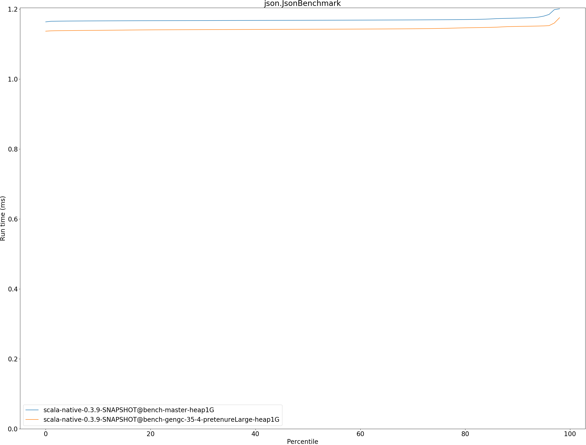

# Summary
## Benchmark run time (ms) at 50 percentile 

|name | scala-native-0.3.9-SNAPSHOT@bench-master-heap1G | scala-native-0.3.9-SNAPSHOT@bench-gengc-35-4-pretenureLarge-heap1G | |
| -- | -- | -- | -- |
|[permute.PermuteBenchmark](#permutepermutebenchmark)|0.1760|0.1853|+5.29%|
|[queens.QueensBenchmark](#queensqueensbenchmark)|0.0764|0.0769|+0.63%|
|[json.JsonBenchmark](#jsonjsonbenchmark)|1.1679|1.1422|__-2.20%__|
|[brainfuck.BrainfuckBenchmark](#brainfuckbrainfuckbenchmark)|3.0094|3.0114|+0.07%|
|[nbody.NbodyBenchmark](#nbodynbodybenchmark)|28.9692|28.9265|__-0.15%__|
|[mandelbrot.MandelbrotBenchmark](#mandelbrotmandelbrotbenchmark)|114.3240|114.3430|+0.02%|
|[tracer.TracerBenchmark](#tracertracerbenchmark)|0.6243|0.6349|+1.69%|
|[deltablue.DeltaBlueBenchmark](#deltabluedeltabluebenchmark)|0.1744|0.1718|__-1.46%__|
|[cd.CDBenchmark](#cdcdbenchmark)|20.8529|21.1812|+1.57%|
|[sudoku.SudokuBenchmark](#sudokusudokubenchmark)|1.7597|1.8335|+4.19%|
|[kmeans.KmeansBenchmark](#kmeanskmeansbenchmark)|41.1034|42.7681|+4.05%|
|[gcbench.GCBenchBenchmark](#gcbenchgcbenchbenchmark)|88.2452|81.5940|__-7.54%__|
|[richards.RichardsBenchmark](#richardsrichardsbenchmark)|0.0791|0.0835|+5.50%|
|[bounce.BounceBenchmark](#bouncebouncebenchmark)|0.0460|0.0414|__-10.05%__|
| __Geometrical mean:__|| |+0.02%|
## Benchmark run time (ms) at 90 percentile 

|name | scala-native-0.3.9-SNAPSHOT@bench-master-heap1G | scala-native-0.3.9-SNAPSHOT@bench-gengc-35-4-pretenureLarge-heap1G | |
| -- | -- | -- | -- |
|[permute.PermuteBenchmark](#permutepermutebenchmark)|0.2602|0.1874|__-27.97%__|
|[queens.QueensBenchmark](#queensqueensbenchmark)|0.0783|0.0785|+0.30%|
|[json.JsonBenchmark](#jsonjsonbenchmark)|1.1741|1.1503|__-2.03%__|
|[brainfuck.BrainfuckBenchmark](#brainfuckbrainfuckbenchmark)|3.0653|3.1069|+1.36%|
|[nbody.NbodyBenchmark](#nbodynbodybenchmark)|29.4635|29.4373|__-0.09%__|
|[mandelbrot.MandelbrotBenchmark](#mandelbrotmandelbrotbenchmark)|114.4460|114.4445|__-0.00%__|
|[tracer.TracerBenchmark](#tracertracerbenchmark)|0.6321|0.6387|+1.04%|
|[deltablue.DeltaBlueBenchmark](#deltabluedeltabluebenchmark)|0.1799|0.1749|__-2.74%__|
|[cd.CDBenchmark](#cdcdbenchmark)|21.0551|22.9603|+9.05%|
|[sudoku.SudokuBenchmark](#sudokusudokubenchmark)|1.7783|1.8768|+5.54%|
|[kmeans.KmeansBenchmark](#kmeanskmeansbenchmark)|41.7748|111.1174|+165.99%|
|[gcbench.GCBenchBenchmark](#gcbenchgcbenchbenchmark)|89.9123|88.0483|__-2.07%__|
|[richards.RichardsBenchmark](#richardsrichardsbenchmark)|0.0821|0.0860|+4.78%|
|[bounce.BounceBenchmark](#bouncebouncebenchmark)|0.0472|0.0425|__-9.98%__|
| __Geometrical mean:__|| |+5.04%|
## Benchmark run time (ms) at 99 percentile 

|name | scala-native-0.3.9-SNAPSHOT@bench-master-heap1G | scala-native-0.3.9-SNAPSHOT@bench-gengc-35-4-pretenureLarge-heap1G | |
| -- | -- | -- | -- |
|[permute.PermuteBenchmark](#permutepermutebenchmark)|0.2674|0.2155|__-19.40%__|
|[queens.QueensBenchmark](#queensqueensbenchmark)|0.0810|0.0805|__-0.65%__|
|[json.JsonBenchmark](#jsonjsonbenchmark)|1.2098|1.1852|__-2.03%__|
|[brainfuck.BrainfuckBenchmark](#brainfuckbrainfuckbenchmark)|3.1718|20.4398|+544.42%|
|[nbody.NbodyBenchmark](#nbodynbodybenchmark)|30.9112|30.7519|__-0.52%__|
|[mandelbrot.MandelbrotBenchmark](#mandelbrotmandelbrotbenchmark)|115.3943|115.3985|+0.00%|
|[tracer.TracerBenchmark](#tracertracerbenchmark)|0.6446|0.6708|+4.06%|
|[deltablue.DeltaBlueBenchmark](#deltabluedeltabluebenchmark)|0.2632|0.2597|__-1.33%__|
|[cd.CDBenchmark](#cdcdbenchmark)|25.9893|23.1655|__-10.87%__|
|[sudoku.SudokuBenchmark](#sudokusudokubenchmark)|1.8228|1.9249|+5.60%|
|[kmeans.KmeansBenchmark](#kmeanskmeansbenchmark)|47.1211|156.5395|+232.21%|
|[gcbench.GCBenchBenchmark](#gcbenchgcbenchbenchmark)|90.7894|90.4196|__-0.41%__|
|[richards.RichardsBenchmark](#richardsrichardsbenchmark)|0.1603|0.1239|__-22.75%__|
|[bounce.BounceBenchmark](#bouncebouncebenchmark)|0.0489|0.0439|__-10.26%__|
| __Geometrical mean:__|| |+18.80%|
## Benchmark total run time (ms) 

|name | scala-native-0.3.9-SNAPSHOT@bench-master-heap1G | scala-native-0.3.9-SNAPSHOT@bench-gengc-35-4-pretenureLarge-heap1G | |
| -- | -- | -- | -- |
|[permute.PermuteBenchmark](#permutepermutebenchmark)|3781.0794|3763.0348|__-0.48%__|
|[queens.QueensBenchmark](#queensqueensbenchmark)|1545.0228|1554.2772|+0.60%|
|[json.JsonBenchmark](#jsonjsonbenchmark)|23601.6803|23048.9390|__-2.34%__|
|[brainfuck.BrainfuckBenchmark](#brainfuckbrainfuckbenchmark)|60858.5172|66592.5561|+9.42%|
|[nbody.NbodyBenchmark](#nbodynbodybenchmark)|583211.2324|581700.3978|__-0.26%__|
|[mandelbrot.MandelbrotBenchmark](#mandelbrotmandelbrotbenchmark)|2287872.1770|2288164.8771|+0.01%|
|[tracer.TracerBenchmark](#tracertracerbenchmark)|12802.1035|12971.0904|+1.32%|
|[deltablue.DeltaBlueBenchmark](#deltabluedeltabluebenchmark)|3644.6332|3558.9203|__-2.35%__|
|[cd.CDBenchmark](#cdcdbenchmark)|424065.5461|430360.6728|+1.48%|
|[sudoku.SudokuBenchmark](#sudokusudokubenchmark)|35357.5041|37012.0672|+4.68%|
|[kmeans.KmeansBenchmark](#kmeanskmeansbenchmark)|827134.0270|1068112.9203|+29.13%|
|[gcbench.GCBenchBenchmark](#gcbenchgcbenchbenchmark)|1690323.7191|1665811.4374|__-1.45%__|
|[richards.RichardsBenchmark](#richardsrichardsbenchmark)|1616.2647|1702.5489|+5.34%|
|[bounce.BounceBenchmark](#bouncebouncebenchmark)|930.5583|837.2641|__-10.03%__|
| __Geometrical mean:__|| |+2.18%|
# Individual benchmarks
## permute.PermuteBenchmark

## queens.QueensBenchmark

## json.JsonBenchmark

## brainfuck.BrainfuckBenchmark

## nbody.NbodyBenchmark

## mandelbrot.MandelbrotBenchmark

## tracer.TracerBenchmark

## deltablue.DeltaBlueBenchmark

## cd.CDBenchmark

## sudoku.SudokuBenchmark

## kmeans.KmeansBenchmark

## gcbench.GCBenchBenchmark

## richards.RichardsBenchmark

## bounce.BounceBenchmark

