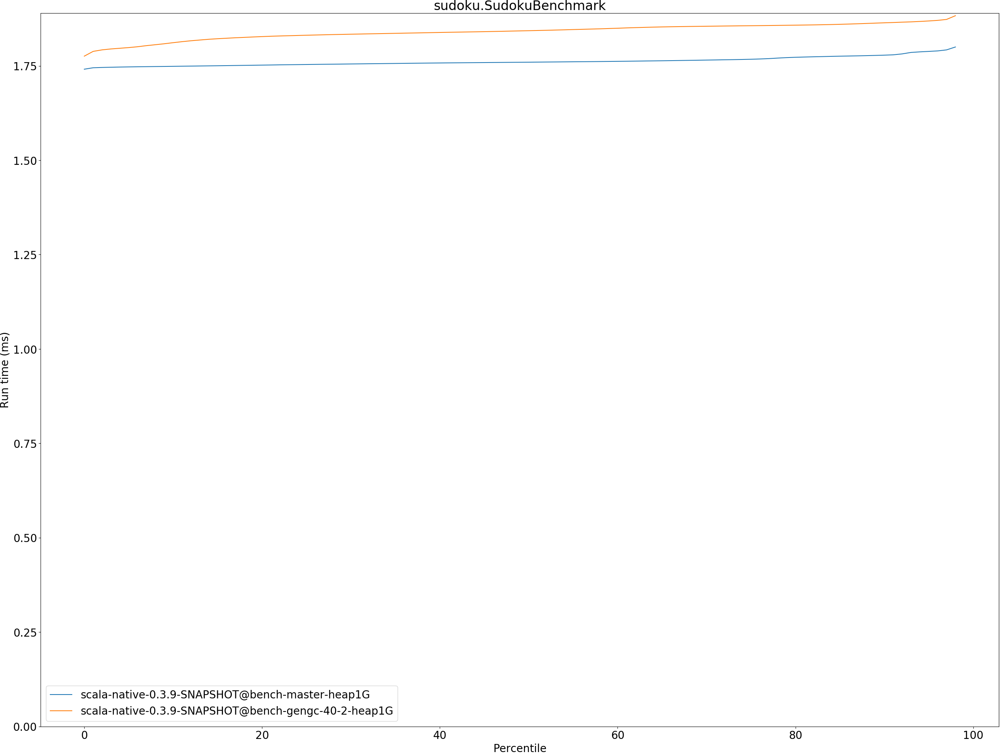

# Summary
## Benchmark run time (ms) at 50 percentile 

|name | scala-native-0.3.9-SNAPSHOT@bench-master-heap1G | scala-native-0.3.9-SNAPSHOT@bench-gengc-40-2-heap1G | |
| -- | -- | -- | -- |
|[permute.PermuteBenchmark](#permutepermutebenchmark)|0.1760|0.1840|+4.54%|
|[queens.QueensBenchmark](#queensqueensbenchmark)|0.0764|0.0776|+1.53%|
|[json.JsonBenchmark](#jsonjsonbenchmark)|1.1679|1.1401|__-2.38%__|
|[brainfuck.BrainfuckBenchmark](#brainfuckbrainfuckbenchmark)|3.0094|3.0253|+0.53%|
|[nbody.NbodyBenchmark](#nbodynbodybenchmark)|28.9692|28.9116|__-0.20%__|
|[mandelbrot.MandelbrotBenchmark](#mandelbrotmandelbrotbenchmark)|114.3240|115.2283|+0.79%|
|[tracer.TracerBenchmark](#tracertracerbenchmark)|0.6243|0.6381|+2.20%|
|[deltablue.DeltaBlueBenchmark](#deltabluedeltabluebenchmark)|0.1744|0.1733|__-0.62%__|
|[cd.CDBenchmark](#cdcdbenchmark)|20.8529|21.0984|+1.18%|
|[sudoku.SudokuBenchmark](#sudokusudokubenchmark)|1.7597|1.8431|+4.74%|
|[kmeans.KmeansBenchmark](#kmeanskmeansbenchmark)|41.1034|42.2921|+2.89%|
|[gcbench.GCBenchBenchmark](#gcbenchgcbenchbenchmark)|88.2452|81.3598|__-7.80%__|
|[richards.RichardsBenchmark](#richardsrichardsbenchmark)|0.0791|0.0836|+5.70%|
|[bounce.BounceBenchmark](#bouncebouncebenchmark)|0.0460|0.0419|__-8.98%__|
| __Geometrical mean:__|| |+0.21%|
## Benchmark run time (ms) at 90 percentile 

|name | scala-native-0.3.9-SNAPSHOT@bench-master-heap1G | scala-native-0.3.9-SNAPSHOT@bench-gengc-40-2-heap1G | |
| -- | -- | -- | -- |
|[permute.PermuteBenchmark](#permutepermutebenchmark)|0.2602|0.1861|__-28.48%__|
|[queens.QueensBenchmark](#queensqueensbenchmark)|0.0783|0.0795|+1.47%|
|[json.JsonBenchmark](#jsonjsonbenchmark)|1.1741|1.1473|__-2.28%__|
|[brainfuck.BrainfuckBenchmark](#brainfuckbrainfuckbenchmark)|3.0653|3.0518|__-0.44%__|
|[nbody.NbodyBenchmark](#nbodynbodybenchmark)|29.4635|29.4246|__-0.13%__|
|[mandelbrot.MandelbrotBenchmark](#mandelbrotmandelbrotbenchmark)|114.4460|115.3312|+0.77%|
|[tracer.TracerBenchmark](#tracertracerbenchmark)|0.6321|0.6412|+1.44%|
|[deltablue.DeltaBlueBenchmark](#deltabluedeltabluebenchmark)|0.1799|0.1773|__-1.40%__|
|[cd.CDBenchmark](#cdcdbenchmark)|21.0551|23.1506|+9.95%|
|[sudoku.SudokuBenchmark](#sudokusudokubenchmark)|1.7783|1.8640|+4.82%|
|[kmeans.KmeansBenchmark](#kmeanskmeansbenchmark)|41.7748|43.4251|+3.95%|
|[gcbench.GCBenchBenchmark](#gcbenchgcbenchbenchmark)|89.9123|89.4657|__-0.50%__|
|[richards.RichardsBenchmark](#richardsrichardsbenchmark)|0.0821|0.0858|+4.54%|
|[bounce.BounceBenchmark](#bouncebouncebenchmark)|0.0472|0.0428|__-9.35%__|
| __Geometrical mean:__|| |__-1.56%__|
## Benchmark run time (ms) at 99 percentile 

|name | scala-native-0.3.9-SNAPSHOT@bench-master-heap1G | scala-native-0.3.9-SNAPSHOT@bench-gengc-40-2-heap1G | |
| -- | -- | -- | -- |
|[permute.PermuteBenchmark](#permutepermutebenchmark)|0.2674|0.1898|__-29.03%__|
|[queens.QueensBenchmark](#queensqueensbenchmark)|0.0810|0.0823|+1.55%|
|[json.JsonBenchmark](#jsonjsonbenchmark)|1.2098|1.1780|__-2.63%__|
|[brainfuck.BrainfuckBenchmark](#brainfuckbrainfuckbenchmark)|3.1718|3.2132|+1.30%|
|[nbody.NbodyBenchmark](#nbodynbodybenchmark)|30.9112|30.9064|__-0.02%__|
|[mandelbrot.MandelbrotBenchmark](#mandelbrotmandelbrotbenchmark)|115.3943|116.2504|+0.74%|
|[tracer.TracerBenchmark](#tracertracerbenchmark)|0.6446|0.6697|+3.89%|
|[deltablue.DeltaBlueBenchmark](#deltabluedeltabluebenchmark)|0.2632|0.2613|__-0.70%__|
|[cd.CDBenchmark](#cdcdbenchmark)|25.9893|23.4242|__-9.87%__|
|[sudoku.SudokuBenchmark](#sudokusudokubenchmark)|1.8228|1.9099|+4.78%|
|[kmeans.KmeansBenchmark](#kmeanskmeansbenchmark)|47.1211|46.1817|__-1.99%__|
|[gcbench.GCBenchBenchmark](#gcbenchgcbenchbenchmark)|90.7894|91.1770|+0.43%|
|[richards.RichardsBenchmark](#richardsrichardsbenchmark)|0.1603|0.1656|+3.25%|
|[bounce.BounceBenchmark](#bouncebouncebenchmark)|0.0489|0.0443|__-9.37%__|
| __Geometrical mean:__|| |__-3.11%__|
## Benchmark total run time (ms) 

|name | scala-native-0.3.9-SNAPSHOT@bench-master-heap1G | scala-native-0.3.9-SNAPSHOT@bench-gengc-40-2-heap1G | |
| -- | -- | -- | -- |
|[permute.PermuteBenchmark](#permutepermutebenchmark)|3781.0794|3685.1358|__-2.54%__|
|[queens.QueensBenchmark](#queensqueensbenchmark)|1545.0228|1568.9134|+1.55%|
|[json.JsonBenchmark](#jsonjsonbenchmark)|23601.6803|23007.1932|__-2.52%__|
|[brainfuck.BrainfuckBenchmark](#brainfuckbrainfuckbenchmark)|60858.5172|60998.2439|+0.23%|
|[nbody.NbodyBenchmark](#nbodynbodybenchmark)|583211.2324|581164.9551|__-0.35%__|
|[mandelbrot.MandelbrotBenchmark](#mandelbrotmandelbrotbenchmark)|2287872.1770|2305794.3711|+0.78%|
|[tracer.TracerBenchmark](#tracertracerbenchmark)|12802.1035|13035.1591|+1.82%|
|[deltablue.DeltaBlueBenchmark](#deltabluedeltabluebenchmark)|3644.6332|3611.3862|__-0.91%__|
|[cd.CDBenchmark](#cdcdbenchmark)|424065.5461|429128.7488|+1.19%|
|[sudoku.SudokuBenchmark](#sudokusudokubenchmark)|35357.5041|36995.1208|+4.63%|
|[kmeans.KmeansBenchmark](#kmeanskmeansbenchmark)|827134.0270|851478.0196|+2.94%|
|[gcbench.GCBenchBenchmark](#gcbenchgcbenchbenchmark)|1690323.7191|1661443.6637|__-1.71%__|
|[richards.RichardsBenchmark](#richardsrichardsbenchmark)|1616.2647|1702.5035|+5.34%|
|[bounce.BounceBenchmark](#bouncebouncebenchmark)|930.5583|846.7982|__-9.00%__|
| __Geometrical mean:__|| |+0.04%|
# Individual benchmarks
## permute.PermuteBenchmark

## queens.QueensBenchmark

## json.JsonBenchmark

## brainfuck.BrainfuckBenchmark

## nbody.NbodyBenchmark

## mandelbrot.MandelbrotBenchmark

## tracer.TracerBenchmark

## deltablue.DeltaBlueBenchmark

## cd.CDBenchmark

## sudoku.SudokuBenchmark

## kmeans.KmeansBenchmark

## gcbench.GCBenchBenchmark

## richards.RichardsBenchmark

## bounce.BounceBenchmark

