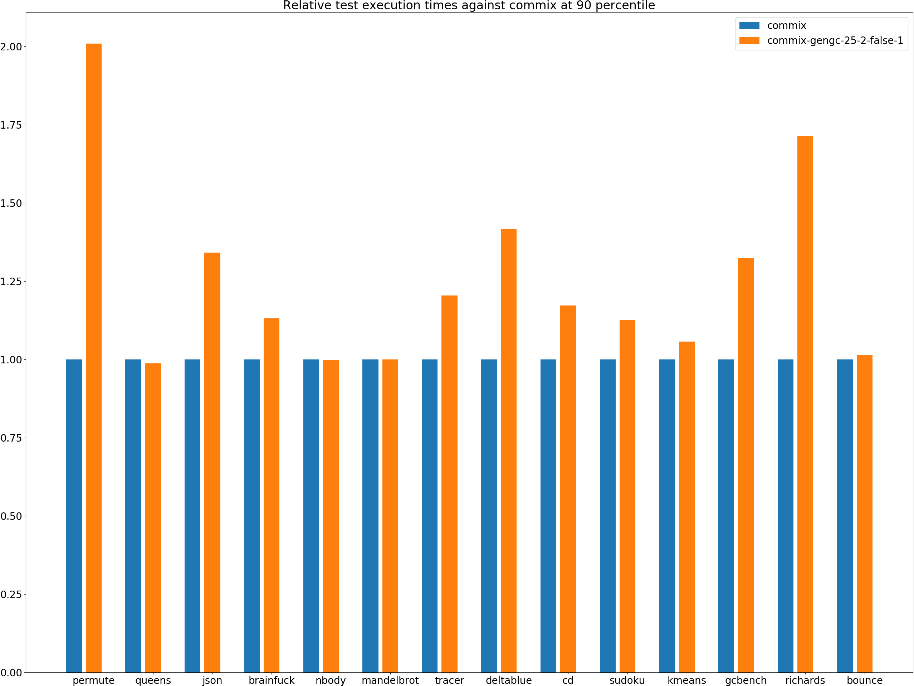
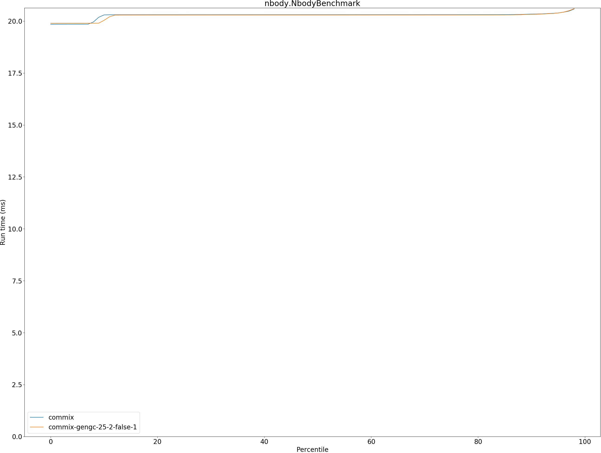
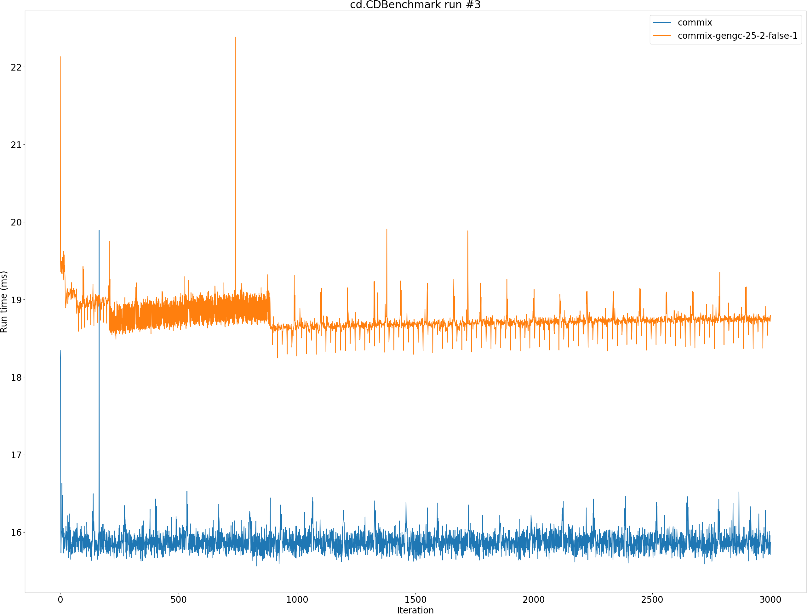

# Summary
## Benchmark run time (ms) at 50 percentile 

|name | commix | commix-gengc-25-2-false-1 | |
| -- | -- | -- | -- |
|[permute.PermuteBenchmark](#permutepermutebenchmark)|0.0748|0.1258|+68.31%|
|[queens.QueensBenchmark](#queensqueensbenchmark)|0.0726|0.0718|__-1.08%__|
|[json.JsonBenchmark](#jsonjsonbenchmark)|0.4025|0.5168|+28.42%|
|[brainfuck.BrainfuckBenchmark](#brainfuckbrainfuckbenchmark)|1.0799|1.2130|+12.32%|
|[nbody.NbodyBenchmark](#nbodynbodybenchmark)|20.3051|20.2913|__-0.07%__|
|[mandelbrot.MandelbrotBenchmark](#mandelbrotmandelbrotbenchmark)|115.2399|115.1934|__-0.04%__|
|[tracer.TracerBenchmark](#tracertracerbenchmark)|0.3328|0.3780|+13.58%|
|[deltablue.DeltaBlueBenchmark](#deltabluedeltabluebenchmark)|0.0638|0.0904|+41.76%|
|[cd.CDBenchmark](#cdcdbenchmark)|15.8868|18.7391|+17.95%|
|[sudoku.SudokuBenchmark](#sudokusudokubenchmark)|1.3017|1.4596|+12.13%|
|[kmeans.KmeansBenchmark](#kmeanskmeansbenchmark)|20.6062|21.6371|+5.00%|
|[gcbench.GCBenchBenchmark](#gcbenchgcbenchbenchmark)|54.6288|71.8436|+31.51%|
|[richards.RichardsBenchmark](#richardsrichardsbenchmark)|0.0541|0.0928|+71.60%|
|[bounce.BounceBenchmark](#bouncebouncebenchmark)|0.0165|0.0167|+1.42%|
| __Geometrical mean:__|| |+19.62%|
## Benchmark run time (ms) at 90 percentile 

|name | commix | commix-gengc-25-2-false-1 | |
| -- | -- | -- | -- |
|[permute.PermuteBenchmark](#permutepermutebenchmark)|0.0773|0.1552|+100.85%|
|[queens.QueensBenchmark](#queensqueensbenchmark)|0.0732|0.0723|__-1.22%__|
|[json.JsonBenchmark](#jsonjsonbenchmark)|0.4737|0.6352|+34.08%|
|[brainfuck.BrainfuckBenchmark](#brainfuckbrainfuckbenchmark)|1.1210|1.2682|+13.14%|
|[nbody.NbodyBenchmark](#nbodynbodybenchmark)|20.3373|20.3245|__-0.06%__|
|[mandelbrot.MandelbrotBenchmark](#mandelbrotmandelbrotbenchmark)|115.4954|115.4287|__-0.06%__|
|[tracer.TracerBenchmark](#tracertracerbenchmark)|0.3437|0.4140|+20.43%|
|[deltablue.DeltaBlueBenchmark](#deltabluedeltabluebenchmark)|0.0660|0.0935|+41.64%|
|[cd.CDBenchmark](#cdcdbenchmark)|16.0437|18.8081|+17.23%|
|[sudoku.SudokuBenchmark](#sudokusudokubenchmark)|1.3858|1.5599|+12.56%|
|[kmeans.KmeansBenchmark](#kmeanskmeansbenchmark)|21.2528|22.4547|+5.66%|
|[gcbench.GCBenchBenchmark](#gcbenchgcbenchbenchmark)|55.9102|73.9435|+32.25%|
|[richards.RichardsBenchmark](#richardsrichardsbenchmark)|0.0555|0.0952|+71.36%|
|[bounce.BounceBenchmark](#bouncebouncebenchmark)|0.0167|0.0169|+1.36%|
| __Geometrical mean:__|| |+22.13%|
## Benchmark run time (ms) at 99 percentile 

|name | commix | commix-gengc-25-2-false-1 | |
| -- | -- | -- | -- |
|[permute.PermuteBenchmark](#permutepermutebenchmark)|0.0844|0.1777|+110.45%|
|[queens.QueensBenchmark](#queensqueensbenchmark)|0.0764|0.0755|__-1.20%__|
|[json.JsonBenchmark](#jsonjsonbenchmark)|0.5418|0.6797|+25.44%|
|[brainfuck.BrainfuckBenchmark](#brainfuckbrainfuckbenchmark)|1.1574|1.4011|+21.05%|
|[nbody.NbodyBenchmark](#nbodynbodybenchmark)|20.7069|20.7141|+0.03%|
|[mandelbrot.MandelbrotBenchmark](#mandelbrotmandelbrotbenchmark)|116.3890|116.3258|__-0.05%__|
|[tracer.TracerBenchmark](#tracertracerbenchmark)|0.3479|0.4407|+26.69%|
|[deltablue.DeltaBlueBenchmark](#deltabluedeltabluebenchmark)|0.1071|0.1493|+39.46%|
|[cd.CDBenchmark](#cdcdbenchmark)|16.3491|19.1726|+17.27%|
|[sudoku.SudokuBenchmark](#sudokusudokubenchmark)|1.4286|1.5852|+10.96%|
|[kmeans.KmeansBenchmark](#kmeanskmeansbenchmark)|21.9349|23.2053|+5.79%|
|[gcbench.GCBenchBenchmark](#gcbenchgcbenchbenchmark)|57.1985|76.1440|+33.12%|
|[richards.RichardsBenchmark](#richardsrichardsbenchmark)|0.0589|0.1007|+71.01%|
|[bounce.BounceBenchmark](#bouncebouncebenchmark)|0.0184|0.0187|+2.11%|
| __Geometrical mean:__|| |+22.86%|
## Benchmark total run time (ms) 

|name | commix | commix-gengc-25-2-false-1 | |
| -- | -- | -- | -- |
|[permute.PermuteBenchmark](#permutepermutebenchmark)|1507.0145|2618.5994|+73.76%|
|[queens.QueensBenchmark](#queensqueensbenchmark)|1458.6787|1441.1981|__-1.20%__|
|[json.JsonBenchmark](#jsonjsonbenchmark)|8337.8305|10745.7026|+28.88%|
|[brainfuck.BrainfuckBenchmark](#brainfuckbrainfuckbenchmark)|21884.0789|24552.0590|+12.19%|
|[nbody.NbodyBenchmark](#nbodynbodybenchmark)|405656.1483|405444.5751|__-0.05%__|
|[mandelbrot.MandelbrotBenchmark](#mandelbrotmandelbrotbenchmark)|2306635.8210|2305626.5059|__-0.04%__|
|[tracer.TracerBenchmark](#tracertracerbenchmark)|6716.8018|7700.4094|+14.64%|
|[deltablue.DeltaBlueBenchmark](#deltabluedeltabluebenchmark)|1304.1552|1872.3949|+43.57%|
|[cd.CDBenchmark](#cdcdbenchmark)|317917.4161|374894.1379|+17.92%|
|[sudoku.SudokuBenchmark](#sudokusudokubenchmark)|26414.3569|29684.1181|+12.38%|
|[kmeans.KmeansBenchmark](#kmeanskmeansbenchmark)|413404.0552|434092.1540|+5.00%|
|[gcbench.GCBenchBenchmark](#gcbenchgcbenchbenchmark)|1094981.5861|1438869.5897|+31.41%|
|[richards.RichardsBenchmark](#richardsrichardsbenchmark)|1090.3896|1870.8976|+71.58%|
|[bounce.BounceBenchmark](#bouncebouncebenchmark)|330.3866|335.0399|+1.41%|
| __Geometrical mean:__|| |+20.10%|
# Individual benchmarks
## permute.PermuteBenchmark

## queens.QueensBenchmark

## json.JsonBenchmark

## brainfuck.BrainfuckBenchmark

## nbody.NbodyBenchmark

## mandelbrot.MandelbrotBenchmark

## tracer.TracerBenchmark

## deltablue.DeltaBlueBenchmark

## cd.CDBenchmark

## sudoku.SudokuBenchmark

## kmeans.KmeansBenchmark

## gcbench.GCBenchBenchmark

## richards.RichardsBenchmark

## bounce.BounceBenchmark

