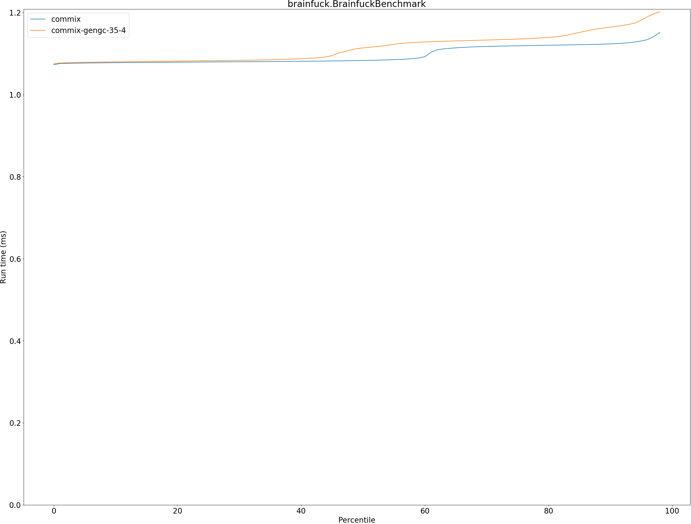

# Summary
## Benchmark run time (ms) at 50 percentile 

|name | commix | commix-gengc-35-4 | |
| -- | -- | -- | -- |
|[permute.PermuteBenchmark](#permutepermutebenchmark)|0.0775|0.0965|+24.54%|
|[queens.QueensBenchmark](#queensqueensbenchmark)|0.0716|0.0719|+0.41%|
|[json.JsonBenchmark](#jsonjsonbenchmark)|0.3928|0.4544|+15.69%|
|[brainfuck.BrainfuckBenchmark](#brainfuckbrainfuckbenchmark)|1.0831|1.1138|+2.83%|
|[nbody.NbodyBenchmark](#nbodynbodybenchmark)|20.3870|20.2777|__-0.54%__|
|[mandelbrot.MandelbrotBenchmark](#mandelbrotmandelbrotbenchmark)|115.1942|115.1414|__-0.05%__|
|[tracer.TracerBenchmark](#tracertracerbenchmark)|0.3335|0.3364|+0.89%|
|[deltablue.DeltaBlueBenchmark](#deltabluedeltabluebenchmark)|0.0638|0.0735|+15.28%|
|[cd.CDBenchmark](#cdcdbenchmark)|15.7420|17.1293|+8.81%|
|[sudoku.SudokuBenchmark](#sudokusudokubenchmark)|1.3146|1.3957|+6.17%|
|[kmeans.KmeansBenchmark](#kmeanskmeansbenchmark)|20.5931|21.1013|+2.47%|
|[gcbench.GCBenchBenchmark](#gcbenchgcbenchbenchmark)|54.6740|61.0432|+11.65%|
|[richards.RichardsBenchmark](#richardsrichardsbenchmark)|0.0542|0.0955|+76.33%|
|[bounce.BounceBenchmark](#bouncebouncebenchmark)|0.0156|0.0164|+5.74%|
| __Geometrical mean:__|| |+10.87%|
## Benchmark run time (ms) at 90 percentile 

|name | commix | commix-gengc-35-4 | |
| -- | -- | -- | -- |
|[permute.PermuteBenchmark](#permutepermutebenchmark)|0.0798|0.1013|+26.82%|
|[queens.QueensBenchmark](#queensqueensbenchmark)|0.0736|0.0725|__-1.52%__|
|[json.JsonBenchmark](#jsonjsonbenchmark)|0.4628|0.4978|+7.55%|
|[brainfuck.BrainfuckBenchmark](#brainfuckbrainfuckbenchmark)|1.1236|1.1644|+3.63%|
|[nbody.NbodyBenchmark](#nbodynbodybenchmark)|20.4200|20.3102|__-0.54%__|
|[mandelbrot.MandelbrotBenchmark](#mandelbrotmandelbrotbenchmark)|115.4382|115.3875|__-0.04%__|
|[tracer.TracerBenchmark](#tracertracerbenchmark)|0.3453|0.3608|+4.49%|
|[deltablue.DeltaBlueBenchmark](#deltabluedeltabluebenchmark)|0.0665|0.0762|+14.61%|
|[cd.CDBenchmark](#cdcdbenchmark)|15.9032|17.2212|+8.29%|
|[sudoku.SudokuBenchmark](#sudokusudokubenchmark)|1.4000|1.4385|+2.74%|
|[kmeans.KmeansBenchmark](#kmeanskmeansbenchmark)|21.3010|21.9522|+3.06%|
|[gcbench.GCBenchBenchmark](#gcbenchgcbenchbenchmark)|56.0662|63.6034|+13.44%|
|[richards.RichardsBenchmark](#richardsrichardsbenchmark)|0.0556|0.0983|+76.67%|
|[bounce.BounceBenchmark](#bouncebouncebenchmark)|0.0158|0.0167|+5.56%|
| __Geometrical mean:__|| |+10.45%|
## Benchmark run time (ms) at 99 percentile 

|name | commix | commix-gengc-35-4 | |
| -- | -- | -- | -- |
|[permute.PermuteBenchmark](#permutepermutebenchmark)|0.0875|0.1044|+19.36%|
|[queens.QueensBenchmark](#queensqueensbenchmark)|0.0760|0.0756|__-0.51%__|
|[json.JsonBenchmark](#jsonjsonbenchmark)|0.5359|0.6586|+22.90%|
|[brainfuck.BrainfuckBenchmark](#brainfuckbrainfuckbenchmark)|1.1598|1.2113|+4.44%|
|[nbody.NbodyBenchmark](#nbodynbodybenchmark)|20.7875|20.6766|__-0.53%__|
|[mandelbrot.MandelbrotBenchmark](#mandelbrotmandelbrotbenchmark)|116.3475|116.2808|__-0.06%__|
|[tracer.TracerBenchmark](#tracertracerbenchmark)|0.3745|0.3880|+3.59%|
|[deltablue.DeltaBlueBenchmark](#deltabluedeltabluebenchmark)|0.1081|0.1135|+5.03%|
|[cd.CDBenchmark](#cdcdbenchmark)|16.1698|17.5672|+8.64%|
|[sudoku.SudokuBenchmark](#sudokusudokubenchmark)|1.4505|1.4788|+1.95%|
|[kmeans.KmeansBenchmark](#kmeanskmeansbenchmark)|22.1331|22.6522|+2.35%|
|[gcbench.GCBenchBenchmark](#gcbenchgcbenchbenchmark)|57.3242|65.1802|+13.70%|
|[richards.RichardsBenchmark](#richardsrichardsbenchmark)|0.0609|0.1031|+69.37%|
|[bounce.BounceBenchmark](#bouncebouncebenchmark)|0.0174|0.0185|+6.40%|
| __Geometrical mean:__|| |+10.07%|
## Benchmark total run time (ms) 

|name | commix | commix-gengc-35-4 | |
| -- | -- | -- | -- |
|[permute.PermuteBenchmark](#permutepermutebenchmark)|1562.5550|1948.1197|+24.68%|
|[queens.QueensBenchmark](#queensqueensbenchmark)|1440.5854|1444.5573|+0.28%|
|[json.JsonBenchmark](#jsonjsonbenchmark)|8150.9971|9438.4538|+15.80%|
|[brainfuck.BrainfuckBenchmark](#brainfuckbrainfuckbenchmark)|21950.9141|22307.2073|+1.62%|
|[nbody.NbodyBenchmark](#nbodynbodybenchmark)|407041.5223|405095.0148|__-0.48%__|
|[mandelbrot.MandelbrotBenchmark](#mandelbrotmandelbrotbenchmark)|2305733.9875|2304728.1739|__-0.04%__|
|[tracer.TracerBenchmark](#tracertracerbenchmark)|6748.0569|6804.2419|+0.83%|
|[deltablue.DeltaBlueBenchmark](#deltabluedeltabluebenchmark)|1306.4333|1512.3057|+15.76%|
|[cd.CDBenchmark](#cdcdbenchmark)|314989.0322|342423.6084|+8.71%|
|[sudoku.SudokuBenchmark](#sudokusudokubenchmark)|26676.7765|27920.2328|+4.66%|
|[kmeans.KmeansBenchmark](#kmeanskmeansbenchmark)|413247.0940|424110.8027|+2.63%|
|[gcbench.GCBenchBenchmark](#gcbenchgcbenchbenchmark)|1095760.3297|1231743.4312|+12.41%|
|[richards.RichardsBenchmark](#richardsrichardsbenchmark)|1094.1594|1926.7893|+76.10%|
|[bounce.BounceBenchmark](#bouncebouncebenchmark)|312.2533|329.5955|+5.55%|
| __Geometrical mean:__|| |+10.73%|
# Individual benchmarks
## permute.PermuteBenchmark

## queens.QueensBenchmark

## json.JsonBenchmark

## brainfuck.BrainfuckBenchmark

## nbody.NbodyBenchmark

## mandelbrot.MandelbrotBenchmark

## tracer.TracerBenchmark

## deltablue.DeltaBlueBenchmark

## cd.CDBenchmark

## sudoku.SudokuBenchmark

## kmeans.KmeansBenchmark

## gcbench.GCBenchBenchmark

## richards.RichardsBenchmark

## bounce.BounceBenchmark

