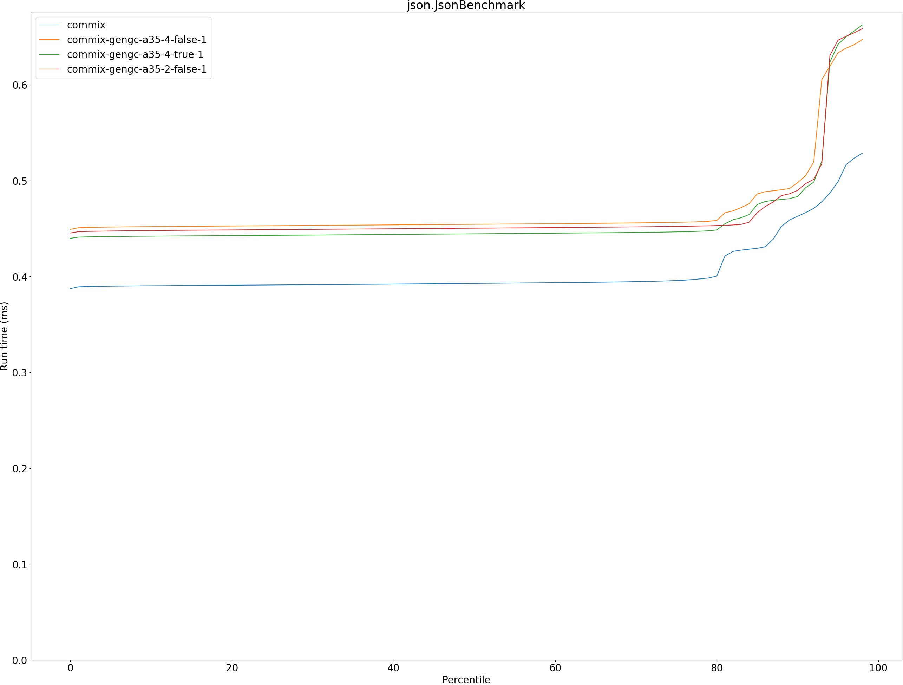
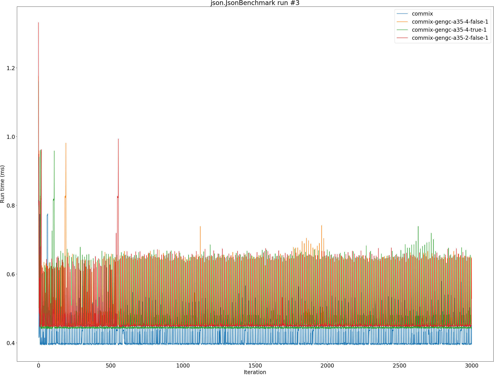
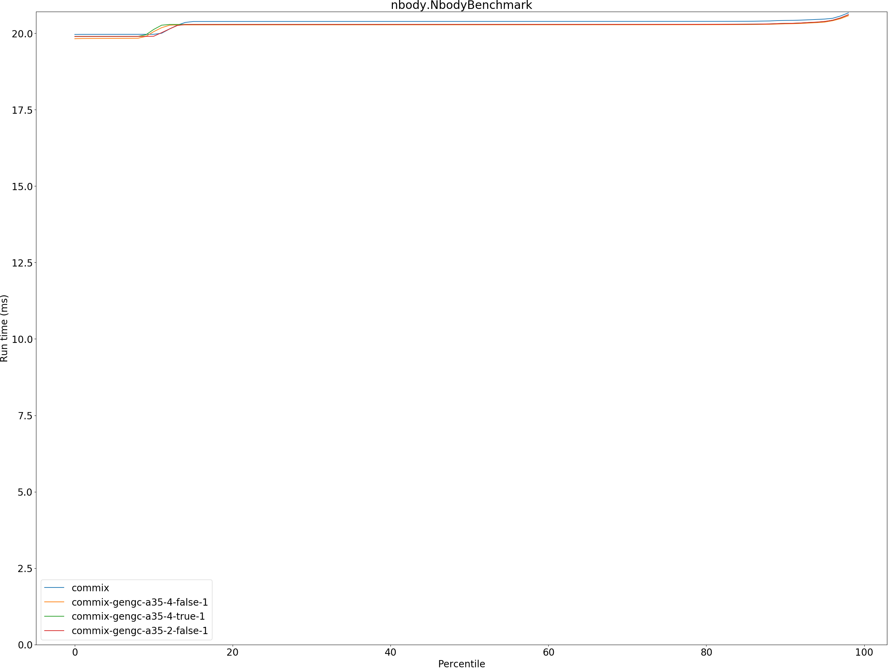
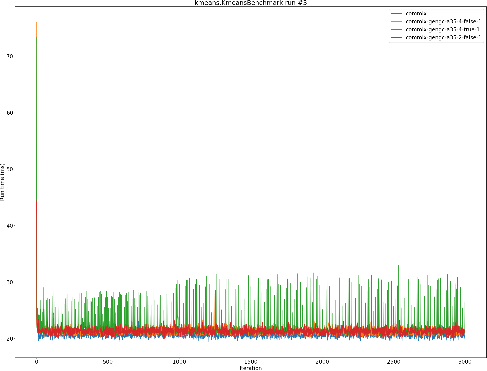

# Summary
## Benchmark run time (ms) at 50 percentile 

|name | commix | commix-gengc-a35-4-false-1 |  | commix-gengc-a35-4-true-1 |  | commix-gengc-a35-2-false-1 | |
| -- | -- | -- | -- | -- | -- | -- | -- |
|[permute.PermuteBenchmark](#permutepermutebenchmark)|0.0775|0.0965|+24.54%|0.0977|+26.12%|0.1011|+30.44%|
|[queens.QueensBenchmark](#queensqueensbenchmark)|0.0716|0.0719|+0.41%|0.0717|+0.15%|0.0720|+0.48%|
|[json.JsonBenchmark](#jsonjsonbenchmark)|0.3928|0.4544|+15.69%|0.4445|+13.16%|0.4504|+14.66%|
|[brainfuck.BrainfuckBenchmark](#brainfuckbrainfuckbenchmark)|1.0831|1.1138|+2.83%|1.0950|+1.11%|1.0983|+1.41%|
|[nbody.NbodyBenchmark](#nbodynbodybenchmark)|20.3870|20.2777|__-0.54%__|20.2908|__-0.47%__|20.2905|__-0.47%__|
|[mandelbrot.MandelbrotBenchmark](#mandelbrotmandelbrotbenchmark)|115.1942|115.1414|__-0.05%__|115.1254|__-0.06%__|115.1312|__-0.05%__|
|[tracer.TracerBenchmark](#tracertracerbenchmark)|0.3335|0.3364|+0.89%|0.3364|+0.88%|0.3364|+0.88%|
|[deltablue.DeltaBlueBenchmark](#deltabluedeltabluebenchmark)|0.0638|0.0735|+15.28%|0.0736|+15.35%|0.0736|+15.43%|
|[cd.CDBenchmark](#cdcdbenchmark)|15.7420|17.1293|+8.81%|17.2973|+9.88%|17.1561|+8.98%|
|[sudoku.SudokuBenchmark](#sudokusudokubenchmark)|1.3146|1.3957|+6.17%|1.3996|+6.46%|1.3941|+6.05%|
|[kmeans.KmeansBenchmark](#kmeanskmeansbenchmark)|20.5931|21.1013|+2.47%|21.2921|+3.39%|21.2105|+3.00%|
|[gcbench.GCBenchBenchmark](#gcbenchgcbenchbenchmark)|54.6740|61.0432|+11.65%|61.0647|+11.69%|60.9230|+11.43%|
|[richards.RichardsBenchmark](#richardsrichardsbenchmark)|0.0542|0.0955|+76.33%|0.0964|+77.90%|0.0940|+73.51%|
|[bounce.BounceBenchmark](#bouncebouncebenchmark)|0.0156|0.0164|+5.74%|0.0163|+5.08%|0.0165|+6.30%|
| __Geometrical mean:__|| |+10.87%| |+10.84%| |+11.02%|
## Benchmark run time (ms) at 90 percentile 

|name | commix | commix-gengc-a35-4-false-1 |  | commix-gengc-a35-4-true-1 |  | commix-gengc-a35-2-false-1 | |
| -- | -- | -- | -- | -- | -- | -- | -- |
|[permute.PermuteBenchmark](#permutepermutebenchmark)|0.0798|0.1013|+26.82%|0.1026|+28.50%|0.1061|+32.88%|
|[queens.QueensBenchmark](#queensqueensbenchmark)|0.0736|0.0725|__-1.52%__|0.0723|__-1.82%__|0.0728|__-1.10%__|
|[json.JsonBenchmark](#jsonjsonbenchmark)|0.4628|0.4978|+7.55%|0.4834|+4.44%|0.4898|+5.82%|
|[brainfuck.BrainfuckBenchmark](#brainfuckbrainfuckbenchmark)|1.1236|1.1644|+3.63%|1.1265|+0.26%|1.1953|+6.38%|
|[nbody.NbodyBenchmark](#nbodynbodybenchmark)|20.4200|20.3102|__-0.54%__|20.3240|__-0.47%__|20.3236|__-0.47%__|
|[mandelbrot.MandelbrotBenchmark](#mandelbrotmandelbrotbenchmark)|115.4382|115.3875|__-0.04%__|115.3591|__-0.07%__|115.3519|__-0.07%__|
|[tracer.TracerBenchmark](#tracertracerbenchmark)|0.3453|0.3608|+4.49%|0.3426|__-0.78%__|0.3766|+9.07%|
|[deltablue.DeltaBlueBenchmark](#deltabluedeltabluebenchmark)|0.0665|0.0762|+14.61%|0.0766|+15.24%|0.0761|+14.57%|
|[cd.CDBenchmark](#cdcdbenchmark)|15.9032|17.2212|+8.29%|17.3796|+9.28%|17.2376|+8.39%|
|[sudoku.SudokuBenchmark](#sudokusudokubenchmark)|1.4000|1.4385|+2.74%|1.4310|+2.21%|1.4314|+2.24%|
|[kmeans.KmeansBenchmark](#kmeanskmeansbenchmark)|21.3010|21.9522|+3.06%|22.1804|+4.13%|22.1156|+3.82%|
|[gcbench.GCBenchBenchmark](#gcbenchgcbenchbenchmark)|56.0662|63.6034|+13.44%|63.5569|+13.36%|63.0904|+12.53%|
|[richards.RichardsBenchmark](#richardsrichardsbenchmark)|0.0556|0.0983|+76.67%|0.0982|+76.47%|0.0962|+72.95%|
|[bounce.BounceBenchmark](#bouncebouncebenchmark)|0.0158|0.0167|+5.56%|0.0166|+4.66%|0.0168|+6.19%|
| __Geometrical mean:__|| |+10.45%| |+9.71%| |+11.11%|
## Benchmark run time (ms) at 99 percentile 

|name | commix | commix-gengc-a35-4-false-1 |  | commix-gengc-a35-4-true-1 |  | commix-gengc-a35-2-false-1 | |
| -- | -- | -- | -- | -- | -- | -- | -- |
|[permute.PermuteBenchmark](#permutepermutebenchmark)|0.0875|0.1044|+19.36%|0.1062|+21.42%|0.1233|+40.93%|
|[queens.QueensBenchmark](#queensqueensbenchmark)|0.0760|0.0756|__-0.51%__|0.0754|__-0.77%__|0.0760|__-0.05%__|
|[json.JsonBenchmark](#jsonjsonbenchmark)|0.5359|0.6586|+22.90%|0.6718|+25.36%|0.6663|+24.34%|
|[brainfuck.BrainfuckBenchmark](#brainfuckbrainfuckbenchmark)|1.1598|1.2113|+4.44%|2.1666|+86.80%|1.2875|+11.01%|
|[nbody.NbodyBenchmark](#nbodynbodybenchmark)|20.7875|20.6766|__-0.53%__|20.7330|__-0.26%__|20.7184|__-0.33%__|
|[mandelbrot.MandelbrotBenchmark](#mandelbrotmandelbrotbenchmark)|116.3475|116.2808|__-0.06%__|116.2786|__-0.06%__|116.2615|__-0.07%__|
|[tracer.TracerBenchmark](#tracertracerbenchmark)|0.3745|0.3880|+3.59%|0.3724|__-0.56%__|0.4102|+9.54%|
|[deltablue.DeltaBlueBenchmark](#deltabluedeltabluebenchmark)|0.1081|0.1135|+5.03%|0.1123|+3.94%|0.1516|+40.31%|
|[cd.CDBenchmark](#cdcdbenchmark)|16.1698|17.5672|+8.64%|17.7300|+9.65%|17.5893|+8.78%|
|[sudoku.SudokuBenchmark](#sudokusudokubenchmark)|1.4505|1.4788|+1.95%|1.4681|+1.21%|1.4666|+1.11%|
|[kmeans.KmeansBenchmark](#kmeanskmeansbenchmark)|22.1331|22.6522|+2.35%|30.8767|+39.50%|22.8822|+3.38%|
|[gcbench.GCBenchBenchmark](#gcbenchgcbenchbenchmark)|57.3242|65.1802|+13.70%|66.4931|+15.99%|65.4646|+14.20%|
|[richards.RichardsBenchmark](#richardsrichardsbenchmark)|0.0609|0.1031|+69.37%|0.1028|+68.78%|0.1014|+66.55%|
|[bounce.BounceBenchmark](#bouncebouncebenchmark)|0.0174|0.0185|+6.40%|0.0183|+4.74%|0.0185|+6.22%|
| __Geometrical mean:__|| |+10.07%| |+17.20%| |+14.72%|
## Benchmark total run time (ms) 

|name | commix | commix-gengc-a35-4-false-1 |  | commix-gengc-a35-4-true-1 |  | commix-gengc-a35-2-false-1 | |
| -- | -- | -- | -- | -- | -- | -- | -- |
|[permute.PermuteBenchmark](#permutepermutebenchmark)|1562.5550|1948.1197|+24.68%|1976.3079|+26.48%|2044.5929|+30.85%|
|[queens.QueensBenchmark](#queensqueensbenchmark)|1440.5854|1444.5573|+0.28%|1440.1693|__-0.03%__|1446.6644|+0.42%|
|[json.JsonBenchmark](#jsonjsonbenchmark)|8150.9971|9438.4538|+15.80%|9250.6331|+13.49%|9338.9191|+14.57%|
|[brainfuck.BrainfuckBenchmark](#brainfuckbrainfuckbenchmark)|21950.9141|22307.2073|+1.62%|24523.6047|+11.72%|22350.5202|+1.82%|
|[nbody.NbodyBenchmark](#nbodynbodybenchmark)|407041.5223|405095.0148|__-0.48%__|405834.8679|__-0.30%__|405501.7501|__-0.38%__|
|[mandelbrot.MandelbrotBenchmark](#mandelbrotmandelbrotbenchmark)|2305733.9875|2304728.1739|__-0.04%__|2304293.9781|__-0.06%__|2304281.3087|__-0.06%__|
|[tracer.TracerBenchmark](#tracertracerbenchmark)|6748.0569|6804.2419|+0.83%|6756.7677|+0.13%|6946.9721|+2.95%|
|[deltablue.DeltaBlueBenchmark](#deltabluedeltabluebenchmark)|1306.4333|1512.3057|+15.76%|1510.3600|+15.61%|1528.0755|+16.97%|
|[cd.CDBenchmark](#cdcdbenchmark)|314989.0322|342423.6084|+8.71%|345740.2178|+9.76%|342665.4630|+8.79%|
|[sudoku.SudokuBenchmark](#sudokusudokubenchmark)|26676.7765|27920.2328|+4.66%|27915.8453|+4.64%|27847.0204|+4.39%|
|[kmeans.KmeansBenchmark](#kmeanskmeansbenchmark)|413247.0940|424110.8027|+2.63%|438003.2484|+5.99%|426077.5065|+3.10%|
|[gcbench.GCBenchBenchmark](#gcbenchgcbenchbenchmark)|1095760.3297|1231743.4312|+12.41%|1232018.9931|+12.44%|1225485.8636|+11.84%|
|[richards.RichardsBenchmark](#richardsrichardsbenchmark)|1094.1594|1926.7893|+76.10%|1939.2864|+77.24%|1892.3897|+72.95%|
|[bounce.BounceBenchmark](#bouncebouncebenchmark)|312.2533|329.5955|+5.55%|327.8394|+4.99%|331.1589|+6.05%|
| __Geometrical mean:__|| |+10.73%| |+11.71%| |+11.19%|
# Individual benchmarks
## permute.PermuteBenchmark

## queens.QueensBenchmark

## json.JsonBenchmark

## brainfuck.BrainfuckBenchmark

## nbody.NbodyBenchmark

## mandelbrot.MandelbrotBenchmark

## tracer.TracerBenchmark

## deltablue.DeltaBlueBenchmark

## cd.CDBenchmark

## sudoku.SudokuBenchmark

## kmeans.KmeansBenchmark

## gcbench.GCBenchBenchmark

## richards.RichardsBenchmark

## bounce.BounceBenchmark

