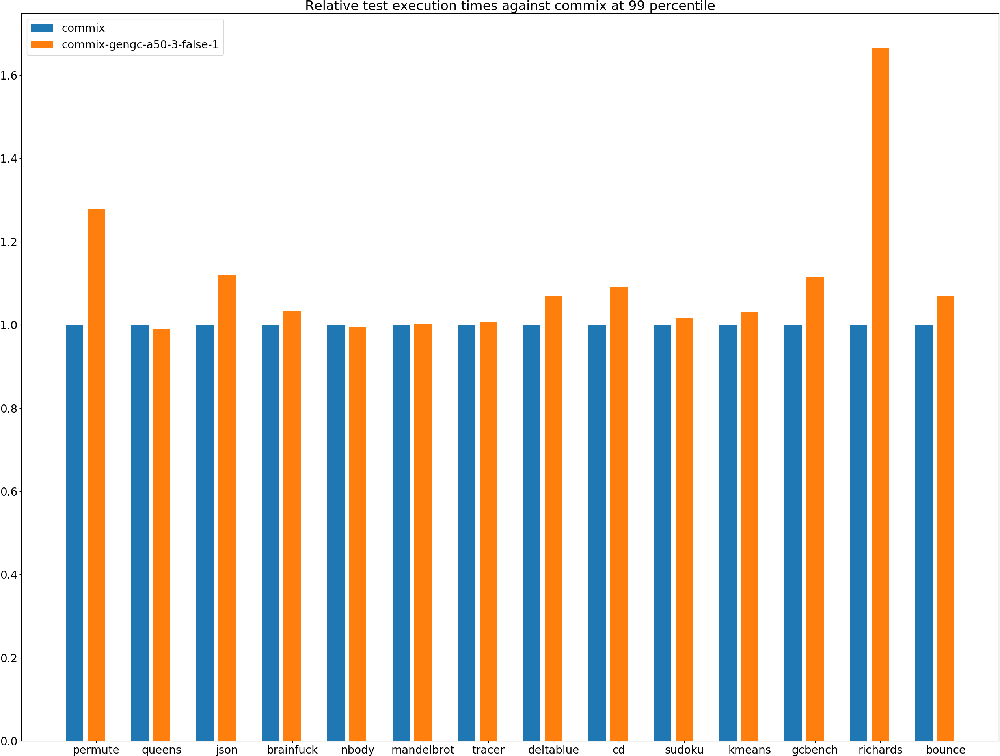
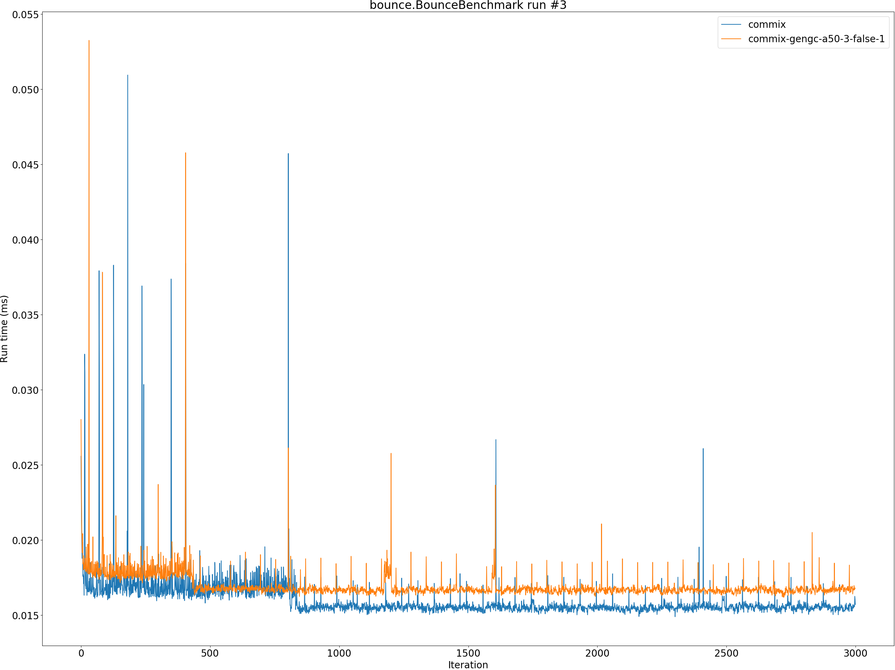

# Summary
## Benchmark run time (ms) at 50 percentile 

|name | commix | commix-gengc-a50-3-false-1 | |
| -- | -- | -- | -- |
|[permute.PermuteBenchmark](#permutepermutebenchmark)|0.0775|0.0965|+24.54%|
|[queens.QueensBenchmark](#queensqueensbenchmark)|0.0716|0.0719|+0.39%|
|[json.JsonBenchmark](#jsonjsonbenchmark)|0.3928|0.4450|+13.29%|
|[brainfuck.BrainfuckBenchmark](#brainfuckbrainfuckbenchmark)|1.0831|1.0855|+0.23%|
|[nbody.NbodyBenchmark](#nbodynbodybenchmark)|20.3870|20.2770|__-0.54%__|
|[mandelbrot.MandelbrotBenchmark](#mandelbrotmandelbrotbenchmark)|115.1942|115.3790|+0.16%|
|[tracer.TracerBenchmark](#tracertracerbenchmark)|0.3335|0.3353|+0.54%|
|[deltablue.DeltaBlueBenchmark](#deltabluedeltabluebenchmark)|0.0638|0.0739|+15.97%|
|[cd.CDBenchmark](#cdcdbenchmark)|15.7420|17.2061|+9.30%|
|[sudoku.SudokuBenchmark](#sudokusudokubenchmark)|1.3146|1.3566|+3.20%|
|[kmeans.KmeansBenchmark](#kmeanskmeansbenchmark)|20.5931|21.4182|+4.01%|
|[gcbench.GCBenchBenchmark](#gcbenchgcbenchbenchmark)|54.6740|61.2799|+12.08%|
|[richards.RichardsBenchmark](#richardsrichardsbenchmark)|0.0542|0.0935|+72.62%|
|[bounce.BounceBenchmark](#bouncebouncebenchmark)|0.0156|0.0166|+7.00%|
| __Geometrical mean:__|| |+10.42%|
## Benchmark run time (ms) at 90 percentile 

|name | commix | commix-gengc-a50-3-false-1 | |
| -- | -- | -- | -- |
|[permute.PermuteBenchmark](#permutepermutebenchmark)|0.0798|0.1012|+26.75%|
|[queens.QueensBenchmark](#queensqueensbenchmark)|0.0736|0.0725|__-1.46%__|
|[json.JsonBenchmark](#jsonjsonbenchmark)|0.4628|0.4840|+4.58%|
|[brainfuck.BrainfuckBenchmark](#brainfuckbrainfuckbenchmark)|1.1236|1.1436|+1.78%|
|[nbody.NbodyBenchmark](#nbodynbodybenchmark)|20.4200|20.3097|__-0.54%__|
|[mandelbrot.MandelbrotBenchmark](#mandelbrotmandelbrotbenchmark)|115.4382|115.6448|+0.18%|
|[tracer.TracerBenchmark](#tracertracerbenchmark)|0.3453|0.3384|__-1.98%__|
|[deltablue.DeltaBlueBenchmark](#deltabluedeltabluebenchmark)|0.0665|0.0767|+15.47%|
|[cd.CDBenchmark](#cdcdbenchmark)|15.9032|17.3127|+8.86%|
|[sudoku.SudokuBenchmark](#sudokusudokubenchmark)|1.4000|1.4497|+3.55%|
|[kmeans.KmeansBenchmark](#kmeanskmeansbenchmark)|21.3010|22.1196|+3.84%|
|[gcbench.GCBenchBenchmark](#gcbenchgcbenchbenchmark)|56.0662|62.5552|+11.57%|
|[richards.RichardsBenchmark](#richardsrichardsbenchmark)|0.0556|0.0956|+71.96%|
|[bounce.BounceBenchmark](#bouncebouncebenchmark)|0.0158|0.0169|+6.48%|
| __Geometrical mean:__|| |+9.55%|
## Benchmark run time (ms) at 99 percentile 

|name | commix | commix-gengc-a50-3-false-1 | |
| -- | -- | -- | -- |
|[permute.PermuteBenchmark](#permutepermutebenchmark)|0.0875|0.1119|+27.96%|
|[queens.QueensBenchmark](#queensqueensbenchmark)|0.0760|0.0752|__-1.06%__|
|[json.JsonBenchmark](#jsonjsonbenchmark)|0.5359|0.6002|+12.01%|
|[brainfuck.BrainfuckBenchmark](#brainfuckbrainfuckbenchmark)|1.1598|1.1993|+3.40%|
|[nbody.NbodyBenchmark](#nbodynbodybenchmark)|20.7875|20.6998|__-0.42%__|
|[mandelbrot.MandelbrotBenchmark](#mandelbrotmandelbrotbenchmark)|116.3475|116.5480|+0.17%|
|[tracer.TracerBenchmark](#tracertracerbenchmark)|0.3745|0.3772|+0.73%|
|[deltablue.DeltaBlueBenchmark](#deltabluedeltabluebenchmark)|0.1081|0.1155|+6.85%|
|[cd.CDBenchmark](#cdcdbenchmark)|16.1698|17.6365|+9.07%|
|[sudoku.SudokuBenchmark](#sudokusudokubenchmark)|1.4505|1.4748|+1.67%|
|[kmeans.KmeansBenchmark](#kmeanskmeansbenchmark)|22.1331|22.8093|+3.06%|
|[gcbench.GCBenchBenchmark](#gcbenchgcbenchbenchmark)|57.3242|63.8978|+11.47%|
|[richards.RichardsBenchmark](#richardsrichardsbenchmark)|0.0609|0.1014|+66.49%|
|[bounce.BounceBenchmark](#bouncebouncebenchmark)|0.0174|0.0186|+6.91%|
| __Geometrical mean:__|| |+9.51%|
## Benchmark total run time (ms) 

|name | commix | commix-gengc-a50-3-false-1 | |
| -- | -- | -- | -- |
|[permute.PermuteBenchmark](#permutepermutebenchmark)|1562.5550|1950.1303|+24.80%|
|[queens.QueensBenchmark](#queensqueensbenchmark)|1440.5854|1443.1062|+0.17%|
|[json.JsonBenchmark](#jsonjsonbenchmark)|8150.9971|9195.5308|+12.81%|
|[brainfuck.BrainfuckBenchmark](#brainfuckbrainfuckbenchmark)|21950.9141|22118.1655|+0.76%|
|[nbody.NbodyBenchmark](#nbodynbodybenchmark)|407041.5223|405218.0820|__-0.45%__|
|[mandelbrot.MandelbrotBenchmark](#mandelbrotmandelbrotbenchmark)|2305733.9875|2309465.5007|+0.16%|
|[tracer.TracerBenchmark](#tracertracerbenchmark)|6748.0569|6727.5764|__-0.30%__|
|[deltablue.DeltaBlueBenchmark](#deltabluedeltabluebenchmark)|1306.4333|1532.0444|+17.27%|
|[cd.CDBenchmark](#cdcdbenchmark)|314989.0322|343881.7961|+9.17%|
|[sudoku.SudokuBenchmark](#sudokusudokubenchmark)|26676.7765|27494.9653|+3.07%|
|[kmeans.KmeansBenchmark](#kmeanskmeansbenchmark)|413247.0940|429121.3467|+3.84%|
|[gcbench.GCBenchBenchmark](#gcbenchgcbenchbenchmark)|1095760.3297|1228209.7020|+12.09%|
|[richards.RichardsBenchmark](#richardsrichardsbenchmark)|1094.1594|1883.8429|+72.17%|
|[bounce.BounceBenchmark](#bouncebouncebenchmark)|312.2533|333.8176|+6.91%|
| __Geometrical mean:__|| |+10.40%|
# Individual benchmarks
## permute.PermuteBenchmark

## queens.QueensBenchmark

## json.JsonBenchmark

## brainfuck.BrainfuckBenchmark

## nbody.NbodyBenchmark

## mandelbrot.MandelbrotBenchmark

## tracer.TracerBenchmark

## deltablue.DeltaBlueBenchmark

## cd.CDBenchmark

## sudoku.SudokuBenchmark

## kmeans.KmeansBenchmark

## gcbench.GCBenchBenchmark

## richards.RichardsBenchmark

## bounce.BounceBenchmark

