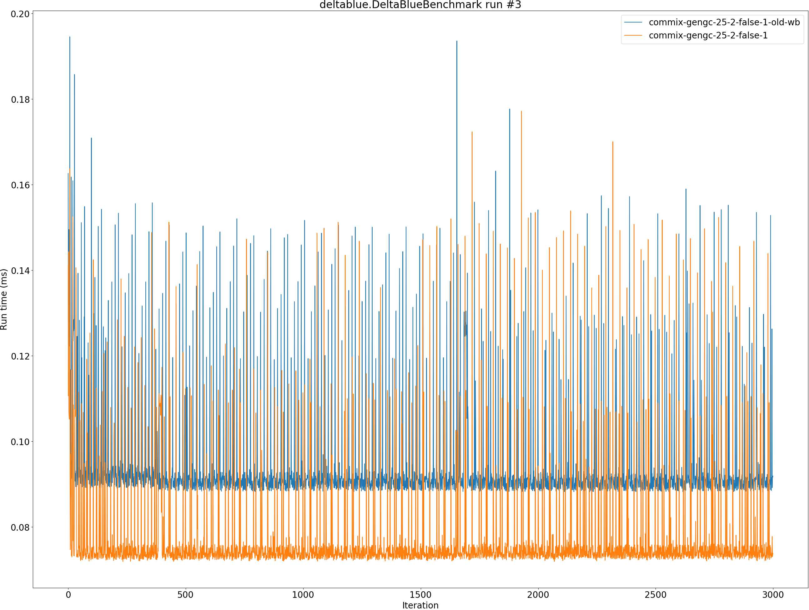
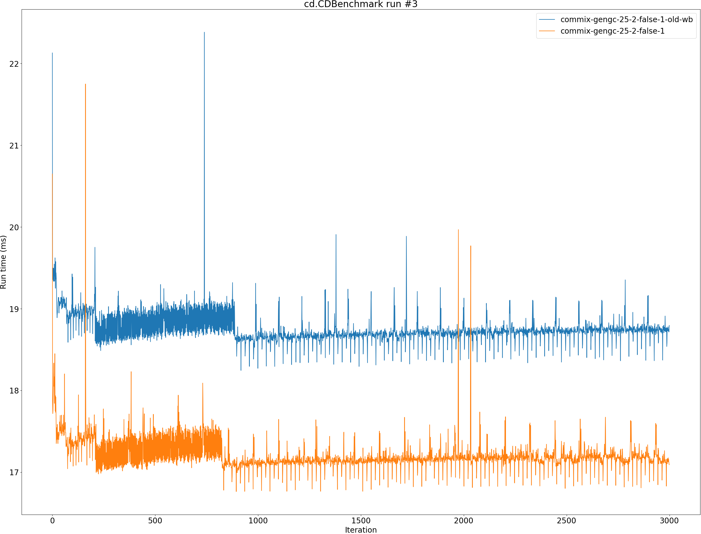
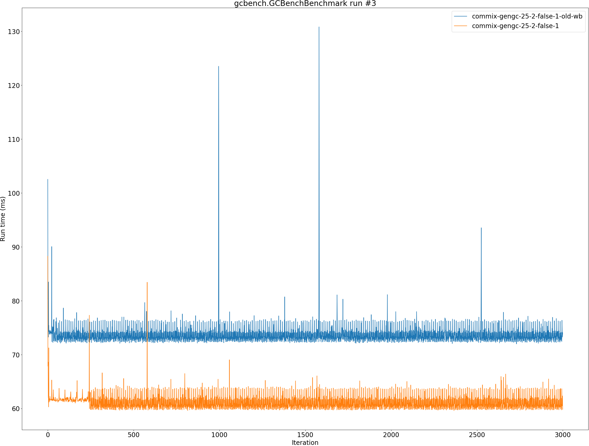
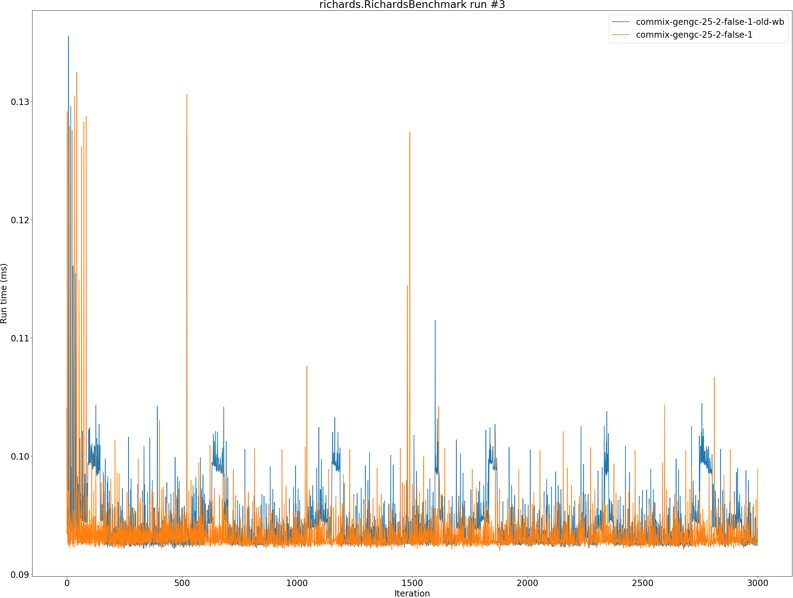

# Summary
## Benchmark run time (ms) at 50 percentile 

|name | commix-gengc-25-2-false-1-old-wb | commix-gengc-25-2-false-1 | |
| -- | -- | -- | -- |
|[permute.PermuteBenchmark](#permutepermutebenchmark)|0.1258|0.1009|__-19.82%__|
|[queens.QueensBenchmark](#queensqueensbenchmark)|0.0718|0.0718|+0.05%|
|[json.JsonBenchmark](#jsonjsonbenchmark)|0.5168|0.4601|__-10.97%__|
|[brainfuck.BrainfuckBenchmark](#brainfuckbrainfuckbenchmark)|1.2130|1.0898|__-10.15%__|
|[nbody.NbodyBenchmark](#nbodynbodybenchmark)|20.2913|20.4184|+0.63%|
|[mandelbrot.MandelbrotBenchmark](#mandelbrotmandelbrotbenchmark)|115.1934|115.2743|+0.07%|
|[tracer.TracerBenchmark](#tracertracerbenchmark)|0.3780|0.3614|__-4.39%__|
|[deltablue.DeltaBlueBenchmark](#deltabluedeltabluebenchmark)|0.0904|0.0738|__-18.43%__|
|[cd.CDBenchmark](#cdcdbenchmark)|18.7391|17.1760|__-8.34%__|
|[sudoku.SudokuBenchmark](#sudokusudokubenchmark)|1.4596|1.4085|__-3.50%__|
|[kmeans.KmeansBenchmark](#kmeanskmeansbenchmark)|21.6371|21.1315|__-2.34%__|
|[gcbench.GCBenchBenchmark](#gcbenchgcbenchbenchmark)|71.8436|61.6164|__-14.24%__|
|[richards.RichardsBenchmark](#richardsrichardsbenchmark)|0.0928|0.0928|+0.03%|
|[bounce.BounceBenchmark](#bouncebouncebenchmark)|0.0167|0.0164|__-1.53%__|
| __Geometrical mean:__|| |__-6.90%__|
## Benchmark run time (ms) at 90 percentile 

|name | commix-gengc-25-2-false-1-old-wb | commix-gengc-25-2-false-1 | |
| -- | -- | -- | -- |
|[permute.PermuteBenchmark](#permutepermutebenchmark)|0.1552|0.1068|__-31.18%__|
|[queens.QueensBenchmark](#queensqueensbenchmark)|0.0723|0.0739|+2.12%|
|[json.JsonBenchmark](#jsonjsonbenchmark)|0.6352|0.5690|__-10.42%__|
|[brainfuck.BrainfuckBenchmark](#brainfuckbrainfuckbenchmark)|1.2682|1.1478|__-9.50%__|
|[nbody.NbodyBenchmark](#nbodynbodybenchmark)|20.3245|20.4515|+0.63%|
|[mandelbrot.MandelbrotBenchmark](#mandelbrotmandelbrotbenchmark)|115.4287|115.5464|+0.10%|
|[tracer.TracerBenchmark](#tracertracerbenchmark)|0.4140|0.3835|__-7.36%__|
|[deltablue.DeltaBlueBenchmark](#deltabluedeltabluebenchmark)|0.0935|0.0764|__-18.26%__|
|[cd.CDBenchmark](#cdcdbenchmark)|18.8081|17.2757|__-8.15%__|
|[sudoku.SudokuBenchmark](#sudokusudokubenchmark)|1.5599|1.4488|__-7.12%__|
|[kmeans.KmeansBenchmark](#kmeanskmeansbenchmark)|22.4547|21.9288|__-2.34%__|
|[gcbench.GCBenchBenchmark](#gcbenchgcbenchbenchmark)|73.9435|63.2394|__-14.48%__|
|[richards.RichardsBenchmark](#richardsrichardsbenchmark)|0.0952|0.0958|+0.71%|
|[bounce.BounceBenchmark](#bouncebouncebenchmark)|0.0169|0.0167|__-1.57%__|
| __Geometrical mean:__|| |__-8.09%__|
## Benchmark run time (ms) at 99 percentile 

|name | commix-gengc-25-2-false-1-old-wb | commix-gengc-25-2-false-1 | |
| -- | -- | -- | -- |
|[permute.PermuteBenchmark](#permutepermutebenchmark)|0.1777|0.1378|__-22.47%__|
|[queens.QueensBenchmark](#queensqueensbenchmark)|0.0755|0.0836|+10.68%|
|[json.JsonBenchmark](#jsonjsonbenchmark)|0.6797|0.6147|__-9.56%__|
|[brainfuck.BrainfuckBenchmark](#brainfuckbrainfuckbenchmark)|1.4011|1.2808|__-8.59%__|
|[nbody.NbodyBenchmark](#nbodynbodybenchmark)|20.7141|20.8022|+0.43%|
|[mandelbrot.MandelbrotBenchmark](#mandelbrotmandelbrotbenchmark)|116.3258|116.4525|+0.11%|
|[tracer.TracerBenchmark](#tracertracerbenchmark)|0.4407|0.4157|__-5.68%__|
|[deltablue.DeltaBlueBenchmark](#deltabluedeltabluebenchmark)|0.1493|0.1389|__-6.95%__|
|[cd.CDBenchmark](#cdcdbenchmark)|19.1726|17.6273|__-8.06%__|
|[sudoku.SudokuBenchmark](#sudokusudokubenchmark)|1.5852|1.4849|__-6.33%__|
|[kmeans.KmeansBenchmark](#kmeanskmeansbenchmark)|23.2053|22.6815|__-2.26%__|
|[gcbench.GCBenchBenchmark](#gcbenchgcbenchbenchmark)|76.1440|65.1011|__-14.50%__|
|[richards.RichardsBenchmark](#richardsrichardsbenchmark)|0.1007|0.1079|+7.23%|
|[bounce.BounceBenchmark](#bouncebouncebenchmark)|0.0187|0.0185|__-1.59%__|
| __Geometrical mean:__|| |__-5.17%__|
## Benchmark total run time (ms) 

|name | commix-gengc-25-2-false-1-old-wb | commix-gengc-25-2-false-1 | |
| -- | -- | -- | -- |
|[permute.PermuteBenchmark](#permutepermutebenchmark)|2618.5994|2059.9243|__-21.33%__|
|[queens.QueensBenchmark](#queensqueensbenchmark)|1441.1981|1452.9481|+0.82%|
|[json.JsonBenchmark](#jsonjsonbenchmark)|10745.7026|9534.6696|__-11.27%__|
|[brainfuck.BrainfuckBenchmark](#brainfuckbrainfuckbenchmark)|24552.0590|22120.9661|__-9.90%__|
|[nbody.NbodyBenchmark](#nbodynbodybenchmark)|405444.5751|407947.9329|+0.62%|
|[mandelbrot.MandelbrotBenchmark](#mandelbrotmandelbrotbenchmark)|2305626.5059|2307462.2008|+0.08%|
|[tracer.TracerBenchmark](#tracertracerbenchmark)|7700.4094|7107.0042|__-7.71%__|
|[deltablue.DeltaBlueBenchmark](#deltabluedeltabluebenchmark)|1872.3949|1533.2022|__-18.12%__|
|[cd.CDBenchmark](#cdcdbenchmark)|374894.1379|343947.3999|__-8.25%__|
|[sudoku.SudokuBenchmark](#sudokusudokubenchmark)|29684.1181|28194.0422|__-5.02%__|
|[kmeans.KmeansBenchmark](#kmeanskmeansbenchmark)|434092.1540|424005.2357|__-2.32%__|
|[gcbench.GCBenchBenchmark](#gcbenchgcbenchbenchmark)|1438869.5897|1232228.2373|__-14.36%__|
|[richards.RichardsBenchmark](#richardsrichardsbenchmark)|1870.8976|1880.8580|+0.53%|
|[bounce.BounceBenchmark](#bouncebouncebenchmark)|335.0399|329.9597|__-1.52%__|
| __Geometrical mean:__|| |__-7.26%__|
# Individual benchmarks
## permute.PermuteBenchmark

## queens.QueensBenchmark

## json.JsonBenchmark

## brainfuck.BrainfuckBenchmark

## nbody.NbodyBenchmark

## mandelbrot.MandelbrotBenchmark

## tracer.TracerBenchmark

## deltablue.DeltaBlueBenchmark

## cd.CDBenchmark

## sudoku.SudokuBenchmark

## kmeans.KmeansBenchmark

## gcbench.GCBenchBenchmark

## richards.RichardsBenchmark

## bounce.BounceBenchmark

