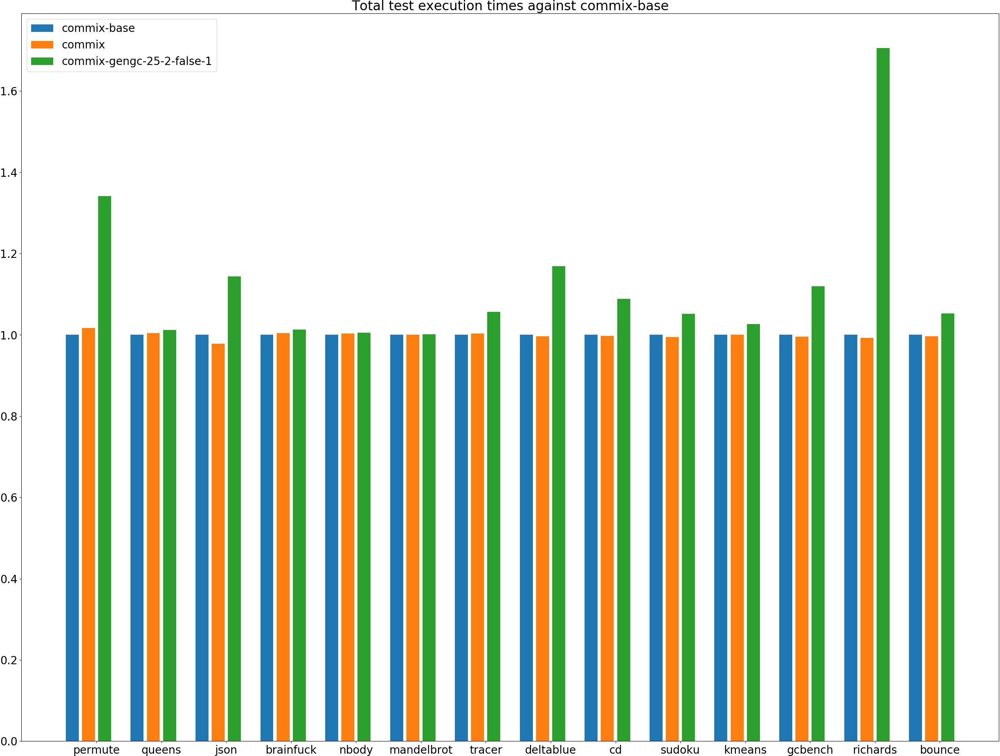
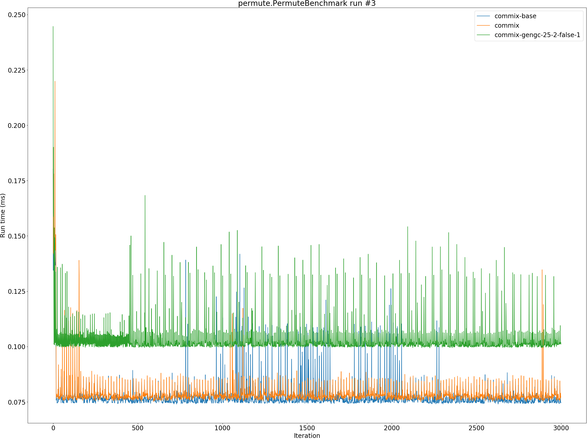

# Summary
## Benchmark run time (ms) at 50 percentile 

|name | commix-base | commix |  | commix-gengc-25-2-false-1 | |
| -- | -- | -- | -- | -- | -- |
|[permute.PermuteBenchmark](#permutepermutebenchmark)|0.0760|0.0775|+1.91%|0.1009|+32.71%|
|[queens.QueensBenchmark](#queensqueensbenchmark)|0.0715|0.0716|+0.24%|0.0718|+0.54%|
|[json.JsonBenchmark](#jsonjsonbenchmark)|0.4016|0.3928|__-2.19%__|0.4601|+14.58%|
|[brainfuck.BrainfuckBenchmark](#brainfuckbrainfuckbenchmark)|1.0787|1.0831|+0.40%|1.0898|+1.03%|
|[nbody.NbodyBenchmark](#nbodynbodybenchmark)|20.3051|20.3870|+0.40%|20.4184|+0.56%|
|[mandelbrot.MandelbrotBenchmark](#mandelbrotmandelbrotbenchmark)|115.1467|115.1942|+0.04%|115.2743|+0.11%|
|[tracer.TracerBenchmark](#tracertracerbenchmark)|0.3325|0.3335|+0.31%|0.3614|+8.70%|
|[deltablue.DeltaBlueBenchmark](#deltabluedeltabluebenchmark)|0.0640|0.0638|__-0.40%__|0.0738|+15.21%|
|[cd.CDBenchmark](#cdcdbenchmark)|15.7851|15.7420|__-0.27%__|17.1760|+8.81%|
|[sudoku.SudokuBenchmark](#sudokusudokubenchmark)|1.3221|1.3146|__-0.57%__|1.4085|+6.54%|
|[kmeans.KmeansBenchmark](#kmeanskmeansbenchmark)|20.5973|20.5931|__-0.02%__|21.1315|+2.59%|
|[gcbench.GCBenchBenchmark](#gcbenchgcbenchbenchmark)|54.7407|54.6740|__-0.12%__|61.6164|+12.56%|
|[richards.RichardsBenchmark](#richardsrichardsbenchmark)|0.0547|0.0542|__-0.96%__|0.0928|+69.67%|
|[bounce.BounceBenchmark](#bouncebouncebenchmark)|0.0156|0.0156|__-0.40%__|0.0164|+5.28%|
| __Geometrical mean:__|| |__-0.12%__| |+11.61%|
## Benchmark run time (ms) at 90 percentile 

|name | commix-base | commix |  | commix-gengc-25-2-false-1 | |
| -- | -- | -- | -- | -- | -- |
|[permute.PermuteBenchmark](#permutepermutebenchmark)|0.0792|0.0798|+0.86%|0.1068|+34.90%|
|[queens.QueensBenchmark](#queensqueensbenchmark)|0.0725|0.0736|+1.56%|0.0739|+1.95%|
|[json.JsonBenchmark](#jsonjsonbenchmark)|0.4726|0.4628|__-2.07%__|0.5690|+20.39%|
|[brainfuck.BrainfuckBenchmark](#brainfuckbrainfuckbenchmark)|1.1182|1.1236|+0.49%|1.1478|+2.65%|
|[nbody.NbodyBenchmark](#nbodynbodybenchmark)|20.3397|20.4200|+0.40%|20.4515|+0.55%|
|[mandelbrot.MandelbrotBenchmark](#mandelbrotmandelbrotbenchmark)|115.4014|115.4382|+0.03%|115.5464|+0.13%|
|[tracer.TracerBenchmark](#tracertracerbenchmark)|0.3435|0.3453|+0.51%|0.3835|+11.63%|
|[deltablue.DeltaBlueBenchmark](#deltabluedeltabluebenchmark)|0.0664|0.0665|+0.03%|0.0764|+15.05%|
|[cd.CDBenchmark](#cdcdbenchmark)|15.9365|15.9032|__-0.21%__|17.2757|+8.40%|
|[sudoku.SudokuBenchmark](#sudokusudokubenchmark)|1.4069|1.4000|__-0.49%__|1.4488|+2.97%|
|[kmeans.KmeansBenchmark](#kmeanskmeansbenchmark)|21.2635|21.3010|+0.18%|21.9288|+3.13%|
|[gcbench.GCBenchBenchmark](#gcbenchgcbenchbenchmark)|56.1433|56.0662|__-0.14%__|63.2394|+12.64%|
|[richards.RichardsBenchmark](#richardsrichardsbenchmark)|0.0561|0.0556|__-0.90%__|0.0958|+70.75%|
|[bounce.BounceBenchmark](#bouncebouncebenchmark)|0.0160|0.0158|__-0.86%__|0.0167|+4.31%|
| __Geometrical mean:__|| |__-0.05%__| |+12.30%|
## Benchmark run time (ms) at 99 percentile 

|name | commix-base | commix |  | commix-gengc-25-2-false-1 | |
| -- | -- | -- | -- | -- | -- |
|[permute.PermuteBenchmark](#permutepermutebenchmark)|0.0868|0.0875|+0.76%|0.1378|+58.72%|
|[queens.QueensBenchmark](#queensqueensbenchmark)|0.0745|0.0760|+2.01%|0.0836|+12.13%|
|[json.JsonBenchmark](#jsonjsonbenchmark)|0.5396|0.5359|__-0.69%__|0.6147|+13.92%|
|[brainfuck.BrainfuckBenchmark](#brainfuckbrainfuckbenchmark)|1.1551|1.1598|+0.41%|1.2808|+10.88%|
|[nbody.NbodyBenchmark](#nbodynbodybenchmark)|20.7307|20.7875|+0.27%|20.8022|+0.34%|
|[mandelbrot.MandelbrotBenchmark](#mandelbrotmandelbrotbenchmark)|116.3035|116.3475|+0.04%|116.4525|+0.13%|
|[tracer.TracerBenchmark](#tracertracerbenchmark)|0.3746|0.3745|__-0.03%__|0.4157|+10.98%|
|[deltablue.DeltaBlueBenchmark](#deltabluedeltabluebenchmark)|0.1088|0.1081|__-0.72%__|0.1389|+27.63%|
|[cd.CDBenchmark](#cdcdbenchmark)|16.2265|16.1698|__-0.35%__|17.6273|+8.63%|
|[sudoku.SudokuBenchmark](#sudokusudokubenchmark)|1.4533|1.4505|__-0.19%__|1.4849|+2.17%|
|[kmeans.KmeansBenchmark](#kmeanskmeansbenchmark)|22.0218|22.1331|+0.51%|22.6815|+3.00%|
|[gcbench.GCBenchBenchmark](#gcbenchgcbenchbenchmark)|58.7552|57.3242|__-2.44%__|65.1011|+10.80%|
|[richards.RichardsBenchmark](#richardsrichardsbenchmark)|0.0598|0.0609|+1.74%|0.1079|+80.36%|
|[bounce.BounceBenchmark](#bouncebouncebenchmark)|0.0179|0.0174|__-2.65%__|0.0185|+3.06%|
| __Geometrical mean:__|| |__-0.10%__| |+15.51%|
## Benchmark total run time (ms) 

|name | commix-base | commix |  | commix-gengc-25-2-false-1 | |
| -- | -- | -- | -- | -- | -- |
|[permute.PermuteBenchmark](#permutepermutebenchmark)|1535.8965|1562.5550|+1.74%|2059.9243|+34.12%|
|[queens.QueensBenchmark](#queensqueensbenchmark)|1434.9509|1440.5854|+0.39%|1452.9481|+1.25%|
|[json.JsonBenchmark](#jsonjsonbenchmark)|8333.6229|8150.9971|__-2.19%__|9534.6696|+14.41%|
|[brainfuck.BrainfuckBenchmark](#brainfuckbrainfuckbenchmark)|21845.3307|21950.9141|+0.48%|22120.9661|+1.26%|
|[nbody.NbodyBenchmark](#nbodynbodybenchmark)|405649.5950|407041.5223|+0.34%|407947.9329|+0.57%|
|[mandelbrot.MandelbrotBenchmark](#mandelbrotmandelbrotbenchmark)|2304755.6172|2305733.9875|+0.04%|2307462.2008|+0.12%|
|[tracer.TracerBenchmark](#tracertracerbenchmark)|6727.9905|6748.0569|+0.30%|7107.0042|+5.63%|
|[deltablue.DeltaBlueBenchmark](#deltabluedeltabluebenchmark)|1311.2411|1306.4333|__-0.37%__|1533.2022|+16.93%|
|[cd.CDBenchmark](#cdcdbenchmark)|315801.5111|314989.0322|__-0.26%__|343947.3999|+8.91%|
|[sudoku.SudokuBenchmark](#sudokusudokubenchmark)|26816.1644|26676.7765|__-0.52%__|28194.0422|+5.14%|
|[kmeans.KmeansBenchmark](#kmeanskmeansbenchmark)|412878.5848|413247.0940|+0.09%|424005.2357|+2.69%|
|[gcbench.GCBenchBenchmark](#gcbenchgcbenchbenchmark)|1100249.7298|1095760.3297|__-0.41%__|1232228.2373|+12.00%|
|[richards.RichardsBenchmark](#richardsrichardsbenchmark)|1102.6297|1094.1594|__-0.77%__|1880.8580|+70.58%|
|[bounce.BounceBenchmark](#bouncebouncebenchmark)|313.4626|312.2533|__-0.39%__|329.9597|+5.26%|
| __Geometrical mean:__|| |__-0.11%__| |+11.56%|
# Individual benchmarks
## permute.PermuteBenchmark

## queens.QueensBenchmark

## json.JsonBenchmark

## brainfuck.BrainfuckBenchmark

## nbody.NbodyBenchmark

## mandelbrot.MandelbrotBenchmark

## tracer.TracerBenchmark

## deltablue.DeltaBlueBenchmark

## cd.CDBenchmark

## sudoku.SudokuBenchmark

## kmeans.KmeansBenchmark

## gcbench.GCBenchBenchmark

## richards.RichardsBenchmark

## bounce.BounceBenchmark

