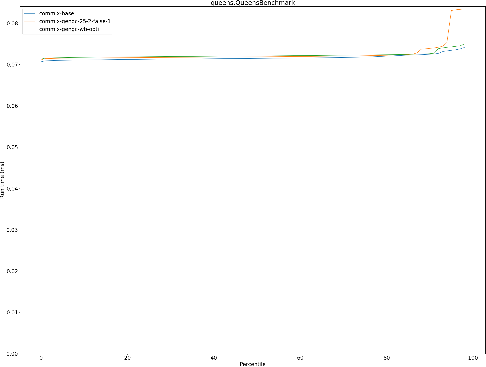
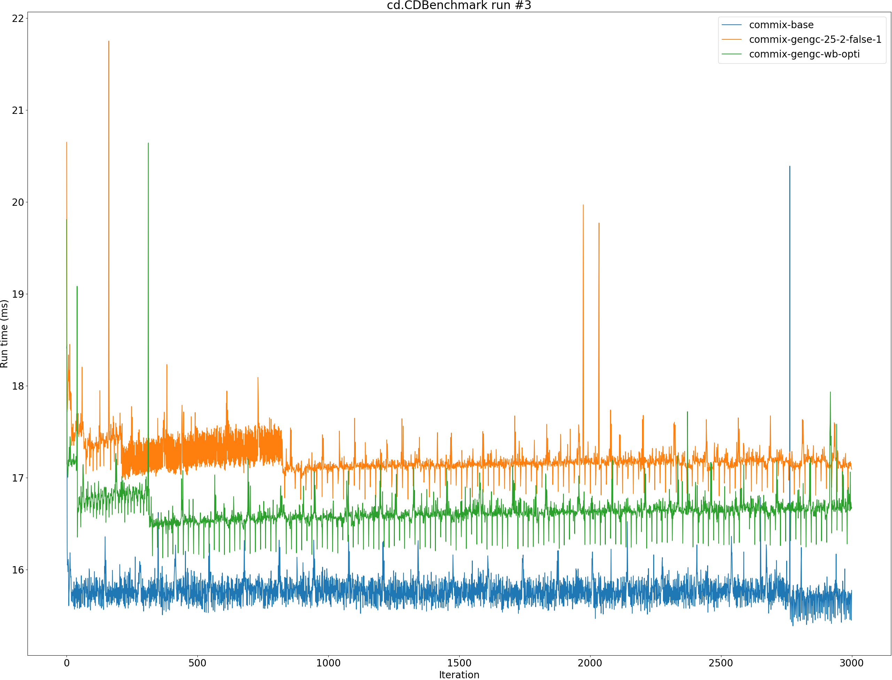

# Summary
## Benchmark run time (ms) at 50 percentile 

|name | commix-base | commix-gengc-25-2-false-1 |  | commix-gengc-wb-opti | |
| -- | -- | -- | -- | -- | -- |
|[permute.PermuteBenchmark](#permutepermutebenchmark)|0.0760|0.1009|+32.71%|0.0909|+19.55%|
|[queens.QueensBenchmark](#queensqueensbenchmark)|0.0715|0.0718|+0.54%|0.0721|+0.83%|
|[json.JsonBenchmark](#jsonjsonbenchmark)|0.4016|0.4601|+14.58%|0.4257|+5.99%|
|[brainfuck.BrainfuckBenchmark](#brainfuckbrainfuckbenchmark)|1.0787|1.0898|+1.03%|1.0894|+0.99%|
|[nbody.NbodyBenchmark](#nbodynbodybenchmark)|20.3051|20.4184|+0.56%|20.2771|__-0.14%__|
|[mandelbrot.MandelbrotBenchmark](#mandelbrotmandelbrotbenchmark)|115.1467|115.2743|+0.11%|115.2939|+0.13%|
|[tracer.TracerBenchmark](#tracertracerbenchmark)|0.3325|0.3614|+8.70%|0.3477|+4.59%|
|[deltablue.DeltaBlueBenchmark](#deltabluedeltabluebenchmark)|0.0640|0.0738|+15.21%|0.0688|+7.55%|
|[cd.CDBenchmark](#cdcdbenchmark)|15.7851|17.1760|+8.81%|16.6507|+5.48%|
|[sudoku.SudokuBenchmark](#sudokusudokubenchmark)|1.3221|1.4085|+6.54%|1.3661|+3.33%|
|[kmeans.KmeansBenchmark](#kmeanskmeansbenchmark)|20.5973|21.1315|+2.59%|20.9167|+1.55%|
|[gcbench.GCBenchBenchmark](#gcbenchgcbenchbenchmark)|54.7407|61.6164|+12.56%|57.5775|+5.18%|
|[richards.RichardsBenchmark](#richardsrichardsbenchmark)|0.0547|0.0928|+69.67%|0.0779|+42.39%|
|[bounce.BounceBenchmark](#bouncebouncebenchmark)|0.0156|0.0164|+5.28%|0.0163|+4.68%|
| __Geometrical mean:__|| |+11.61%| |+6.82%|
## Benchmark run time (ms) at 90 percentile 

|name | commix-base | commix-gengc-25-2-false-1 |  | commix-gengc-wb-opti | |
| -- | -- | -- | -- | -- | -- |
|[permute.PermuteBenchmark](#permutepermutebenchmark)|0.0792|0.1068|+34.90%|0.0956|+20.75%|
|[queens.QueensBenchmark](#queensqueensbenchmark)|0.0725|0.0739|+1.95%|0.0726|+0.19%|
|[json.JsonBenchmark](#jsonjsonbenchmark)|0.4726|0.5690|+20.39%|0.4738|+0.25%|
|[brainfuck.BrainfuckBenchmark](#brainfuckbrainfuckbenchmark)|1.1182|1.1478|+2.65%|1.1451|+2.41%|
|[nbody.NbodyBenchmark](#nbodynbodybenchmark)|20.3397|20.4515|+0.55%|20.3109|__-0.14%__|
|[mandelbrot.MandelbrotBenchmark](#mandelbrotmandelbrotbenchmark)|115.4014|115.5464|+0.13%|115.5245|+0.11%|
|[tracer.TracerBenchmark](#tracertracerbenchmark)|0.3435|0.3835|+11.63%|0.3801|+10.64%|
|[deltablue.DeltaBlueBenchmark](#deltabluedeltabluebenchmark)|0.0664|0.0764|+15.05%|0.0843|+26.88%|
|[cd.CDBenchmark](#cdcdbenchmark)|15.9365|17.2757|+8.40%|16.7504|+5.11%|
|[sudoku.SudokuBenchmark](#sudokusudokubenchmark)|1.4069|1.4488|+2.97%|1.4693|+4.43%|
|[kmeans.KmeansBenchmark](#kmeanskmeansbenchmark)|21.2635|21.9288|+3.13%|21.6399|+1.77%|
|[gcbench.GCBenchBenchmark](#gcbenchgcbenchbenchmark)|56.1433|63.2394|+12.64%|58.6051|+4.38%|
|[richards.RichardsBenchmark](#richardsrichardsbenchmark)|0.0561|0.0958|+70.75%|0.0804|+43.22%|
|[bounce.BounceBenchmark](#bouncebouncebenchmark)|0.0160|0.0167|+4.31%|0.0167|+4.39%|
| __Geometrical mean:__|| |+12.30%| |+8.26%|
## Benchmark run time (ms) at 99 percentile 

|name | commix-base | commix-gengc-25-2-false-1 |  | commix-gengc-wb-opti | |
| -- | -- | -- | -- | -- | -- |
|[permute.PermuteBenchmark](#permutepermutebenchmark)|0.0868|0.1378|+58.72%|0.1201|+38.39%|
|[queens.QueensBenchmark](#queensqueensbenchmark)|0.0745|0.0836|+12.13%|0.0761|+2.15%|
|[json.JsonBenchmark](#jsonjsonbenchmark)|0.5396|0.6147|+13.92%|0.5763|+6.79%|
|[brainfuck.BrainfuckBenchmark](#brainfuckbrainfuckbenchmark)|1.1551|1.2808|+10.88%|1.2921|+11.86%|
|[nbody.NbodyBenchmark](#nbodynbodybenchmark)|20.7307|20.8022|+0.34%|20.6929|__-0.18%__|
|[mandelbrot.MandelbrotBenchmark](#mandelbrotmandelbrotbenchmark)|116.3035|116.4525|+0.13%|116.4344|+0.11%|
|[tracer.TracerBenchmark](#tracertracerbenchmark)|0.3746|0.4157|+10.98%|0.4130|+10.24%|
|[deltablue.DeltaBlueBenchmark](#deltabluedeltabluebenchmark)|0.1088|0.1389|+27.63%|0.1404|+29.03%|
|[cd.CDBenchmark](#cdcdbenchmark)|16.2265|17.6273|+8.63%|17.0533|+5.10%|
|[sudoku.SudokuBenchmark](#sudokusudokubenchmark)|1.4533|1.4849|+2.17%|1.4958|+2.93%|
|[kmeans.KmeansBenchmark](#kmeanskmeansbenchmark)|22.0218|22.6815|+3.00%|22.3533|+1.51%|
|[gcbench.GCBenchBenchmark](#gcbenchgcbenchbenchmark)|58.7552|65.1011|+10.80%|59.7355|+1.67%|
|[richards.RichardsBenchmark](#richardsrichardsbenchmark)|0.0598|0.1079|+80.36%|0.0879|+46.83%|
|[bounce.BounceBenchmark](#bouncebouncebenchmark)|0.0179|0.0185|+3.06%|0.0184|+2.89%|
| __Geometrical mean:__|| |+15.51%| |+10.50%|
## Benchmark total run time (ms) 

|name | commix-base | commix-gengc-25-2-false-1 |  | commix-gengc-wb-opti | |
| -- | -- | -- | -- | -- | -- |
|[permute.PermuteBenchmark](#permutepermutebenchmark)|1535.8965|2059.9243|+34.12%|1843.2718|+20.01%|
|[queens.QueensBenchmark](#queensqueensbenchmark)|1434.9509|1452.9481|+1.25%|1447.1673|+0.85%|
|[json.JsonBenchmark](#jsonjsonbenchmark)|8333.6229|9534.6696|+14.41%|8818.2344|+5.82%|
|[brainfuck.BrainfuckBenchmark](#brainfuckbrainfuckbenchmark)|21845.3307|22120.9661|+1.26%|22133.4811|+1.32%|
|[nbody.NbodyBenchmark](#nbodynbodybenchmark)|405649.5950|407947.9329|+0.57%|405167.6656|__-0.12%__|
|[mandelbrot.MandelbrotBenchmark](#mandelbrotmandelbrotbenchmark)|2304755.6172|2307462.2008|+0.12%|2307618.1981|+0.12%|
|[tracer.TracerBenchmark](#tracertracerbenchmark)|6727.9905|7107.0042|+5.63%|7062.7142|+4.98%|
|[deltablue.DeltaBlueBenchmark](#deltabluedeltabluebenchmark)|1311.2411|1533.2022|+16.93%|1458.1163|+11.20%|
|[cd.CDBenchmark](#cdcdbenchmark)|315801.5111|343947.3999|+8.91%|332749.0408|+5.37%|
|[sudoku.SudokuBenchmark](#sudokusudokubenchmark)|26816.1644|28194.0422|+5.14%|27784.6676|+3.61%|
|[kmeans.KmeansBenchmark](#kmeanskmeansbenchmark)|412878.5848|424005.2357|+2.69%|419211.4535|+1.53%|
|[gcbench.GCBenchBenchmark](#gcbenchgcbenchbenchmark)|1100249.7298|1232228.2373|+12.00%|1149506.3884|+4.48%|
|[richards.RichardsBenchmark](#richardsrichardsbenchmark)|1102.6297|1880.8580|+70.58%|1572.6375|+42.63%|
|[bounce.BounceBenchmark](#bouncebouncebenchmark)|313.4626|329.9597|+5.26%|327.9708|+4.63%|
| __Geometrical mean:__|| |+11.56%| |+7.12%|
# Individual benchmarks
## permute.PermuteBenchmark

## queens.QueensBenchmark

## json.JsonBenchmark

## brainfuck.BrainfuckBenchmark

## nbody.NbodyBenchmark

## mandelbrot.MandelbrotBenchmark

## tracer.TracerBenchmark

## deltablue.DeltaBlueBenchmark

## cd.CDBenchmark

## sudoku.SudokuBenchmark

## kmeans.KmeansBenchmark

## gcbench.GCBenchBenchmark

## richards.RichardsBenchmark

## bounce.BounceBenchmark

