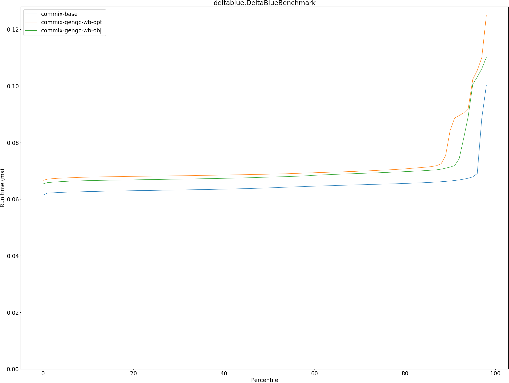
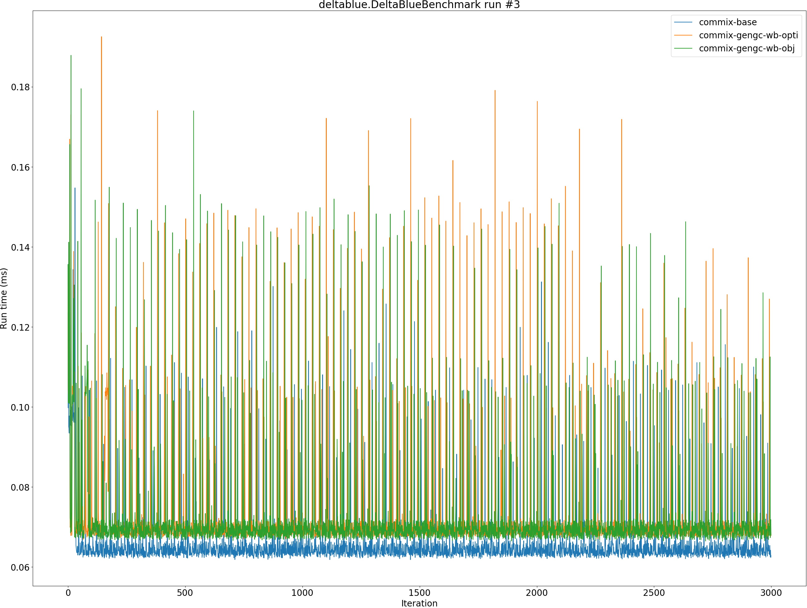

# Summary
## Benchmark run time (ms) at 50 percentile 

|name | commix-base | commix-gengc-wb-opti |  | commix-gengc-wb-obj | |
| -- | -- | -- | -- | -- | -- |
|[permute.PermuteBenchmark](#permutepermutebenchmark)|0.0760|0.0909|+19.55%|0.0836|+9.95%|
|[queens.QueensBenchmark](#queensqueensbenchmark)|0.0715|0.0721|+0.83%|0.0724|+1.26%|
|[json.JsonBenchmark](#jsonjsonbenchmark)|0.4016|0.4257|+5.99%|0.4149|+3.31%|
|[brainfuck.BrainfuckBenchmark](#brainfuckbrainfuckbenchmark)|1.0787|1.0894|+0.99%|1.0877|+0.83%|
|[nbody.NbodyBenchmark](#nbodynbodybenchmark)|20.3051|20.2771|__-0.14%__|20.2915|__-0.07%__|
|[mandelbrot.MandelbrotBenchmark](#mandelbrotmandelbrotbenchmark)|115.1467|115.2939|+0.13%|115.2679|+0.11%|
|[tracer.TracerBenchmark](#tracertracerbenchmark)|0.3325|0.3477|+4.59%|0.3590|+7.98%|
|[deltablue.DeltaBlueBenchmark](#deltabluedeltabluebenchmark)|0.0640|0.0688|+7.55%|0.0678|+5.93%|
|[cd.CDBenchmark](#cdcdbenchmark)|15.7851|16.6507|+5.48%|16.3600|+3.64%|
|[sudoku.SudokuBenchmark](#sudokusudokubenchmark)|1.3221|1.3661|+3.33%|1.4065|+6.39%|
|[kmeans.KmeansBenchmark](#kmeanskmeansbenchmark)|20.5973|20.9167|+1.55%|21.0152|+2.03%|
|[gcbench.GCBenchBenchmark](#gcbenchgcbenchbenchmark)|54.7407|57.5775|+5.18%|55.4450|+1.29%|
|[richards.RichardsBenchmark](#richardsrichardsbenchmark)|0.0547|0.0779|+42.39%|0.0770|+40.82%|
|[bounce.BounceBenchmark](#bouncebouncebenchmark)|0.0156|0.0163|+4.68%|0.0165|+5.51%|
| __Geometrical mean:__|| |+6.82%| |+5.95%|
## Benchmark run time (ms) at 90 percentile 

|name | commix-base | commix-gengc-wb-opti |  | commix-gengc-wb-obj | |
| -- | -- | -- | -- | -- | -- |
|[permute.PermuteBenchmark](#permutepermutebenchmark)|0.0792|0.0956|+20.75%|0.1092|+37.99%|
|[queens.QueensBenchmark](#queensqueensbenchmark)|0.0725|0.0726|+0.19%|0.0729|+0.61%|
|[json.JsonBenchmark](#jsonjsonbenchmark)|0.4726|0.4738|+0.25%|0.4550|__-3.72%__|
|[brainfuck.BrainfuckBenchmark](#brainfuckbrainfuckbenchmark)|1.1182|1.1451|+2.41%|1.1369|+1.68%|
|[nbody.NbodyBenchmark](#nbodynbodybenchmark)|20.3397|20.3109|__-0.14%__|20.3804|+0.20%|
|[mandelbrot.MandelbrotBenchmark](#mandelbrotmandelbrotbenchmark)|115.4014|115.5245|+0.11%|115.6057|+0.18%|
|[tracer.TracerBenchmark](#tracertracerbenchmark)|0.3435|0.3801|+10.64%|0.3813|+10.99%|
|[deltablue.DeltaBlueBenchmark](#deltabluedeltabluebenchmark)|0.0664|0.0843|+26.88%|0.0714|+7.41%|
|[cd.CDBenchmark](#cdcdbenchmark)|15.9365|16.7504|+5.11%|16.4519|+3.23%|
|[sudoku.SudokuBenchmark](#sudokusudokubenchmark)|1.4069|1.4693|+4.43%|1.4469|+2.85%|
|[kmeans.KmeansBenchmark](#kmeanskmeansbenchmark)|21.2635|21.6399|+1.77%|21.8734|+2.87%|
|[gcbench.GCBenchBenchmark](#gcbenchgcbenchbenchmark)|56.1433|58.6051|+4.38%|57.0132|+1.55%|
|[richards.RichardsBenchmark](#richardsrichardsbenchmark)|0.0561|0.0804|+43.22%|0.0796|+41.79%|
|[bounce.BounceBenchmark](#bouncebouncebenchmark)|0.0160|0.0167|+4.39%|0.0167|+4.53%|
| __Geometrical mean:__|| |+8.26%| |+7.28%|
## Benchmark run time (ms) at 99 percentile 

|name | commix-base | commix-gengc-wb-opti |  | commix-gengc-wb-obj | |
| -- | -- | -- | -- | -- | -- |
|[permute.PermuteBenchmark](#permutepermutebenchmark)|0.0868|0.1201|+38.39%|0.1327|+52.90%|
|[queens.QueensBenchmark](#queensqueensbenchmark)|0.0745|0.0761|+2.15%|0.0760|+1.97%|
|[json.JsonBenchmark](#jsonjsonbenchmark)|0.5396|0.5763|+6.79%|0.5639|+4.51%|
|[brainfuck.BrainfuckBenchmark](#brainfuckbrainfuckbenchmark)|1.1551|1.2921|+11.86%|1.2836|+11.12%|
|[nbody.NbodyBenchmark](#nbodynbodybenchmark)|20.7307|20.6929|__-0.18%__|20.7184|__-0.06%__|
|[mandelbrot.MandelbrotBenchmark](#mandelbrotmandelbrotbenchmark)|116.3035|116.4344|+0.11%|116.5734|+0.23%|
|[tracer.TracerBenchmark](#tracertracerbenchmark)|0.3746|0.4130|+10.24%|0.4136|+10.42%|
|[deltablue.DeltaBlueBenchmark](#deltabluedeltabluebenchmark)|0.1088|0.1404|+29.03%|0.1331|+22.32%|
|[cd.CDBenchmark](#cdcdbenchmark)|16.2265|17.0533|+5.10%|16.7807|+3.42%|
|[sudoku.SudokuBenchmark](#sudokusudokubenchmark)|1.4533|1.4958|+2.93%|1.4884|+2.42%|
|[kmeans.KmeansBenchmark](#kmeanskmeansbenchmark)|22.0218|22.3533|+1.51%|22.9951|+4.42%|
|[gcbench.GCBenchBenchmark](#gcbenchgcbenchbenchmark)|58.7552|59.7355|+1.67%|59.6203|+1.47%|
|[richards.RichardsBenchmark](#richardsrichardsbenchmark)|0.0598|0.0879|+46.83%|0.0863|+44.13%|
|[bounce.BounceBenchmark](#bouncebouncebenchmark)|0.0179|0.0184|+2.89%|0.0185|+3.31%|
| __Geometrical mean:__|| |+10.50%| |+10.59%|
## Benchmark total run time (ms) 

|name | commix-base | commix-gengc-wb-opti |  | commix-gengc-wb-obj | |
| -- | -- | -- | -- | -- | -- |
|[permute.PermuteBenchmark](#permutepermutebenchmark)|1535.8965|1843.2718|+20.01%|1769.4778|+15.21%|
|[queens.QueensBenchmark](#queensqueensbenchmark)|1434.9509|1447.1673|+0.85%|1451.6929|+1.17%|
|[json.JsonBenchmark](#jsonjsonbenchmark)|8333.6229|8818.2344|+5.82%|8584.3582|+3.01%|
|[brainfuck.BrainfuckBenchmark](#brainfuckbrainfuckbenchmark)|21845.3307|22133.4811|+1.32%|22095.8056|+1.15%|
|[nbody.NbodyBenchmark](#nbodynbodybenchmark)|405649.5950|405167.6656|__-0.12%__|405693.0217|+0.01%|
|[mandelbrot.MandelbrotBenchmark](#mandelbrotmandelbrotbenchmark)|2304755.6172|2307618.1981|+0.12%|2307273.3756|+0.11%|
|[tracer.TracerBenchmark](#tracertracerbenchmark)|6727.9905|7062.7142|+4.98%|7083.4293|+5.28%|
|[deltablue.DeltaBlueBenchmark](#deltabluedeltabluebenchmark)|1311.2411|1458.1163|+11.20%|1417.7770|+8.12%|
|[cd.CDBenchmark](#cdcdbenchmark)|315801.5111|332749.0408|+5.37%|327221.2231|+3.62%|
|[sudoku.SudokuBenchmark](#sudokusudokubenchmark)|26816.1644|27784.6676|+3.61%|28154.7890|+4.99%|
|[kmeans.KmeansBenchmark](#kmeanskmeansbenchmark)|412878.5848|419211.4535|+1.53%|422302.1925|+2.28%|
|[gcbench.GCBenchBenchmark](#gcbenchgcbenchbenchmark)|1100249.7298|1149506.3884|+4.48%|1108414.2261|+0.74%|
|[richards.RichardsBenchmark](#richardsrichardsbenchmark)|1102.6297|1572.6375|+42.63%|1554.0862|+40.94%|
|[bounce.BounceBenchmark](#bouncebouncebenchmark)|313.4626|327.9708|+4.63%|330.9159|+5.57%|
| __Geometrical mean:__|| |+7.12%| |+6.16%|
# Individual benchmarks
## permute.PermuteBenchmark

## queens.QueensBenchmark

## json.JsonBenchmark

## brainfuck.BrainfuckBenchmark

## nbody.NbodyBenchmark

## mandelbrot.MandelbrotBenchmark

## tracer.TracerBenchmark

## deltablue.DeltaBlueBenchmark

## cd.CDBenchmark

## sudoku.SudokuBenchmark

## kmeans.KmeansBenchmark

## gcbench.GCBenchBenchmark

## richards.RichardsBenchmark

## bounce.BounceBenchmark

