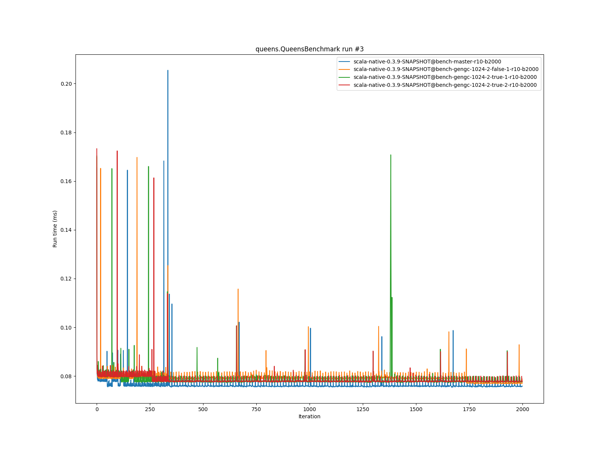

# Summary
## Benchmark run time (ms) at 50 percentile 

|name | scala-native-0.3.9-SNAPSHOT@bench-master-r10-b2000 | scala-native-0.3.9-SNAPSHOT@bench-gengc-1024-2-false-1-r10-b2000 |  | scala-native-0.3.9-SNAPSHOT@bench-gengc-1024-2-true-1-r10-b2000 |  | scala-native-0.3.9-SNAPSHOT@bench-gengc-1024-2-true-2-r10-b2000 | |
| -- | -- | -- | -- | -- | -- | -- | -- |
|[permute.PermuteBenchmark](#permutepermutebenchmark)|0.1829|0.1866|+2.02%|0.1911|+4.50%|0.1900|+3.91%|
|[queens.QueensBenchmark](#queensqueensbenchmark)|0.0763|0.0771|+1.14%|0.0775|+1.58%|0.0776|+1.81%|
|[json.JsonBenchmark](#jsonjsonbenchmark)|1.1905|1.2116|+1.77%|1.1853|__-0.44%__|1.1929|+0.20%|
|[brainfuck.BrainfuckBenchmark](#brainfuckbrainfuckbenchmark)|3.0396|3.1330|+3.07%|3.1310|+3.01%|0.0000|__-100.00%__|
|[nbody.NbodyBenchmark](#nbodynbodybenchmark)|28.9564|29.0803|+0.43%|29.0825|+0.44%|29.1158|+0.55%|
|[mandelbrot.MandelbrotBenchmark](#mandelbrotmandelbrotbenchmark)|114.4536|114.9356|+0.42%|115.2126|+0.66%|114.3854|__-0.06%__|
|[list.ListBenchmark](#listlistbenchmark)|0.0513|0.0513|__-0.01%__|0.0428|__-16.56%__|0.0433|__-15.52%__|
|[tracer.TracerBenchmark](#tracertracerbenchmark)|0.6281|0.6594|+4.99%|0.6558|+4.41%|0.6561|+4.46%|
|[deltablue.DeltaBlueBenchmark](#deltabluedeltabluebenchmark)|0.1754|0.1761|+0.38%|0.1799|+2.53%|0.1775|+1.18%|
|[cd.CDBenchmark](#cdcdbenchmark)|21.3793|21.6142|+1.10%|21.5262|+0.69%|21.4646|+0.40%|
|[sudoku.SudokuBenchmark](#sudokusudokubenchmark)|1.8000|1.8105|+0.58%|0.0000|__-100.00%__|1.8365|+2.02%|
|[kmeans.KmeansBenchmark](#kmeanskmeansbenchmark)|42.7299|45.0315|+5.39%|48.3291|+13.10%|48.2402|+12.90%|
|[gcbench.GCBenchBenchmark](#gcbenchgcbenchbenchmark)|92.7333|98.5401|+6.26%|98.3450|+6.05%|98.7915|+6.53%|
|[richards.RichardsBenchmark](#richardsrichardsbenchmark)|0.0764|0.0823|+7.68%|0.0826|+7.99%|0.0824|+7.81%|
|[bounce.BounceBenchmark](#bouncebouncebenchmark)|0.0446|0.0419|__-5.95%__|0.0454|+1.84%|0.0431|__-3.28%__|
| __Geometrical mean:__|| |+1.90%| |+1.92%| |+1.44%|
## Benchmark run time (ms) at 90 percentile 

|name | scala-native-0.3.9-SNAPSHOT@bench-master-r10-b2000 | scala-native-0.3.9-SNAPSHOT@bench-gengc-1024-2-false-1-r10-b2000 |  | scala-native-0.3.9-SNAPSHOT@bench-gengc-1024-2-true-1-r10-b2000 |  | scala-native-0.3.9-SNAPSHOT@bench-gengc-1024-2-true-2-r10-b2000 | |
| -- | -- | -- | -- | -- | -- | -- | -- |
|[permute.PermuteBenchmark](#permutepermutebenchmark)|0.1870|0.1903|+1.79%|0.1962|+4.90%|0.1956|+4.61%|
|[queens.QueensBenchmark](#queensqueensbenchmark)|0.0769|0.0791|+2.89%|0.0793|+3.17%|0.0795|+3.42%|
|[json.JsonBenchmark](#jsonjsonbenchmark)|1.2009|1.2202|+1.61%|1.2925|+7.62%|1.2942|+7.77%|
|[brainfuck.BrainfuckBenchmark](#brainfuckbrainfuckbenchmark)|3.0731|3.2016|+4.18%|3.1818|+3.54%|0.0000|__-100.00%__|
|[nbody.NbodyBenchmark](#nbodynbodybenchmark)|29.4037|29.5579|+0.52%|29.5615|+0.54%|29.6290|+0.77%|
|[mandelbrot.MandelbrotBenchmark](#mandelbrotmandelbrotbenchmark)|114.5925|115.0997|+0.44%|115.3348|+0.65%|114.5419|__-0.04%__|
|[list.ListBenchmark](#listlistbenchmark)|0.0527|0.0519|__-1.36%__|0.0440|__-16.48%__|0.0444|__-15.60%__|
|[tracer.TracerBenchmark](#tracertracerbenchmark)|0.6333|0.6635|+4.76%|0.6645|+4.92%|0.6652|+5.02%|
|[deltablue.DeltaBlueBenchmark](#deltabluedeltabluebenchmark)|0.1794|0.1803|+0.46%|0.1852|+3.21%|0.1832|+2.09%|
|[cd.CDBenchmark](#cdcdbenchmark)|21.5467|21.9047|+1.66%|21.7032|+0.73%|21.6459|+0.46%|
|[sudoku.SudokuBenchmark](#sudokusudokubenchmark)|1.9263|1.8300|__-5.00%__|0.0000|__-100.00%__|1.8729|__-2.77%__|
|[kmeans.KmeansBenchmark](#kmeanskmeansbenchmark)|43.8723|46.4510|+5.88%|50.1375|+14.28%|49.4587|+12.73%|
|[gcbench.GCBenchBenchmark](#gcbenchgcbenchbenchmark)|94.0469|100.6443|+7.02%|100.8122|+7.19%|100.9877|+7.38%|
|[richards.RichardsBenchmark](#richardsrichardsbenchmark)|0.0786|0.0846|+7.66%|0.0847|+7.72%|0.0848|+7.86%|
|[bounce.BounceBenchmark](#bouncebouncebenchmark)|0.0460|0.0423|__-8.09%__|0.0512|+11.34%|0.0444|__-3.45%__|
| __Geometrical mean:__|| |+1.54%| |+3.57%| |+1.94%|
## Benchmark run time (ms) at 99 percentile 

|name | scala-native-0.3.9-SNAPSHOT@bench-master-r10-b2000 | scala-native-0.3.9-SNAPSHOT@bench-gengc-1024-2-false-1-r10-b2000 |  | scala-native-0.3.9-SNAPSHOT@bench-gengc-1024-2-true-1-r10-b2000 |  | scala-native-0.3.9-SNAPSHOT@bench-gengc-1024-2-true-2-r10-b2000 | |
| -- | -- | -- | -- | -- | -- | -- | -- |
|[permute.PermuteBenchmark](#permutepermutebenchmark)|0.2019|0.2003|__-0.81%__|0.2034|+0.75%|0.2024|+0.25%|
|[queens.QueensBenchmark](#queensqueensbenchmark)|0.0788|0.0812|+3.04%|0.0809|+2.56%|0.0816|+3.46%|
|[json.JsonBenchmark](#jsonjsonbenchmark)|1.2327|1.2522|+1.58%|1.3844|+12.30%|1.3941|+13.09%|
|[brainfuck.BrainfuckBenchmark](#brainfuckbrainfuckbenchmark)|3.1658|3.3087|+4.51%|3.2697|+3.28%|0.0000|__-100.00%__|
|[nbody.NbodyBenchmark](#nbodynbodybenchmark)|30.2512|30.4783|+0.75%|30.4133|+0.54%|30.9343|+2.26%|
|[mandelbrot.MandelbrotBenchmark](#mandelbrotmandelbrotbenchmark)|115.5023|116.0006|+0.43%|116.1702|+0.58%|115.4856|__-0.01%__|
|[list.ListBenchmark](#listlistbenchmark)|0.0544|0.0533|__-2.09%__|0.0454|__-16.50%__|0.0460|__-15.44%__|
|[tracer.TracerBenchmark](#tracertracerbenchmark)|0.6525|0.6810|+4.37%|0.6941|+6.38%|0.6937|+6.31%|
|[deltablue.DeltaBlueBenchmark](#deltabluedeltabluebenchmark)|0.2259|0.2079|__-7.93%__|0.2190|__-3.03%__|0.2245|__-0.61%__|
|[cd.CDBenchmark](#cdcdbenchmark)|21.9369|22.7244|+3.59%|22.3946|+2.09%|22.3738|+1.99%|
|[sudoku.SudokuBenchmark](#sudokusudokubenchmark)|1.9691|1.8826|__-4.39%__|0.0000|__-100.00%__|1.9141|__-2.79%__|
|[kmeans.KmeansBenchmark](#kmeanskmeansbenchmark)|45.1396|48.1872|+6.75%|51.6337|+14.39%|50.7698|+12.47%|
|[gcbench.GCBenchBenchmark](#gcbenchgcbenchbenchmark)|95.4406|101.8520|+6.72%|102.3713|+7.26%|102.4637|+7.36%|
|[richards.RichardsBenchmark](#richardsrichardsbenchmark)|0.0833|0.0916|+9.95%|0.0917|+10.05%|0.0915|+9.87%|
|[bounce.BounceBenchmark](#bouncebouncebenchmark)|0.0526|0.0456|__-13.38%__|0.0570|+8.25%|0.0486|__-7.68%__|
| __Geometrical mean:__|| |+0.70%| |+3.22%| |+1.90%|
# Individual benchmarks
## permute.PermuteBenchmark

## queens.QueensBenchmark

## json.JsonBenchmark

## brainfuck.BrainfuckBenchmark

## nbody.NbodyBenchmark

## mandelbrot.MandelbrotBenchmark

## list.ListBenchmark

## tracer.TracerBenchmark

## deltablue.DeltaBlueBenchmark

## cd.CDBenchmark

## sudoku.SudokuBenchmark

## kmeans.KmeansBenchmark

## gcbench.GCBenchBenchmark

## richards.RichardsBenchmark

## bounce.BounceBenchmark

